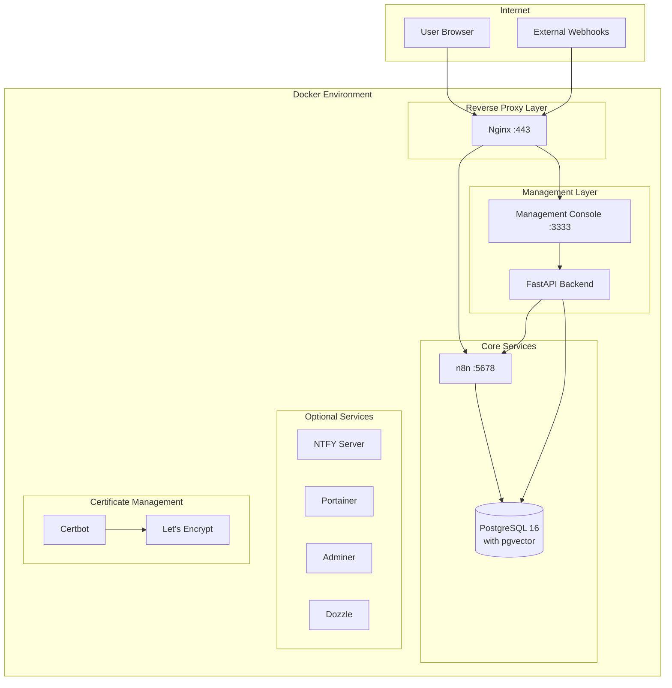
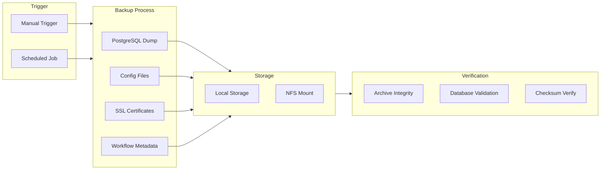
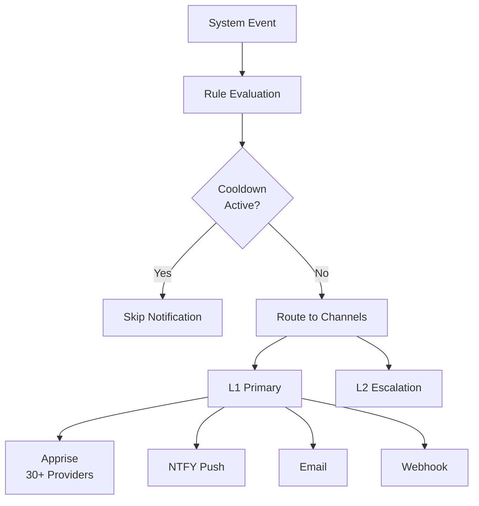
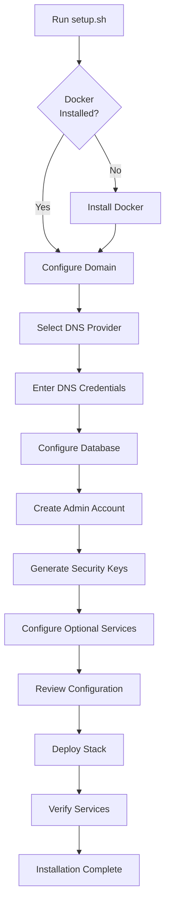
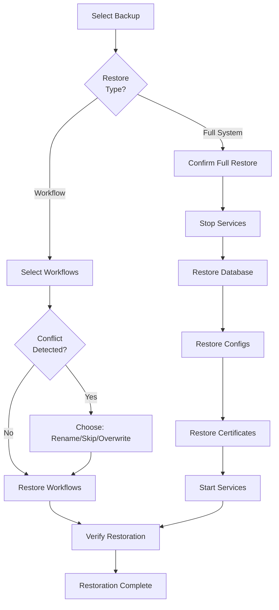

# n8n Enterprise Deployment Suite - Documentation Plan

> **Status:** Planning Complete - Ready for User Approval
> **Last Updated:** 2025-12-20
> **Author:** Documentation Agent

---

## Progress Tracker

| Section | Status | Notes |
|---------|--------|-------|
| PART I: Introduction | Not Started | |
| PART II: Installation | Not Started | |
| PART III: Initial Configuration | Not Started | |
| PART IV: Management Console Reference | Not Started | |
| PART V: Operations & Maintenance | Not Started | |
| PART VI: Advanced Configuration | Not Started | |
| PART VII: Troubleshooting | Not Started | |
| PART VIII: Reference | Not Started | |
| Appendices | Not Started | |
| API.md | Not Started | |

**Current Task:** Awaiting user approval of plan

---

## Proposed Tagline

> *"Enterprise-grade automation infrastructure shouldn't require an enterprise budget."*

---

## Proposed Shields/Badges

```markdown
[](LICENSE)
[](https://github.com/rjsears/n8n_nginx/commits)
[](https://github.com/rjsears/n8n_nginx/issues)
[](https://n8n.io)
[](https://www.postgresql.org)
[](https://docker.com)
[](https://nginx.org)
[](https://letsencrypt.org)
[](https://vuejs.org)
[](https://fastapi.tiangolo.com)
[](CHANGELOG.md)
```

---

## Complete Table of Contents

### PART I: INTRODUCTION

#### 1. Overview
- 1.1 What is n8n Enterprise Deployment Suite?
- 1.2 Key Features at a Glance
- 1.3 Architecture Diagram (Mermaid)
- 1.4 Technology Stack

#### 2. System Requirements
- 2.1 Hardware Requirements
- 2.2 Software Requirements
- 2.3 Supported Operating Systems
- 2.4 Network Requirements
- 2.5 DNS Provider Requirements

---

### PART II: INSTALLATION

#### 3. Pre-Installation Preparation
- 3.1 Gathering Required Information
  - DNS Provider Credentials
    - Cloudflare API Token (with screenshots)
    - AWS Route 53 Credentials
    - Google Cloud DNS Service Account
    - DigitalOcean API Token
  - Domain Configuration
  - Tailscale Auth Key (optional)
  - Cloudflare Tunnel Token (optional)
- 3.2 Preparing Your Server
- 3.3 Downloading the Repository

#### 4. Interactive Setup (setup.sh)
- 4.1 Starting the Setup
- 4.2 Docker Installation & Verification
- 4.3 Domain Configuration
  - Entering Your Domain
  - DNS Validation Process
  - Troubleshooting DNS Issues
- 4.4 DNS Provider Selection
  - Cloudflare Setup (Recommended)
  - AWS Route 53 Setup
  - Google Cloud DNS Setup
  - DigitalOcean Setup
  - Manual DNS Setup
- 4.5 Database Configuration
  - Database Names
  - User Credentials
  - Password Generation
- 4.6 Administrator Account Setup
  - Username Configuration
  - Password Requirements
  - Email Configuration
- 4.7 Security Configuration
  - Encryption Key Generation
  - Secret Key Generation
  - Saving Your Keys (CRITICAL)
- 4.8 Container Naming
- 4.9 Timezone Configuration
- 4.10 Optional Services
  - Portainer (Container Management)
  - Cloudflare Tunnel
  - Tailscale VPN
  - Adminer (Database UI)
  - Dozzle (Log Viewer)
  - NTFY (Push Notifications)
- 4.11 Configuration Summary & Confirmation
- 4.12 Deployment Process
  - PostgreSQL Startup
  - SSL Certificate Acquisition
  - Service Deployment
  - Health Verification
- 4.13 Post-Installation Summary

---

### PART III: INITIAL CONFIGURATION

#### 5. First-Time Setup
- 5.1 Accessing the n8n Interface
  - Creating Your Owner Account
  - Initial n8n Configuration
- 5.2 Accessing the Management Console
  - Login Process
  - Dashboard Overview
- 5.3 Configuring the n8n API Connection
  - Generating an n8n API Key
  - Entering the API Key in Management Console
  - Testing the Connection
- 5.4 Deploying Test Workflows
  - Available Test Workflows
  - Verifying Workflow Execution
- 5.5 IP Access Control Configuration
  - Understanding Subnet Restrictions
  - Adding Allowed IP Ranges
  - Tailscale Network Integration

---

### PART IV: MANAGEMENT CONSOLE REFERENCE

#### 6. Dashboard
- 6.1 System Metrics Overview
- 6.2 Container Status Summary
- 6.3 Backup Status
- 6.4 Quick Actions

#### 7. Backup Management
- 7.1 Understanding the Backup System
  - Backup Architecture (Mermaid Diagram)
  - What Gets Backed Up
  - Storage Options (Local vs. NFS)
- 7.2 Backup History Page
  - Viewing Backup History
  - Backup Status Indicators
  - Viewing Backup Contents
  - Protecting Backups from Deletion
- 7.3 Manual Backups
  - Triggering a Manual Backup
  - Monitoring Backup Progress
- 7.4 Scheduled Backups
  - Creating a Backup Schedule
  - Schedule Frequency Options
  - Managing Existing Schedules
- 7.5 Backup Verification
  - How Verification Works
  - Manual Verification
  - Scheduled Verification
  - Understanding Verification Results
- 7.6 Restoration
  - Workflow Restoration
    - Selecting Workflows to Restore
    - Conflict Resolution Options
    - Credential Handling
  - Full System Restoration
    - Bare Metal Recovery
    - Database Restoration
    - Configuration Restoration
- 7.7 Backup Settings
  - Storage Configuration
    - Local Storage Setup
    - NFS Storage Setup
  - Compression Options
  - Retention Policies (GFS Strategy)
    - Daily Retention
    - Weekly Retention
    - Monthly Retention
  - Pruning Settings
    - Time-Based Pruning
    - Space-Based Pruning
    - Size-Based Pruning
- 7.8 Backup Notifications

#### 8. Notification System
- 8.1 Notification Architecture (Mermaid Diagram)
- 8.2 Notification Channels
  - Apprise Integration (30+ Providers)
    - Discord
    - Slack
    - Telegram
    - Microsoft Teams
    - [Full Provider List]
  - NTFY Push Notifications
  - Email Notifications
  - Webhook Integration
- 8.3 Creating Notification Channels
  - Channel Configuration Options
  - Testing Channels
  - Channel Priority Settings
- 8.4 Notification Groups
  - Creating Groups
  - Adding Channels to Groups
  - Use Cases for Groups
- 8.5 NTFY Configuration
  - NTFY Server Settings
  - Topic Management
  - Message Composer
  - Template Builder
    - Go Template Syntax
    - Available Variables
    - Template Examples
  - Saved Messages
  - Message History
- 8.6 Standalone NTFY Server Setup
  - Enabling the NTFY Container
  - Configuration Options
  - Client Setup (Mobile/Desktop)
- 8.7 n8n Webhook Integration
  - Webhook URL Format
  - API Key Generation
  - n8n Workflow Examples

#### 9. System Notifications
- 9.1 Event Types & Configuration
  - Backup Events
    - backup_success
    - backup_failure
    - backup_started
    - backup_pending_deletion
    - backup_critical_space
  - Container Events
    - container_unhealthy
    - container_restart
    - container_stopped
    - container_started
    - container_removed
    - container_healthy
    - container_high_cpu
    - container_high_memory
  - System Events
    - disk_space_low
    - high_memory
    - high_cpu
    - certificate_expiring
    - security_event
    - update_available
- 9.2 Event Configuration Options
  - Enabling/Disabling Events
  - Severity Levels
  - Frequency Settings
  - Cooldown Configuration
  - Threshold Settings
- 9.3 Escalation (L1/L2)
  - Primary Notification Targets
  - Fallback Notification Targets
- 9.4 Global Settings
  - Maintenance Mode
  - Quiet Hours
  - Daily Digest
  - Rate Limiting
- 9.5 Per-Container Configuration
- 9.6 Flapping Detection

#### 10. Container Management
- 10.1 Container Overview
- 10.2 Container Status & Health
- 10.3 Resource Monitoring
  - CPU Usage
  - Memory Usage
  - Network I/O
- 10.4 Container Operations
  - Starting Containers
  - Stopping Containers
  - Restarting Containers
  - Viewing Logs
- 10.5 Container Notification Settings

#### 11. Workflow Management
- 11.1 Workflow List
- 11.2 Filtering & Searching
- 11.3 Workflow Operations
  - Activating/Deactivating Workflows
  - Viewing Execution History
  - Opening in n8n Editor
- 11.4 Bulk Operations

#### 12. System Monitoring
- 12.1 Health Dashboard
- 12.2 Service Status
  - n8n Status
  - PostgreSQL Status
  - Nginx Status
  - Certbot Status
- 12.3 Resource Graphs
  - CPU Usage Over Time
  - Memory Usage Over Time
  - Load Average
- 12.4 Disk Usage
- 12.5 Network Status
- 12.6 SSL Certificate Status
- 12.7 Docker Information

#### 13. Settings
- 13.1 Appearance Settings
  - Theme Selection (Light/Dark)
  - Layout Options
- 13.2 Security Settings
  - Password Management
  - IP Access Control
- 13.3 n8n API Configuration
- 13.4 Email Configuration
  - SMTP Settings
  - Email Templates
  - Testing Email
- 13.5 Debug Mode
- 13.6 About & Version Info

---

### PART V: OPERATIONS & MAINTENANCE

#### 14. Daily Operations
- 14.1 Monitoring Best Practices
- 14.2 Log Review
- 14.3 Health Checks

#### 15. SSL Certificate Management
- 15.1 Automatic Renewal
- 15.2 Manual Renewal
- 15.3 Certificate Troubleshooting

#### 16. Database Management
- 16.1 PostgreSQL Overview
- 16.2 pgvector for AI/RAG Workflows
- 16.3 Database Commands
- 16.4 Using Adminer

#### 17. Container Maintenance
- 17.1 Updating Containers
- 17.2 Viewing Logs with Dozzle
- 17.3 Managing with Portainer

#### 18. Backup Best Practices
- 18.1 Recommended Backup Strategy
- 18.2 Off-Site Backup with NFS
- 18.3 Backup Verification Schedule
- 18.4 Disaster Recovery Planning

---

### PART VI: ADVANCED CONFIGURATION

#### 19. Tailscale Integration
- 19.1 Setting Up Tailscale
- 19.2 Restricting Access to Tailscale IPs
- 19.3 Accessing n8n via Tailscale

#### 20. Cloudflare Tunnel
- 20.1 Tunnel Configuration
- 20.2 DNS Setup
- 20.3 Zero Trust Access

#### 21. NFS Backup Storage
- 21.1 NFS Server Requirements
- 21.2 Configuration
- 21.3 Troubleshooting NFS

#### 22. Custom Nginx Configuration
- 22.1 Configuration File Location
- 22.2 Adding Custom Headers
- 22.3 Rate Limiting

#### 23. Environment Variables Reference
- Complete .env variable documentation

---

### PART VII: TROUBLESHOOTING

#### 24. Common Issues & Solutions
- 24.1 Installation Issues
  - Docker Not Starting
  - AppArmor Blocking Docker
  - DNS Validation Failures
  - Certificate Acquisition Failures
- 24.2 Runtime Issues
  - Container Won't Start
  - Database Connection Errors
  - SSL Certificate Errors
  - Webhook Not Accessible
- 24.3 Management Console Issues
  - Cannot Login
  - API Key Not Working
  - Backups Failing
- 24.4 Performance Issues

#### 25. Logs & Diagnostics
- 25.1 Log Locations
- 25.2 Reading Docker Logs
- 25.3 Debug Mode

---

### PART VIII: REFERENCE

#### 26. Command Reference
- 26.1 Docker Compose Commands
- 26.2 Database Commands
- 26.3 Certificate Commands
- 26.4 Backup Commands

#### 27. File Locations

#### 28. Glossary

#### 29. Changelog

#### 30. Contributing

---

### APPENDICES

#### Appendix A: DNS Provider Credential Setup Guides
- A.1 Cloudflare API Token (Step-by-Step)
- A.2 AWS Route 53 IAM Setup
- A.3 Google Cloud Service Account
- A.4 DigitalOcean API Token

#### Appendix B: Tailscale Auth Key Generation

#### Appendix C: Cloudflare Tunnel Token Generation

#### Appendix D: n8n API Key Generation

#### Appendix E: Sample Notification Configurations

---

## Mermaid Diagrams

### 1. System Architecture Diagram



### 2. Backup System Flow



### 3. Notification Flow



### 4. Setup Process Flow



### 5. Restoration Process



---

## Screenshot Placeholders

The following screenshots will be needed (approximately 45-50):

### Setup Process (~10)
- [ ] Initial setup.sh welcome screen
- [ ] Docker installation prompt
- [ ] Domain configuration screen
- [ ] DNS provider selection menu
- [ ] Cloudflare credentials entry
- [ ] Database configuration
- [ ] Admin account setup
- [ ] Optional services menu
- [ ] Configuration summary
- [ ] Deployment progress

### n8n Initial Configuration (~3)
- [ ] n8n owner account creation
- [ ] n8n settings page (API key location)
- [ ] n8n API key generation

### Management Console - Dashboard (~3)
- [ ] Dashboard overview
- [ ] System metrics cards
- [ ] Container status summary

### Management Console - Backups (~8)
- [ ] Backup history list
- [ ] Backup details modal
- [ ] Backup contents viewer
- [ ] Manual backup trigger
- [ ] Backup progress modal
- [ ] Workflow restore dialog
- [ ] System restore wizard
- [ ] Backup settings page

### Management Console - Notifications (~8)
- [ ] Notification channels list
- [ ] Create channel dialog (Apprise)
- [ ] Create channel dialog (NTFY)
- [ ] Notification groups
- [ ] NTFY message composer
- [ ] NTFY template builder
- [ ] NTFY topics manager
- [ ] Test notification result

### Management Console - System Notifications (~4)
- [ ] Event configuration list
- [ ] Event settings dialog
- [ ] Global settings page
- [ ] Per-container config

### Management Console - Containers (~3)
- [ ] Container list view
- [ ] Container details
- [ ] Container logs viewer

### Management Console - Workflows (~3)
- [ ] Workflow list
- [ ] Workflow details
- [ ] Execution history

### Management Console - System (~3)
- [ ] Health dashboard
- [ ] Resource graphs
- [ ] Certificate status

### Management Console - Settings (~4)
- [ ] Appearance settings
- [ ] Security settings (IP ranges)
- [ ] API configuration
- [ ] Email settings

### DNS Provider Setup (~4)
- [ ] Cloudflare API token creation
- [ ] AWS IAM policy setup
- [ ] Google Cloud service account
- [ ] DigitalOcean API token

### Tailscale/Cloudflare (~3)
- [ ] Tailscale auth key generation
- [ ] Cloudflare tunnel creation
- [ ] Cloudflare tunnel token

---

## API.md Structure

### Sections to Document

1. **Introduction**
   - API Overview
   - Base URL
   - Authentication
   - Rate Limiting
   - Error Responses

2. **Authentication Endpoints**
   - POST /api/auth/login
   - POST /api/auth/logout
   - GET /api/auth/verify
   - GET /api/auth/session
   - GET /api/auth/user
   - POST /api/auth/password
   - GET /api/auth/subnets
   - POST /api/auth/subnets
   - PUT /api/auth/subnets/{id}
   - DELETE /api/auth/subnets/{id}

3. **Backup Endpoints**
   - GET /api/backups/schedules
   - POST /api/backups/schedules
   - GET /api/backups/schedules/{id}
   - PUT /api/backups/schedules/{id}
   - DELETE /api/backups/schedules/{id}
   - POST /api/backups/run
   - GET /api/backups/history
   - GET /api/backups/history/{id}
   - GET /api/backups/history/{id}/contents
   - DELETE /api/backups/history/{id}
   - POST /api/backups/history/{id}/verify
   - POST /api/backups/history/{id}/restore-workflow
   - POST /api/backups/history/{id}/restore-system
   - POST /api/backups/history/{id}/protect
   - GET /api/backups/stats
   - GET /api/backups/retention-policies
   - PUT /api/backups/retention-policies
   - GET /api/backups/verification-schedule
   - PUT /api/backups/verification-schedule
   - POST /api/backups/pruning-settings
   - GET /api/backups/pruning-settings

4. **Notification Endpoints**
   - GET /api/notifications/services
   - POST /api/notifications/services
   - PUT /api/notifications/services/{id}
   - DELETE /api/notifications/services/{id}
   - POST /api/notifications/services/{id}/test
   - GET /api/notifications/groups
   - POST /api/notifications/groups
   - PUT /api/notifications/groups/{id}
   - DELETE /api/notifications/groups/{id}
   - GET /api/notifications/rules
   - POST /api/notifications/rules
   - PUT /api/notifications/rules/{id}
   - DELETE /api/notifications/rules/{id}
   - GET /api/notifications/history
   - POST /api/notifications/webhook

5. **NTFY Endpoints**
   - GET /api/ntfy/health
   - GET /api/ntfy/status
   - POST /api/ntfy/send
   - POST /api/ntfy/send-templated
   - GET /api/ntfy/templates
   - POST /api/ntfy/templates
   - PUT /api/ntfy/templates/{id}
   - DELETE /api/ntfy/templates/{id}
   - POST /api/ntfy/templates/{id}/preview
   - GET /api/ntfy/topics
   - POST /api/ntfy/topics
   - PUT /api/ntfy/topics/{id}
   - DELETE /api/ntfy/topics/{id}
   - GET /api/ntfy/saved-messages
   - POST /api/ntfy/saved-messages
   - DELETE /api/ntfy/saved-messages/{id}
   - GET /api/ntfy/message-history
   - GET /api/ntfy/server-config
   - PUT /api/ntfy/server-config

6. **System Notification Endpoints**
   - GET /api/system-notifications/events
   - GET /api/system-notifications/events/{id}
   - PUT /api/system-notifications/events/{id}
   - POST /api/system-notifications/events/{id}/test
   - GET /api/system-notifications/targets
   - POST /api/system-notifications/targets
   - DELETE /api/system-notifications/targets/{id}
   - GET /api/system-notifications/container-configs
   - POST /api/system-notifications/container-configs
   - PUT /api/system-notifications/container-configs/{id}
   - DELETE /api/system-notifications/container-configs/{id}
   - GET /api/system-notifications/global-settings
   - PUT /api/system-notifications/global-settings
   - POST /api/system-notifications/global-settings/maintenance-mode
   - GET /api/system-notifications/history

7. **Container Endpoints**
   - GET /api/containers/
   - GET /api/containers/stats
   - GET /api/containers/health
   - GET /api/containers/{name}
   - POST /api/containers/{name}/start
   - POST /api/containers/{name}/stop
   - POST /api/containers/{name}/restart
   - GET /api/containers/{name}/logs
   - DELETE /api/containers/{name}

8. **Workflow Endpoints**
   - GET /api/flows/list
   - POST /api/flows/{id}/toggle
   - POST /api/flows/{id}/execute
   - GET /api/flows/{id}/executions
   - GET /api/flows/{id}/executions/{exec_id}
   - POST /api/flows/export
   - POST /api/flows/restore

9. **System Endpoints**
   - GET /api/system/health
   - GET /api/system/metrics
   - GET /api/system/metrics/cached/{max_age_seconds}
   - GET /api/system/audit-log
   - GET /api/system/uptime
   - POST /api/system/reboot

10. **Email Endpoints**
    - GET /api/email/config
    - PUT /api/email/config
    - GET /api/email/templates
    - PUT /api/email/templates/{key}
    - POST /api/email/test
    - GET /api/email/test-history
    - POST /api/email/preview

11. **Settings Endpoints**
    - GET /api/settings/
    - GET /api/settings/categories
    - GET /api/settings/config/{type}
    - PUT /api/settings/config/{type}
    - GET /api/settings/access-control
    - POST /api/settings/access-control/ip-ranges
    - PUT /api/settings/access-control/ip-ranges/{id}
    - DELETE /api/settings/access-control/ip-ranges/{id}
    - GET /api/settings/nfs-status

---

## Writing Guidelines

### Style Requirements
- Professional tone, no emojis
- Clear, concise language accessible to non-technical users
- Technical depth for advanced users where appropriate
- Consistent formatting throughout
- All code blocks with proper syntax highlighting
- Tables for comparative information
- Mermaid diagrams for visual explanations

### Structure Requirements
- Linked table of contents
- Progressive disclosure (overview to details)
- Screenshot placeholders marked clearly
- Cross-references between related sections
- Warning/Note/Tip callout boxes where appropriate

### Content Requirements
- Every setup.sh option documented
- Every Management Console page documented
- Every API endpoint documented (in API.md)
- All configuration options explained
- Step-by-step procedures for common tasks
- Troubleshooting for common issues
- Command reference for operations

---

## File Deliverables

1. **README.md** - Main documentation (~2000+ lines)
2. **API.md** - Complete API reference (~1500+ lines)
3. **DOCUMENT_PLAN.md** - This planning document (for reference)

---

## Notes for Resume

If we get separated, the documentation writer should:

1. Reference this plan for the complete structure
2. Check the Progress Tracker table above for current status
3. Review the codebase exploration notes in the conversation
4. Follow the style guidelines from the user's other READMEs
5. Maintain the professional, no-emoji style throughout
