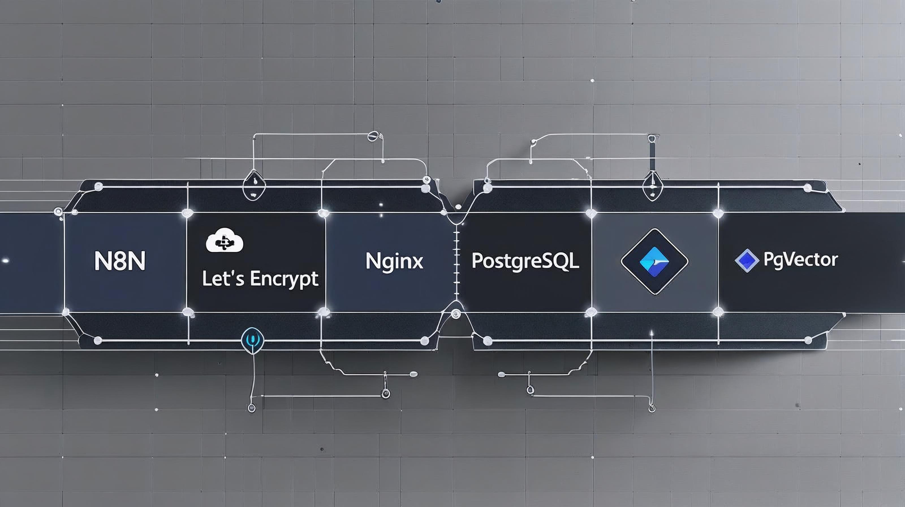

# n8n with HTTPS using Docker, Nginx & Let's Encrypt

<p align="center">
  
</p>

**Version:** 2.0.0  
**Release Date:** November 30th, 2025


A production-ready self-hosted deployment of n8n workflow automation with HTTPS, automated SSL certificate management, and PostgreSQL with pgvector for AI/RAG workflows. Features a **fully interactive setup script** that handles everything from Docker installation to SSL certificate verification - no manual configuration file editing required!

---

## Table of Contents

- [What's New in v2.0.0](#whats-new-in-v200)
- [What This Deploys](#what-this-deploys)
- [Features](#features)
- [Prerequisites](#prerequisites)
- [Quick Start](#quick-start)
- [Interactive Setup Guide](#interactive-setup-guide)
  - [Running as Root](#running-as-root)
  - [Docker Installation](#1-docker-installation)
  - [System Checks](#2-system-checks)
  - [DNS Provider Selection](#3-dns-provider-selection)
  - [Domain Configuration](#4-domain-configuration)
  - [Database Configuration](#5-database-configuration)
  - [Container Names](#6-container-names)
  - [Email & Timezone](#7-email--timezone)
  - [Encryption Key](#8-encryption-key)
  - [Portainer Agent](#9-portainer-agent-optional)
  - [Configuration Summary](#10-configuration-summary)
  - [Deployment & Testing](#11-deployment--testing)
- [DNS Provider Setup Details](#dns-provider-setup-details)
- [SSL Certificate Auto-Renewal](#ssl-certificate-auto-renewal)
- [Accessing n8n](#accessing-n8n)
- [Docker Commands Reference](#docker-commands-reference)
- [Troubleshooting](#troubleshooting)
- [Proxmox LXC Troubleshooting](#proxmox-lxc-troubleshooting)
- [Architecture](#architecture)
- [Security Notes](#security-notes)
- [Manual Configuration](#manual-configuration)
- [Contributing](#contributing)
- [License](#license)

---

## What's New in v2.0.0

### Fully Interactive Setup Script

The setup script has been completely rewritten to be **fully interactive** - no more manual editing of configuration files!

**New Features:**

- **Bare Metal Support** - Automatically installs Docker and Docker Compose on fresh servers
- **DNS Provider Selection** - Interactive menu for Cloudflare, AWS Route53, Google Cloud DNS, DigitalOcean
- **Domain Validation** - Verifies DNS resolution and checks if domain points to your server
- **Auto-Generated Credentials** - Secure passwords and encryption keys generated automatically
- **Customizable Container Names** - Change default names or use the provided defaults
- **Portainer Agent Support** - Optional container management agent for remote administration
- **Comprehensive Testing** - Verifies PostgreSQL, n8n health, nginx, SSL certificates after deployment
- **Polished UI** - Color-coded output, progress indicators, and clear section headers

---

## What This Deploys

This setup deploys a complete, production-ready n8n automation platform with:

| Component | Description |
|-----------|-------------|
| **n8n** | Workflow automation tool (latest version) |
| **PostgreSQL 16** | Database with pgvector extension for AI embeddings |
| **Nginx** | Reverse proxy handling SSL/TLS termination |
| **Certbot** | Automated SSL certificate management via Let's Encrypt |
| **Portainer Agent** | Optional remote container management (disabled by default) |

All running on **port 443 (HTTPS)** with valid SSL certificates that automatically renew.

---

## Features

- **Zero-Config Setup** - Fully interactive installation with no file editing required
- **Bare Metal Ready** - Installs Docker/Docker Compose if not present
- **Valid SSL Certificates** - Let's Encrypt with auto-renewal
- **DNS-01 Challenge** - No port 80/443 internet exposure needed during setup
- **Multiple DNS Providers** - Cloudflare, Route53, Google DNS, DigitalOcean, and more
- **Domain Validation** - Verifies DNS points to your server before proceeding
- **Auto-Generated Secrets** - Secure passwords and encryption keys
- **PostgreSQL + pgvector** - Ready for AI/RAG workflows
- **Auto-Renewal** - Certificates check and renew every 12 hours
- **Comprehensive Testing** - Validates all services after deployment
- **Portainer Support** - Optional agent for remote management
- **Production Ready** - Proper security headers, timeouts, and configurations

---

## Prerequisites

### Minimum Requirements

- **Server/VPS/Desktop** with:
  - 2 CPU cores (recommended)
  - 2GB RAM minimum
  - 5GB disk space
  - Internet access
- **Domain name** with DNS managed by a supported provider
- **DNS API access** (API token/credentials from your DNS provider)

### Supported Operating Systems

#### Linux (Native Docker Installation)

| OS | Versions | Auto-Install Docker |
|----|----------|---------------------|
| **Ubuntu** | 20.04, 22.04, 24.04 | ✅ Yes |
| **Debian** | 11, 12 | ✅ Yes |
| **CentOS** | 8, 9 | ✅ Yes |
| **RHEL** | 8, 9 | ✅ Yes |
| **Fedora** | 38+ | ✅ Yes |
| **Rocky Linux** | 8, 9 | ✅ Yes |
| **AlmaLinux** | 8, 9 | ✅ Yes |

#### macOS (Docker Desktop)

| OS | Versions | Docker Installation |
|----|----------|---------------------|
| **macOS** | 10.15+ (Catalina and later) | ✅ Via Homebrew or manual download |

The script will:
- Detect macOS automatically
- Offer to install Docker Desktop via Homebrew (if installed)
- Provide manual installation instructions if Homebrew is not available
- Guide you through starting Docker Desktop

#### Windows (WSL2)

| Platform | Docker Options |
|----------|----------------|
| **WSL2** (Ubuntu/Debian) | ✅ Docker Desktop for Windows (recommended) |
| **WSL2** (Ubuntu/Debian) | ✅ Native Docker in WSL2 |

The script will:
- Detect WSL environment automatically
- Check if Docker Desktop for Windows is already providing Docker
- Offer to install Docker natively in WSL2 if preferred
- Handle the lack of systemd in WSL gracefully

#### Proxmox LXC Containers

| Platform | Requirements |
|----------|--------------|
| **Proxmox LXC** | ⚠️ Requires host-level configuration |

**IMPORTANT:** Running Docker inside Proxmox LXC containers requires special configuration on the Proxmox host. The setup script will detect LXC environments and display a warning with instructions.

**Required Proxmox Configuration:**

On your **Proxmox host**, add this line to the container config:

```bash
# Edit /etc/pve/lxc/<CTID>.conf on the Proxmox host
lxc.apparmor.profile: unconfined
```

Then restart the container from the Proxmox UI before running the setup script.

**Why is this needed?**
- Docker inside LXC cannot manage AppArmor profiles without host-level permissions
- The `lxc.apparmor.profile: unconfined` setting allows Docker to function normally
- This is a Proxmox-specific requirement, not a limitation of this setup script

> **Note:** The setup script will automatically install Docker and Docker Compose if they're not already installed!

---

## Quick Start

```bash
# Clone the repository
git clone https://github.com/rjsears/n8n_nginx.git
cd n8n_nginx

# Run the interactive setup
./setup.sh
```

That's it! The script will guide you through everything.

---

## Interactive Setup Guide

The setup script provides a polished, step-by-step experience. Here's what to expect:

### Welcome Screen

```
╔═══════════════════════════════════════════════════════════════════════════╗
║                n8n HTTPS Interactive Setup v2.0.0                         ║
╚═══════════════════════════════════════════════════════════════════════════╝

  This script will guide you through setting up a production-ready
  n8n instance with HTTPS, PostgreSQL, and automatic SSL renewal.

  Features:
    - Automated SSL certificates via Let's Encrypt
    - DNS-01 challenge (no port 80/443 exposure needed)
    - PostgreSQL 16 with pgvector for AI/RAG workflows
    - Nginx reverse proxy with security headers
    - Automatic certificate renewal every 12 hours

  Ready to begin? [Y/n]:
```

---

### Running as Root

If you run the script as root (common for server administrators), you'll see a note:

```
╔═══════════════════════════════════════════════════════════════════════════╗
║                n8n HTTPS Interactive Setup v2.0.0                         ║
╚═══════════════════════════════════════════════════════════════════════════╝

  ╔═══════════════════════════════════════════════════════════════════════════╗
  ║                              NOTE                                         ║
  ║  You are running this script as root. While this will work, it's          ║
  ║  recommended to run as a regular user (the script uses sudo internally).  ║
  ╚═══════════════════════════════════════════════════════════════════════════╝

  Continue as root? [Y/n]: y
```

The script intelligently handles different execution contexts:

| Scenario | sudo for commands | Docker group prompt |
|----------|------------------|---------------------|
| Running as root | Not needed | Skipped |
| Running via `sudo ./setup.sh` | Not needed | Offered (for real user) |
| Running as regular user | Used when needed | Offered |

---

### 1. Docker Installation

The script checks if Docker and Docker Compose are installed. If not, it offers to install them automatically.

**When running as a regular user:**

```
┌─────────────────────────────────────────────────────────────────────────────┐
│ Docker Environment Check                                                    │
└─────────────────────────────────────────────────────────────────────────────┘
  ✓ Docker is installed (version: 24.0.7)
  ✓ Docker daemon is running
  ✓ Docker Compose is available (version: 2.21.0)
```

**When running as root:**

```
┌─────────────────────────────────────────────────────────────────────────────┐
│ Docker Environment Check                                                    │
└─────────────────────────────────────────────────────────────────────────────┘
  ✓ Docker is installed (version: 24.0.7)
  ✓ Docker daemon is running
  ✓ Docker Compose is available (version: 2.21.0)
  ✓ Running as root - no sudo required for Docker commands
```

**If Docker is not installed (regular user):**

```
  ⚠ Docker is not installed
  Would you like to install Docker? [Y/n]: y

───────────────────────────────────────────────────────────────────────────────

  Installing Docker and Docker Compose...

  ℹ Detected ubuntu 22.04
  ℹ Updating package index...
  ℹ Installing prerequisites...
  ℹ Adding Docker GPG key...
  ℹ Adding Docker repository...
  ℹ Installing Docker Engine and Docker Compose...
  ✓ Docker and Docker Compose installed successfully!
  ℹ Verifying installation...
  ✓ Docker is working correctly
  Would you like to add your user to the docker group? (recommended) [Y/n]: y
  ✓ User added to docker group
  ⚠ You will need to log out and back in for this to take effect
```

**If Docker is not installed (as root):**

```
  ⚠ Docker is not installed
  Would you like to install Docker? [Y/n]: y

───────────────────────────────────────────────────────────────────────────────

  Installing Docker and Docker Compose...

  ℹ Detected ubuntu 22.04
  ℹ Updating package index...
  ℹ Installing prerequisites...
  ℹ Adding Docker GPG key...
  ℹ Adding Docker repository...
  ℹ Installing Docker Engine and Docker Compose...
  ✓ Docker and Docker Compose installed successfully!
  ℹ Verifying installation...
  ✓ Docker is working correctly
  ✓ Running as root - no docker group membership needed
```

**On macOS (with Homebrew):**

```
┌─────────────────────────────────────────────────────────────────────────────┐
│ Docker Environment Check                                                    │
└─────────────────────────────────────────────────────────────────────────────┘
  ⚠ Docker is not installed
  Would you like to install Docker? [Y/n]: y

───────────────────────────────────────────────────────────────────────────────

  Installing Docker and Docker Compose...

  ℹ Detected macOS
  ℹ Homebrew detected
  Install Docker Desktop using Homebrew? [Y/n]: y
  ℹ Installing Docker Desktop via Homebrew...
  ✓ Docker Desktop installed!

  IMPORTANT: You need to start Docker Desktop manually:
    1. Open Docker from Applications folder
    2. Complete the Docker Desktop setup wizard
    3. Wait for Docker to start (whale icon in menu bar)
    4. Run this script again

  Have you started Docker Desktop and it's running? [y/N]: y
  ✓ Docker is running!
```

**On WSL2:**

```
┌─────────────────────────────────────────────────────────────────────────────┐
│ Docker Environment Check                                                    │
└─────────────────────────────────────────────────────────────────────────────┘
  ⚠ Docker is not installed
  Would you like to install Docker? [Y/n]: y

───────────────────────────────────────────────────────────────────────────────

  Installing Docker and Docker Compose...

  ℹ Detected WSL (Windows Subsystem for Linux)

  You have two options for Docker in WSL:

  Option 1: Docker Desktop for Windows (recommended):
    1. Download Docker Desktop from: https://www.docker.com/products/docker-desktop/
    2. Install and enable 'Use WSL 2 based engine' in settings
    3. Enable integration with your WSL distro in Settings > Resources > WSL Integration
    4. Run this script again

  Option 2: Native Docker in WSL2:
    Install Docker directly in your WSL distro (requires WSL2)

  Would you like to install Docker natively in WSL2? [y/N]: y
  ℹ Installing Docker natively in WSL...
  ℹ Detected ubuntu 22.04 in WSL
  ℹ Updating package index...
  ℹ Installing prerequisites...
  ℹ Adding Docker GPG key...
  ℹ Adding Docker repository...
  ℹ Installing Docker Engine and Docker Compose...
  ℹ Starting Docker daemon...
  ✓ Docker and Docker Compose installed successfully!
  ⚠ Note: You may need to start Docker manually after WSL restarts:
    sudo service docker start
```

---

### 2. System Checks

```
┌─────────────────────────────────────────────────────────────────────────────┐
│ System Requirements Check                                                   │
└─────────────────────────────────────────────────────────────────────────────┘
  ✓ Disk space: 45GB available (5GB required)
  ✓ Memory: 4GB total (2GB required)
  ✓ Port 443 is available
  ✓ OpenSSL is available
  ✓ curl is available
  ✓ Internet connectivity OK
```

---

### 3. DNS Provider Selection

```
┌─────────────────────────────────────────────────────────────────────────────┐
│ DNS Provider Configuration                                                  │
└─────────────────────────────────────────────────────────────────────────────┘
  Let's Encrypt uses DNS validation to issue SSL certificates.
  This requires API access to your DNS provider.

  Select your DNS provider:

    1) Cloudflare
    2) AWS Route 53
    3) Google Cloud DNS
    4) DigitalOcean
    5) Other (manual configuration)

  Enter your choice [1-5]: 1

───────────────────────────────────────────────────────────────────────────────

  Cloudflare API Configuration

  You need a Cloudflare API token with the following permissions:
    - Zone:DNS:Edit (for your domain's zone)

  Create one at: https://dash.cloudflare.com/profile/api-tokens

  Enter your Cloudflare API token [hidden]:
  ✓ Cloudflare credentials saved to cloudflare.ini
```

---

### 4. Domain Configuration

The script validates your domain and checks if it resolves to your server:

```
┌─────────────────────────────────────────────────────────────────────────────┐
│ Domain Configuration                                                        │
└─────────────────────────────────────────────────────────────────────────────┘
  Enter the domain name where n8n will be accessible.
  Example: n8n.yourdomain.com

  Enter your n8n domain [n8n.example.com]: n8n.mycompany.com

───────────────────────────────────────────────────────────────────────────────

  Validating domain configuration...

  ℹ Resolving n8n.mycompany.com...
  ✓ Domain resolves to: 203.0.113.50
  ✓ Domain IP matches this server
  ℹ Testing connectivity to 203.0.113.50...
  ✓ Host 203.0.113.50 is reachable
```

**If domain doesn't match server IP:**

```
  ⚠ Domain IP (198.51.100.25) does not match any local IP

  Local IP addresses on this machine:
    - 203.0.113.50
    - 10.0.0.5

  IMPORTANT:
  The domain n8n.mycompany.com points to 198.51.100.25
  but this server's IPs are different.

  This will cause the n8n stack to fail because:
    - SSL certificate validation will fail
    - Webhooks won't reach this server
    - The n8n UI won't be accessible

  ╔═══════════════════════════════════════════════════════════════════════════╗
  ║                              WARNING                                      ║
  ║  The domain validation found issues that may prevent n8n from working.    ║
  ║  Please ensure your DNS is properly configured before continuing.         ║
  ╚═══════════════════════════════════════════════════════════════════════════╝

  Do you understand the risks and want to continue? [y/N]:
```

---

#### Understanding DNS Configuration: Cloudflare Tunnel vs Port Forwarding

How your domain should be configured depends on how external traffic reaches your n8n server:

**Option 1: Cloudflare Tunnel**

If you're using Cloudflare Tunnel, your domain MUST resolve to the **INTERNAL IP address** of your server (an RFC1918 private IP like `192.168.x.x`, `10.x.x.x`, or `172.16-31.x.x`).

```
┌─────────────────────────────────────────────────────────────────────────────┐
│  CLOUDFLARE TUNNEL - DNS Configuration                                     │
├─────────────────────────────────────────────────────────────────────────────┤
│                                                                             │
│   n8n.yourdomain.com ──────► A Record: 192.168.50.50                       │
│                              (Your server's INTERNAL IP)                    │
│                                                                             │
│   Why Internal IP?                                                          │
│   The cloudflared daemon performs a LOCAL host lookup for your domain       │
│   and uses that IP (192.168.50.50) as the routing endpoint.                │
│                                                                             │
│   Example: n8n.mycompany.com → A → 192.168.50.50                           │
│                                                                             │
└─────────────────────────────────────────────────────────────────────────────┘
```

**Setup Script Behavior for Cloudflare Tunnel:**
- Validates that your domain resolves to your server's **INTERNAL IP**
- The cloudflared daemon performs a local host lookup for your domain
- This internal IP is used as the tunnel's routing endpoint
- Prompts for your Cloudflare Tunnel token
- Configures the cloudflared container automatically

**Option 2: Port Forwarding (No Cloudflare Tunnel)**

If you're NOT using Cloudflare Tunnel and are instead using traditional port forwarding through your router/firewall, your domain should resolve to your **EXTERNAL (public) IP address**.

```
┌─────────────────────────────────────────────────────────────────────────────┐
│  PORT FORWARDING - DNS Configuration                                        │
├─────────────────────────────────────────────────────────────────────────────┤
│                                                                             │
│   n8n.yourdomain.com ──────► A Record: 203.0.113.1                         │
│                              (Your firewall's EXTERNAL/PUBLIC IP)           │
│                                                                             │
│   Your firewall/router must forward port 443 to your server:               │
│   External:443 ──────► Internal Server: 192.168.50.50:443                  │
│                                                                             │
│   Example: n8n.mycompany.com → A → 203.0.113.1 (public IP)                 │
│                                                                             │
└─────────────────────────────────────────────────────────────────────────────┘
```

**Setup Script Behavior for Port Forwarding:**
- **Skips IP validation** (no automatic check)
- Performs an nslookup on your domain and displays the resolved IP
- Informs you that this IP should be the **EXTERNAL IP** on your firewall
- Tells you to forward port 443 to your server's internal IP (where n8n is installed)
- Example: If your server's internal IP is 192.168.50.50, port 443 on your firewall should forward to 192.168.50.50:443

**Important Notes:**
- **SSL certificates are required for both methods** - n8n requires HTTPS for webhooks and CORS compliance
- Both methods use DNS-01 challenge for Let's Encrypt (no port 80 exposure needed)

---

### 5. Database Configuration

```
┌─────────────────────────────────────────────────────────────────────────────┐
│ PostgreSQL Database Configuration                                           │
└─────────────────────────────────────────────────────────────────────────────┘
  Configure your PostgreSQL database settings.
  These credentials will be used by n8n to store data.

  Database name [n8n]:
  Database username [n8n]:

  Enter a strong password for the database.
  Leave blank to auto-generate a secure password.

  Database password [hidden]:
  ✓ Generated secure database password
```

---

### 6. Container Names

```
┌─────────────────────────────────────────────────────────────────────────────┐
│ Container Names Configuration                                               │
└─────────────────────────────────────────────────────────────────────────────┘
  The following default container names will be used:

    PostgreSQL:  n8n_postgres
    n8n:         n8n
    Nginx:       n8n_nginx
    Certbot:     n8n_certbot

  Would you like to customize these names? [y/N]: n
  ✓ Container names configured
```

---

### 7. Email & Timezone

```
┌─────────────────────────────────────────────────────────────────────────────┐
│ Let's Encrypt Email Configuration                                           │ 
└─────────────────────────────────────────────────────────────────────────────┘
  Let's Encrypt requires an email address for:
    - Certificate expiration notifications
    - Account recovery

  Email address for Let's Encrypt [admin@mycompany.com]:

┌─────────────────────────────────────────────────────────────────────────────┐
│ Timezone Configuration                                                      │
└─────────────────────────────────────────────────────────────────────────────┘
  Detected system timezone: America/New_York

  Use America/New_York as the timezone for n8n? [Y/n]:
  ✓ Timezone set to: America/New_York
```

---

### 8. Encryption Key

```
┌─────────────────────────────────────────────────────────────────────────────┐
│ Encryption Key Configuration                                                │
└─────────────────────────────────────────────────────────────────────────────┘
  n8n uses an encryption key to secure credentials stored in the database.
  This key should be kept secret and backed up securely.

  ✓ Generated secure encryption key using OpenSSL

  ⚠ IMPORTANT: Save your encryption key in a secure location!
  If you lose this key, you will not be able to decrypt stored credentials.
```

---

### 9. Portainer Agent (Optional)

```
┌─────────────────────────────────────────────────────────────────────────────┐
│ Portainer Agent Configuration                                               │
└─────────────────────────────────────────────────────────────────────────────┘
  Portainer is a popular container management UI.
  If you're running Portainer on another server, you can install
  the Portainer Agent here to manage this n8n stack remotely.

  Are you using Portainer to manage your containers? [y/N]: y
  ✓ Portainer Agent will be included in docker-compose.yaml

  The agent will be accessible on port 9001.
  Add this server to Portainer using: <this-server-ip>:9001
```

---

### 10. Configuration Summary

```
┌─────────────────────────────────────────────────────────────────────────────┐
│ Configuration Summary                                                       │
└─────────────────────────────────────────────────────────────────────────────┘

  Domain & URL:
    Domain:              n8n.mycompany.com
    URL:                 https://n8n.mycompany.com

  DNS Provider:
    Provider:            cloudflare
    Credentials file:    cloudflare.ini

  Database:
    Name:                n8n
    User:                n8n
    Password:            [configured]

  Container Names:
    PostgreSQL:          n8n_postgres
    n8n:                 n8n
    Nginx:               n8n_nginx
    Certbot:             n8n_certbot

  Other Settings:
    Email:               admin@mycompany.com
    Timezone:            America/New_York
    Encryption key:      [configured]
    Portainer Agent:     enabled

───────────────────────────────────────────────────────────────────────────────

  Is this configuration correct? [Y/n]:
```

---

### 11. Deployment & Testing

```
┌─────────────────────────────────────────────────────────────────────────────┐
│ Generating Configuration Files                                              │
└─────────────────────────────────────────────────────────────────────────────┘

  [1/4] Generating docker-compose.yaml

  ✓ docker-compose.yaml generated

  [2/4] Generating nginx.conf

  ✓ nginx.conf generated

  [3/4] Saving configuration backup

  ✓ Configuration saved to /home/user/n8n_nginx/.n8n_setup_config

  [4/4] Creating Let's Encrypt Docker volume

  ✓ Volume 'letsencrypt' created

  ✓ All configuration files generated successfully!

  Would you like to deploy the stack now? [Y/n]: y

┌─────────────────────────────────────────────────────────────────────────────┐
│ Deploying n8n Stack                                                         │
└─────────────────────────────────────────────────────────────────────────────┘

  [1/6] Starting PostgreSQL database

  Waiting for PostgreSQL to be ready...
  ✓ PostgreSQL is running and healthy

  [2/6] Obtaining SSL certificate from Let's Encrypt

  Domain: n8n.mycompany.com
  This uses DNS-01 challenge (no ports 80/443 exposure required)

  Saving debug log to /var/log/letsencrypt/letsencrypt.log
  Requesting a certificate for n8n.mycompany.com
  Waiting 60 seconds for DNS propagation

  Successfully received certificate.
  Certificate is saved at: /etc/letsencrypt/live/n8n.mycompany.com/fullchain.pem
  Key is saved at:         /etc/letsencrypt/live/n8n.mycompany.com/privkey.pem

  ✓ SSL certificate obtained successfully!

  [3/6] Copying certificates to Docker volume

  ✓ Certificates copied to Docker volume

  [4/6] Starting all services

  Waiting for services to start...
  ✓ All services started

  [5/6] Verifying services

  Checking PostgreSQL...
  ✓ PostgreSQL is responding
  ✓ PostgreSQL authentication successful
  Checking n8n...
  ✓ n8n is responding
  Checking Nginx...
  ✓ Nginx configuration is valid

  Container Status:
  NAMES          STATUS                   PORTS
  n8n_postgres   Up 2 minutes (healthy)
  n8n            Up About a minute
  n8n_nginx      Up About a minute        0.0.0.0:443->443/tcp
  n8n_certbot    Up About a minute

  [6/6] Testing SSL certificate and connectivity

  Testing HTTPS connectivity to https://n8n.mycompany.com...
  ✓ SSL certificate is valid
  notBefore=Nov 29 00:00:00 2025 GMT
  notAfter=Feb 27 23:59:59 2026 GMT
  ✓ n8n is accessible via HTTPS

  ✓ All connectivity tests passed!

╔═══════════════════════════════════════════════════════════════════════════╗
║                           Setup Complete!                                 ║
╚═══════════════════════════════════════════════════════════════════════════╝

  Your n8n instance is now running!

  Access your n8n instance:
    https://n8n.mycompany.com

  Useful Commands:
    View logs:         docker compose logs -f
    View n8n logs:     docker compose logs -f n8n
    Stop services:     docker compose down
    Start services:    docker compose up -d
    Restart services:  docker compose restart
    View status:       docker compose ps

  Important Files:
    Docker Compose:    /home/user/n8n_nginx/docker-compose.yaml
    Nginx Config:      /home/user/n8n_nginx/nginx.conf
    DNS Credentials:   /home/user/n8n_nginx/cloudflare.ini
    Setup Config:      /home/user/n8n_nginx/.n8n_setup_config

  Security Reminders:
    - Create your n8n owner account immediately
    - Back up your encryption key securely
    - Keep your DNS credentials file secure (chmod 600)
    - SSL certificates auto-renew every 12 hours

───────────────────────────────────────────────────────────────────────────────

  Thank you for using n8n HTTPS Setup Script v2.0.0
  Created by Richard J. Sears - richardjsears@gmail.com
```

---

## DNS Provider Setup Details

### Cloudflare (Recommended)

**Most Popular Choice** - Free tier available, excellent API

1. **Log in to Cloudflare Dashboard** at https://dash.cloudflare.com
2. **Create API Token:**
   - Click your profile → **API Tokens**
   - Click **Create Token**
   - Use **Edit zone DNS** template
   - Configure:
     - **Permissions:** Zone → DNS → Edit
     - **Zone Resources:** Include → Specific zone → `yourdomain.com`
   - Click **Continue to summary** → **Create Token**
   - **Copy the token** (you won't see it again!)

### AWS Route 53

1. Go to IAM → Users → Create User
2. Attach policy: `AmazonRoute53FullAccess`
3. Create access key and save both the Access Key ID and Secret Access Key

### Google Cloud DNS

1. Go to IAM & Admin → Service Accounts
2. Create service account with **DNS Administrator** role
3. Create and download JSON key file

### DigitalOcean

1. Go to API → Tokens/Keys
2. Generate New Token (read + write access)
3. Copy the token

---

## SSL Certificate Auto-Renewal

The **certbot container** handles automatic certificate renewal:

**Process:**

1. **Every 12 hours**, certbot checks if certificates need renewal
2. Let's Encrypt certificates are valid for **90 days**
3. Certbot attempts renewal at **30 days before expiration**
4. Uses **DNS-01 challenge** via your DNS provider API
5. **Nginx automatically reloads** after successful renewal

**Verify Auto-Renewal:**

```bash
# Check when certificates expire
docker run --rm \
  -v letsencrypt:/etc/letsencrypt \
  certbot/certbot:latest \
  certificates

# Test renewal process (dry-run)
docker exec n8n_certbot certbot renew --dry-run

# View certbot logs
docker logs n8n_certbot
```

---

## Accessing n8n

### Initial Access

1. Open your browser to: `https://n8n.your-domain.com` (Whatever you set this as)
2. You'll see the n8n setup page
3. Create your **owner account** (first user = admin)
4. Start building workflows!

### Valid SSL Certificate

Your browser will show:
- Green padlock (valid HTTPS)
- Certificate issued by Let's Encrypt
- Valid for 90 days (auto-renews at 60 days)

---

## Docker Commands Reference

### Starting and Stopping

```bash
# Start all services
docker compose up -d

# Stop all services
docker compose down

# Restart specific service
docker compose restart n8n
docker compose restart nginx

# Stop and remove everything (including data!)
docker compose down -v
```

### Viewing Logs

```bash
# View all logs
docker compose logs -f

# View specific service logs
docker compose logs -f n8n
docker compose logs -f nginx
docker compose logs -f certbot
docker compose logs -f postgres

# Last 50 lines
docker compose logs --tail=50 n8n
```

### Checking Status

```bash
# Check all container status
docker compose ps

# Check resource usage
docker stats
```

### Updating n8n

```bash
# Pull latest n8n image
docker compose pull n8n

# Recreate container with new image
docker compose up -d n8n

# Verify version
docker exec n8n n8n --version
```

### Database Operations

```bash
# Connect to PostgreSQL
docker exec -it n8n_postgres psql -U n8n -d n8n

# Backup database
docker exec n8n_postgres pg_dump -U n8n -d n8n -F c -f /tmp/backup.dump
docker cp n8n_postgres:/tmp/backup.dump ./backup-$(date +%Y%m%d).dump

# Check database size
docker exec n8n_postgres psql -U n8n -d n8n \
  -c "SELECT pg_size_pretty(pg_database_size('n8n'));"
```

---

## Troubleshooting

### n8n Not Accessible

```bash
# 1. Check all containers are running
docker compose ps

# 2. Check port 443 is listening
ss -tulpn | grep :443

# 3. Check nginx logs
docker logs n8n_nginx

# 4. Test from server itself
curl -k https://localhost/healthz
```

### Certificate Errors

```bash
# 1. Check if certificates exist
docker run --rm -v letsencrypt:/certs alpine \
  ls -la /certs/live/your-domain.com/

# 2. Verify certificate details
openssl s_client -connect your-domain.com:443 -servername your-domain.com

# 3. Re-run setup if certificates missing
docker compose down
./setup.sh
```

### 502 Bad Gateway

```bash
# 1. Check n8n is running
docker compose ps n8n

# 2. Check n8n logs
docker logs n8n

# 3. Restart n8n
docker compose restart n8n
```

### Database Connection Issues

```bash
# 1. Check PostgreSQL is healthy
docker compose ps postgres

# 2. Test database connection
docker exec n8n_postgres psql -U n8n -d n8n -c "SELECT version();"
```

### DNS Validation Fails

- Verify DNS provider API token is valid
- Check token has correct permissions
- Increase propagation time (edit the certbot command in docker-compose.yaml)
- Check certbot logs: `docker logs n8n_certbot`

---

## Proxmox LXC Troubleshooting

Running Docker inside Proxmox LXC containers requires special configuration. If you encounter issues, follow these steps:

### AppArmor Blocking Docker

**Error:**
```
Error response from daemon: AppArmor enabled on system but the docker-default
profile could not be loaded: apparmor_parser: Access denied.
```

**Solution:**

On your **Proxmox host** (not inside the container):

```bash
# Edit the container config
nano /etc/pve/lxc/<CTID>.conf

# Add this line:
lxc.apparmor.profile: unconfined
```

Then restart the container from Proxmox UI or CLI:
```bash
pct stop <CTID> && pct start <CTID>
```

### Sysctl Permission Denied

**Error:**
```
OCI runtime create failed: unable to start container process:
error during container init: open sysctl net.ipv4.ip_unprivileged_port_start
```

**Solution:**

1. Ensure Proxmox is updated to the latest version
2. Verify `lxc.apparmor.profile: unconfined` is set
3. Restart the container from Proxmox

### Recommended LXC Container Settings

For optimal Docker compatibility in Proxmox LXC:

```bash
# /etc/pve/lxc/<CTID>.conf

# Required for Docker
features: nesting=1
lxc.apparmor.profile: unconfined

# Optional: if you need keyctl (some containers may require it)
features: nesting=1,keyctl=1
```

### Verifying LXC Configuration

Inside the container, check if Docker works:

```bash
# Test Docker
docker run --rm hello-world

# Check virtualization type
systemd-detect-virt
# Should output: lxc
```

### Still Having Issues?

If Docker still fails after configuration:

1. **Check container is privileged** (if unprivileged, try privileged)
2. **Verify nesting is enabled** in Proxmox container options
3. **Update Proxmox** to latest version (fixes known bugs)
4. **Check Proxmox forum** for version-specific issues

---

## Architecture

```
┌─────────────────────────────────────────────────────────────────────────────┐
│                            Internet / Users                                 │
└─────────────────────────────────────────────────────────────────────────────┘
                                    │
                                    │ HTTPS (443)
                                    ▼
┌─────────────────────────────────────────────────────────────────────────────┐
│                              nginx:alpine                                   │
│  - SSL/TLS Termination                                                      │
│  - Reverse Proxy                                                            │
│  - Security Headers                                                         │
│  - Port: 443 → n8n:5678                                                     │
└─────────────────────────────────────────────────────────────────────────────┘
                                    │
                                    │ HTTP (internal)
                                    ▼
┌─────────────────────────────────────────────────────────────────────────────┐
│                              n8n:latest                                     │
│  - Workflow Automation                                                      │
│  - Webhooks                                                                 │
│  - Port: 5678 (internal)                                                    │
└─────────────────────────────────────────────────────────────────────────────┘
                                    │
                                    │ PostgreSQL Protocol
                                    ▼
┌─────────────────────────────────────────────────────────────────────────────┐
│                        pgvector/pgvector:pg16                               │
│  - Database Storage                                                         │
│  - Vector Embeddings (pgvector)                                             │
│  - Port: 5432 (internal)                                                    │
└─────────────────────────────────────────────────────────────────────────────┘

┌─────────────────────────────────────────────────────────────────────────────┐
│                     certbot/dns-cloudflare:latest                           │
│  - SSL Certificate Management                                               │
│  - Auto-renewal every 12 hours                                              │
│  - DNS-01 Challenge                                                         │
└─────────────────────────────────────────────────────────────────────────────┘

┌─────────────────────────────────────────────────────────────────────────────┐
│                  portainer/agent:latest (Optional)                          │
│  - Remote Container Management                                              │
│  - Port: 9001                                                               │
└─────────────────────────────────────────────────────────────────────────────┘
```

---

## Security Notes

### Credentials Security

- **Never commit** credential files to version control
- Store encryption keys securely (password manager)
- All credential files are automatically set to `chmod 600`
- The `.gitignore` file excludes all sensitive files

### Network Security

- All internal communication is within Docker network
- Only port 443 exposed to internet
- Port 9001 exposed only if Portainer Agent is enabled
- No port 80 exposure required (DNS-01 challenge)

### SSL/TLS Configuration

- TLS 1.2 and 1.3 only
- Strong cipher suites (ECDHE, AES-GCM)
- Security headers configured (X-Frame-Options, X-Content-Type-Options, etc.)

### Backup Strategy

**Critical Data:**
- PostgreSQL database (workflows, credentials, executions)
- n8n encryption key (needed to decrypt credentials)
- Configuration backup file (`.n8n_setup_config`)

**Recommended Backup:**
```bash
# Daily PostgreSQL backup
docker exec n8n_postgres pg_dump -U n8n -d n8n -F c > backup-$(date +%Y%m%d).dump
```

---

## Manual Configuration

If you prefer to configure files manually instead of using the interactive setup:

### 1. Configure DNS Credentials

```bash
# For Cloudflare
cp cloudflare.ini.example cloudflare.ini
# Edit and add your token
chmod 600 cloudflare.ini
```

### 2. Edit docker-compose.yaml

Update these values:

- `POSTGRES_PASSWORD` (lines 10 and 33)
- `N8N_HOST`, `WEBHOOK_URL`, `N8N_EDITOR_BASE_URL` (lines 36-40)
- `N8N_ENCRYPTION_KEY` (line 53) - generate with `openssl rand -base64 32`
- `GENERIC_TIMEZONE` and `TZ` (lines 43-44)

### 3. Edit nginx.conf

Update:
- `server_name` (line 24)
- SSL certificate paths (lines 27-28)

### 4. Run Setup

```bash
./setup.sh
```

The script will detect your configuration and proceed with deployment.

---

## Contributing

Contributions are welcome! Please feel free to submit a Pull Request.

### Reporting Issues

When reporting issues, please include:
- Operating system and version
- Docker and Docker Compose versions
- DNS provider being used
- Full error messages and logs
- Steps to reproduce

---

## License

MIT License - See LICENSE file for details

---

## Acknowledgments

- [n8n.io](https://n8n.io) - Workflow automation platform
- [Let's Encrypt](https://letsencrypt.org) - Free SSL certificates
- [Certbot](https://certbot.eff.org) - SSL automation tool
- [PostgreSQL](https://www.postgresql.org) - Database
- [pgvector](https://github.com/pgvector/pgvector) - Vector similarity search
- [Nginx](https://nginx.org) - Web server and reverse proxy
- [Portainer](https://www.portainer.io) - Container management

---

## Support

- **Issues:** [GitHub Issues](https://github.com/rjsears/n8n_nginx/issues)
- **Discussions:** [GitHub Discussions](https://github.com/rjsears/n8n_nginx/discussions)
- **n8n Community:** [n8n.io/community](https://n8n.io/community)

---

## Acknowledgments

* **My Amazing and loving family!** My family puts up with all my coding and automation projects and encourages me in everything. Without them, my projects would not be possible.
* **My brother James**, who is a continual source of inspiration to me and others. Everyone should have a brother as awesome as mine!