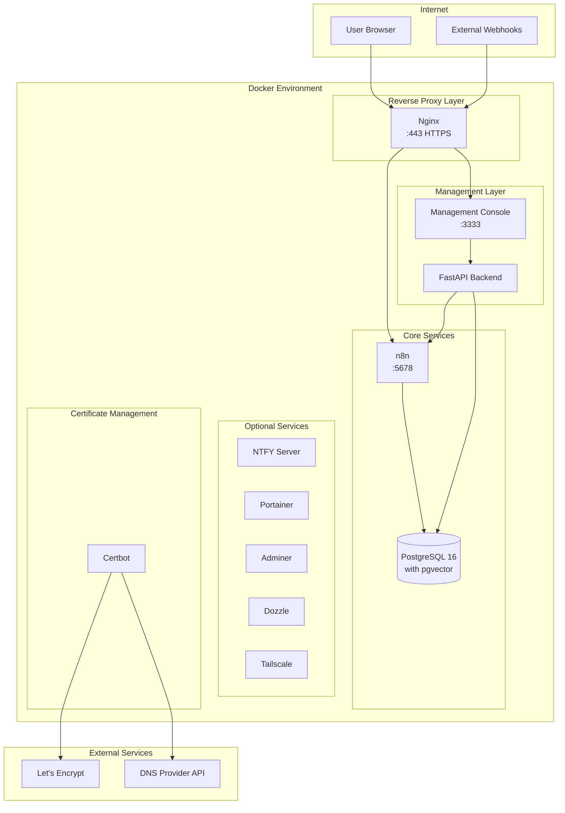
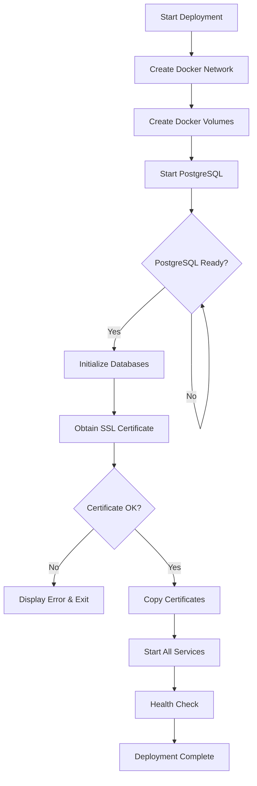

<p align="center">
  
</p>

<p align="center">
  <em>"Enterprise-grade automation infrastructure shouldn't require an enterprise budget."</em>
</p>

<p align="center">
  <a href="LICENSE"></a>
  <a href="https://github.com/rjsears/n8n_nginx/commits"></a>
  <a href="https://github.com/rjsears/n8n_nginx/issues"></a>
  <a href="CHANGELOG.md"></a>
</p>

<p align="center">
  <a href="https://n8n.io"></a>
  <a href="https://www.postgresql.org"></a>
  <a href="https://docker.com"></a>
  <a href="https://nginx.org"></a>
  <a href="https://letsencrypt.org"></a>
</p>

<p align="center">
  <a href="https://vuejs.org"></a>
  <a href="https://fastapi.tiangolo.com"></a>
  <a href="https://tailscale.com"></a>
  <a href="https://ntfy.sh"></a>
</p>

---

# n8n Enterprise Deployment Suite

A production-ready, self-hosted deployment solution for [n8n](https://n8n.io) workflow automation with integrated HTTPS/SSL certificate management, PostgreSQL database with pgvector for AI/RAG workflows, comprehensive backup and disaster recovery, multi-channel notifications, and a full-featured web-based management console.

---

## Table of Contents

### Part I: Introduction
- [1. Overview](#1-overview)
  - [1.1 What is n8n Enterprise Deployment Suite?](#11-what-is-n8n-enterprise-deployment-suite)
  - [1.2 Key Features at a Glance](#12-key-features-at-a-glance)
  - [1.3 Architecture Overview](#13-architecture-overview)
  - [1.4 Technology Stack](#14-technology-stack)
- [2. System Requirements](#2-system-requirements)
  - [2.1 Hardware Requirements](#21-hardware-requirements)
  - [2.2 Software Requirements](#22-software-requirements)
  - [2.3 Supported Operating Systems](#23-supported-operating-systems)
  - [2.4 Network Requirements](#24-network-requirements)
  - [2.5 DNS Provider Requirements](#25-dns-provider-requirements)

### Part II: Installation
- [3. Pre-Installation Preparation](#3-pre-installation-preparation)
  - [3.1 Gathering Required Information](#31-gathering-required-information)
  - [3.2 Preparing Your Server](#32-preparing-your-server)
  - [3.3 Downloading the Repository](#33-downloading-the-repository)
- [4. Interactive Setup](#4-interactive-setup)
  - [4.1 Starting the Setup](#41-starting-the-setup)
  - [4.2 Docker Installation](#42-docker-installation)
  - [4.3 Domain Configuration](#43-domain-configuration)
  - [4.4 DNS Provider Selection](#44-dns-provider-selection)
  - [4.5 Database Configuration](#45-database-configuration)
  - [4.6 Administrator Account Setup](#46-administrator-account-setup)
  - [4.7 Security Configuration](#47-security-configuration)
  - [4.8 Container Naming](#48-container-naming)
  - [4.9 Timezone Configuration](#49-timezone-configuration)
  - [4.10 Optional Services](#410-optional-services)
  - [4.11 Configuration Summary](#411-configuration-summary)
  - [4.12 Deployment Process](#412-deployment-process)
  - [4.13 Post-Installation Summary](#413-post-installation-summary)

### Part III: Initial Configuration
- [5. First-Time Setup](#5-first-time-setup)
  - [5.1 Accessing the n8n Interface](#51-accessing-the-n8n-interface)
  - [5.2 Accessing the Management Console](#52-accessing-the-management-console)
  - [5.3 Configuring the n8n API Connection](#53-configuring-the-n8n-api-connection)
  - [5.4 Deploying Test Workflows](#54-deploying-test-workflows)
  - [5.5 IP Access Control Configuration](#55-ip-access-control-configuration)

### Part IV: Management Console Reference
- [6. Dashboard](#6-dashboard)
- [7. Backup Management](#7-backup-management)
  - [7.1 Understanding the Backup System](#71-understanding-the-backup-system)
  - [7.2 Backup History](#72-backup-history)
  - [7.3 Manual Backups](#73-manual-backups)
  - [7.4 Scheduled Backups](#74-scheduled-backups)
  - [7.5 Backup Verification](#75-backup-verification)
  - [7.6 Restoration](#76-restoration)
  - [7.7 Backup Settings](#77-backup-settings)
  - [7.8 Backup Notifications](#78-backup-notifications)
- [8. Notification System](#8-notification-system)
  - [8.1 Notification Architecture](#81-notification-architecture)
  - [8.2 Notification Channels](#82-notification-channels)
  - [8.3 Creating Notification Channels](#83-creating-notification-channels)
  - [8.4 Notification Groups](#84-notification-groups)
  - [8.5 NTFY Configuration](#85-ntfy-configuration)
  - [8.6 Standalone NTFY Server Setup](#86-standalone-ntfy-server-setup)
  - [8.7 n8n Webhook Integration](#87-n8n-webhook-integration)
- [9. System Notifications](#9-system-notifications)
  - [9.1 Event Types](#91-event-types)
  - [9.2 Event Configuration Options](#92-event-configuration-options)
  - [9.3 Escalation](#93-escalation)
  - [9.4 Global Settings](#94-global-settings)
  - [9.5 Per-Container Configuration](#95-per-container-configuration)
  - [9.6 Flapping Detection](#96-flapping-detection)
- [10. Container Management](#10-container-management)
- [11. Workflow Management](#11-workflow-management)
- [12. System Monitoring](#12-system-monitoring)
- [13. Settings](#13-settings)

### Part V: Operations and Maintenance
- [14. Daily Operations](#14-daily-operations)
- [15. SSL Certificate Management](#15-ssl-certificate-management)
- [16. Database Management](#16-database-management)
- [17. Container Maintenance](#17-container-maintenance)
- [18. Backup Best Practices](#18-backup-best-practices)

### Part VI: Advanced Configuration
- [19. Tailscale Integration](#19-tailscale-integration)
- [20. Cloudflare Tunnel](#20-cloudflare-tunnel)
- [21. NFS Backup Storage](#21-nfs-backup-storage)
- [22. Custom Nginx Configuration](#22-custom-nginx-configuration)
- [23. Environment Variables Reference](#23-environment-variables-reference)

### Part VII: Troubleshooting
- [24. Common Issues and Solutions](#24-common-issues-and-solutions)
- [25. Logs and Diagnostics](#25-logs-and-diagnostics)

### Part VIII: Reference
- [26. Command Reference](#26-command-reference)
- [27. File Locations](#27-file-locations)
- [28. Glossary](#28-glossary)

### Appendices
- [Appendix A: DNS Provider Credential Setup](#appendix-a-dns-provider-credential-setup)
- [Appendix B: Tailscale Auth Key Generation](#appendix-b-tailscale-auth-key-generation)
- [Appendix C: Cloudflare Tunnel Token Generation](#appendix-c-cloudflare-tunnel-token-generation)
- [Appendix D: n8n API Key Generation](#appendix-d-n8n-api-key-generation)

---

# Part I: Introduction

## 1. Overview

### 1.1 What is n8n Enterprise Deployment Suite?

The n8n Enterprise Deployment Suite is a comprehensive, production-ready deployment and management solution for self-hosted n8n workflow automation. It combines:

- **Automated Deployment**: A single interactive script (`setup.sh`) that handles everything from Docker installation to SSL certificate acquisition
- **Enterprise Infrastructure**: PostgreSQL 16 with pgvector for AI/RAG workflows, Nginx reverse proxy with automatic HTTPS, and Let's Encrypt certificate management
- **Management Console**: A full-featured web application for monitoring, backup management, notifications, and system administration
- **Disaster Recovery**: Comprehensive backup system with verification, selective restoration, and bare-metal recovery capabilities
- **Multi-Channel Notifications**: Support for 30+ notification providers through Apprise, plus native NTFY push notifications

Whether you are running n8n for personal automation or deploying it for an organization, this suite provides the infrastructure, monitoring, and management tools typically found only in expensive enterprise solutions.

### 1.2 Key Features at a Glance

#### Deployment and Infrastructure
- One-command interactive setup with automatic Docker installation
- Automatic SSL/TLS certificate acquisition and renewal via Let's Encrypt
- Support for multiple DNS providers (Cloudflare, AWS Route 53, Google Cloud DNS, DigitalOcean)
- PostgreSQL 16 with pgvector extension for AI vector embeddings
- Nginx reverse proxy with optimized configuration for n8n
- Optional Tailscale VPN and Cloudflare Tunnel integration

#### Management Console
- Real-time system metrics dashboard (CPU, memory, disk, network)
- Docker container management (start, stop, restart, logs)
- n8n workflow monitoring and control
- Comprehensive settings management
- Dark/light theme support

#### Backup and Recovery
- Scheduled and on-demand backups
- Multiple storage backends (local, NFS)
- Backup verification with integrity checking
- Selective workflow restoration
- Full system bare-metal recovery
- Grandfather-Father-Son (GFS) retention policies
- Automatic pruning with space management

#### Notifications
- 30+ notification providers via Apprise integration
- Native NTFY push notification support
- Email notifications with customizable templates
- Webhook integration for n8n workflows
- System event notifications with configurable triggers
- L1/L2 escalation support
- Maintenance mode and quiet hours

### 1.3 Architecture Overview



#### Component Overview

| Component | Purpose |
|-----------|---------|
| **Nginx** | Reverse proxy handling HTTPS termination, routing, and security headers |
| **n8n** | Workflow automation engine |
| **PostgreSQL** | Primary database with pgvector for AI/ML vector operations |
| **Management Console** | Web-based administration interface |
| **FastAPI Backend** | REST API powering the management console |
| **Certbot** | Automatic SSL certificate acquisition and renewal |
| **NTFY** | Optional self-hosted push notification server |
| **Portainer** | Optional container management UI |
| **Adminer** | Optional database administration UI |
| **Dozzle** | Optional real-time log viewer |
| **Tailscale** | Optional VPN for secure remote access |

### 1.4 Technology Stack

#### Backend Technologies

| Technology | Version | Purpose |
|------------|---------|---------|
| Python | 3.11+ | Management console backend |
| FastAPI | Latest | Async web framework for REST API |
| SQLAlchemy | 2.0 | Async ORM for database operations |
| PostgreSQL | 16 | Primary database |
| pgvector | Latest | Vector embeddings for AI/RAG |
| APScheduler | Latest | Task scheduling for backups |
| Bcrypt | Latest | Password hashing |
| Cryptography | Latest | AES-256 encryption |

#### Frontend Technologies

| Technology | Version | Purpose |
|------------|---------|---------|
| Vue.js | 3 | Frontend framework |
| Vite | Latest | Build tool |
| Pinia | Latest | State management |
| Vue Router | Latest | Client-side routing |
| Tailwind CSS | Latest | Styling framework |
| Chart.js | Latest | Metrics visualization |
| Axios | Latest | HTTP client |

#### Infrastructure Technologies

| Technology | Purpose |
|------------|---------|
| Docker | Container runtime |
| Docker Compose | Container orchestration |
| Nginx | Reverse proxy and SSL termination |
| Certbot | Let's Encrypt certificate automation |
| Let's Encrypt | Free SSL/TLS certificates |

---

## 2. System Requirements

### 2.1 Hardware Requirements

#### Minimum Requirements

| Resource | Minimum | Recommended |
|----------|---------|-------------|
| CPU | 2 cores | 4+ cores |
| RAM | 4 GB | 8+ GB |
| Storage | 20 GB | 50+ GB SSD |
| Network | 10 Mbps | 100+ Mbps |

#### Storage Considerations

- **Operating System**: ~5 GB
- **Docker Images**: ~3 GB
- **PostgreSQL Data**: Varies with workflow complexity (plan 5-20 GB)
- **Backups**: Plan for 2-3x your database size
- **n8n Data**: Varies with execution history settings

> **Note**: If using NFS for backup storage, local storage requirements for backups are reduced.

### 2.2 Software Requirements

#### Required Software

| Software | Notes |
|----------|-------|
| Docker | Automatically installed by setup.sh if not present |
| Docker Compose | V2 plugin preferred; automatically configured |
| curl | Required for setup script |
| OpenSSL | Required for key generation |

#### Automatically Installed

The setup script will automatically install these if not present:
- Docker Engine
- Docker Compose plugin
- Required Docker images

### 2.3 Supported Operating Systems

| Operating System | Versions | Notes |
|------------------|----------|-------|
| Ubuntu | 20.04, 22.04, 24.04 | Recommended |
| Debian | 11, 12 | Fully supported |
| CentOS | 8, 9 | Stream versions |
| RHEL | 8, 9 | Enterprise Linux |
| Fedora | 38+ | Latest releases |
| Rocky Linux | 8, 9 | RHEL-compatible |
| AlmaLinux | 8, 9 | RHEL-compatible |
| macOS | 10.15+ | Requires Docker Desktop |
| Windows | 10/11 | Via WSL2 with Docker Desktop |

#### Special Environments

| Environment | Support Level | Notes |
|-------------|---------------|-------|
| Proxmox LXC | Supported | Requires `nesting=1` and `lxc.apparmor.profile: unconfined` |
| WSL2 | Supported | Requires Docker Desktop for Windows |
| Virtual Machines | Supported | Any hypervisor (VMware, VirtualBox, Hyper-V, KVM) |

### 2.4 Network Requirements

#### Required Ports

| Port | Protocol | Direction | Purpose |
|------|----------|-----------|---------|
| 443 | TCP | Inbound | HTTPS (n8n and webhooks) |
| 3333 | TCP | Inbound | Management Console (configurable) |

#### Optional Ports

| Port | Protocol | Purpose |
|------|----------|---------|
| 9001 | TCP | Portainer Agent |
| 8080 | TCP | Adminer (database UI) |
| 9999 | TCP | Dozzle (log viewer) |
| 80 | TCP | NTFY (if enabled) |

#### Firewall Considerations

- Port 443 must be accessible from the internet for webhook functionality
- Management console port (3333) should be restricted to trusted networks
- Consider using Tailscale or Cloudflare Tunnel for secure remote access

### 2.5 DNS Provider Requirements

SSL certificate acquisition requires API access to your DNS provider for DNS-01 challenge validation. The following providers are supported:

| Provider | Required Credentials | Recommended |
|----------|---------------------|-------------|
| Cloudflare | API Token with Zone:DNS:Edit permission | Yes |
| AWS Route 53 | Access Key ID + Secret Access Key | Yes |
| Google Cloud DNS | Service Account JSON key | Yes |
| DigitalOcean | API Token with read/write access | Yes |
| Manual | None (requires manual DNS record creation) | No |

> **Recommendation**: Cloudflare is recommended due to fast DNS propagation (60 seconds) and straightforward API token creation.

---

# Part II: Installation

## 3. Pre-Installation Preparation

### 3.1 Gathering Required Information

Before running the setup script, gather the following information:

#### Required Information

| Item | Description | Where to Get It |
|------|-------------|-----------------|
| Domain Name | The domain for your n8n instance (e.g., `n8n.example.com`) | Your domain registrar |
| DNS Provider Credentials | API credentials for your DNS provider | See [Appendix A](#appendix-a-dns-provider-credential-setup) |
| Email Address | For Let's Encrypt certificate notifications | Your email |
| Admin Password | Password for the management console (min 8 characters) | Create a strong password |

#### Optional Information

| Item | Description | When Needed |
|------|-------------|-------------|
| Tailscale Auth Key | Pre-authenticated key for Tailscale VPN | If using Tailscale for secure access |
| Cloudflare Tunnel Token | Token for Cloudflare Zero Trust tunnel | If using Cloudflare Tunnel |
| NFS Server Details | Server address and export path | If using NFS for backup storage |

### 3.2 Preparing Your Server

#### Step 1: Update Your System

```bash
# Ubuntu/Debian
sudo apt update && sudo apt upgrade -y

# CentOS/RHEL/Rocky/AlmaLinux
sudo dnf update -y

# Fedora
sudo dnf upgrade -y
```

#### Step 2: Ensure Required Utilities Are Installed

```bash
# Ubuntu/Debian
sudo apt install -y curl git openssl

# CentOS/RHEL/Rocky/AlmaLinux/Fedora
sudo dnf install -y curl git openssl
```

#### Step 3: Configure DNS

Ensure your domain points to your server's IP address:

1. Log in to your DNS provider's control panel
2. Create an A record pointing your domain to your server's public IP
3. Wait for DNS propagation (typically 5-30 minutes)

Verify DNS resolution:

```bash
# Check if domain resolves to your server
dig +short n8n.yourdomain.com

# Or using nslookup
nslookup n8n.yourdomain.com
```

### 3.3 Downloading the Repository

```bash
# Clone the repository
git clone https://github.com/rjsears/n8n_nginx.git

# Navigate to the directory
cd n8n_nginx

# Make setup script executable
chmod +x setup.sh
```

---

## 4. Interactive Setup

The setup script (`setup.sh`) provides a fully interactive installation experience. It guides you through each configuration step with clear prompts and validation.

### 4.1 Starting the Setup

```bash
./setup.sh
```

The setup script will display a welcome banner and begin the configuration process.

<!-- SCREENSHOT: Setup welcome screen -->
*[Screenshot placeholder: Setup script welcome banner]*

### 4.2 Docker Installation

The script automatically checks for Docker and Docker Compose. If not installed, it will offer to install them.

#### Automatic Detection

The script detects:
- Operating system type and version
- Existing Docker installation
- Docker Compose version (v1 vs v2)
- Proxmox LXC environment
- WSL2 environment

#### Docker Installation Process

If Docker is not found:

1. The script asks if you want to install Docker
2. For supported operating systems, installation is automatic
3. The script adds your user to the docker group
4. You may need to log out and back in for group changes to take effect

```
Docker is not installed. Would you like to install it now? [Y/n]
```

<!-- SCREENSHOT: Docker installation prompt -->
*[Screenshot placeholder: Docker installation prompt]*

#### AppArmor Handling (Proxmox LXC)

If running in a Proxmox LXC container, the script detects AppArmor restrictions:

```
AppArmor detected. This may prevent Docker from running properly.
Would you like to disable AppArmor for this container? [Y/n]
```

For Proxmox LXC, you need to add these settings to the container configuration:

```
lxc.apparmor.profile: unconfined
features: nesting=1
```

### 4.3 Domain Configuration

#### Entering Your Domain

```
Enter your domain name (e.g., n8n.example.com):
```

Enter the fully qualified domain name (FQDN) for your n8n instance.

#### DNS Validation

The script validates your domain configuration:

1. **Format Validation**: Checks that the domain is properly formatted
2. **DNS Resolution**: Verifies the domain resolves to an IP address
3. **IP Matching**: Confirms the domain points to your server's IP

```
Validating domain configuration...
  Domain format: Valid
  DNS resolution: 203.0.113.50
  Server IP match: Yes
```

#### Troubleshooting DNS Issues

If validation fails:

| Issue | Cause | Solution |
|-------|-------|----------|
| Domain does not resolve | DNS record not created | Add A record in DNS provider |
| IP mismatch | Domain points to wrong server | Update A record with correct IP |
| DNS propagation | Changes haven't propagated | Wait 5-30 minutes and retry |

### 4.4 DNS Provider Selection

The script supports multiple DNS providers for Let's Encrypt certificate acquisition:

```
Select your DNS provider:
  1) Cloudflare (Recommended)
  2) AWS Route 53
  3) Google Cloud DNS
  4) DigitalOcean
  5) Manual/Other
```

<!-- SCREENSHOT: DNS provider selection menu -->
*[Screenshot placeholder: DNS provider selection]*

#### Cloudflare Setup (Recommended)

If you select Cloudflare:

```
Enter your Cloudflare API Token:
```

**How to get a Cloudflare API Token:**

1. Log in to the [Cloudflare Dashboard](https://dash.cloudflare.com)
2. Go to **My Profile** (top right) > **API Tokens**
3. Click **Create Token**
4. Use the **Edit zone DNS** template
5. Under **Zone Resources**, select your zone
6. Click **Continue to summary** > **Create Token**
7. Copy the token (it will only be shown once)

<!-- SCREENSHOT: Cloudflare API token creation -->
*[Screenshot placeholder: Cloudflare API token creation page]*

The script creates `cloudflare.ini` with your credentials:

```ini
dns_cloudflare_api_token = your-api-token-here
```

#### AWS Route 53 Setup

If you select AWS Route 53:

```
Enter your AWS Access Key ID:
Enter your AWS Secret Access Key:
```

**Required IAM Policy:**

```json
{
    "Version": "2012-10-17",
    "Statement": [
        {
            "Effect": "Allow",
            "Action": [
                "route53:ListHostedZones",
                "route53:GetChange",
                "route53:ChangeResourceRecordSets"
            ],
            "Resource": "*"
        }
    ]
}
```

See [Appendix A](#appendix-a-dns-provider-credential-setup) for detailed IAM setup instructions.

#### Google Cloud DNS Setup

If you select Google Cloud DNS:

```
Enter the path to your Google Cloud service account JSON file:
```

The service account requires the **DNS Administrator** role.

See [Appendix A](#appendix-a-dns-provider-credential-setup) for service account creation instructions.

#### DigitalOcean Setup

If you select DigitalOcean:

```
Enter your DigitalOcean API Token:
```

Generate a token at [DigitalOcean API Tokens](https://cloud.digitalocean.com/account/api/tokens) with read and write access.

#### Manual DNS Setup

If you select Manual/Other, you will need to manually create DNS TXT records during certificate acquisition. This requires you to be present during the initial setup and each certificate renewal.

> **Warning**: Manual DNS setup is not recommended for production environments as it requires manual intervention for certificate renewals.

### 4.5 Database Configuration

The script configures PostgreSQL for both n8n and the management console.

#### Database Settings

```
Database Configuration
----------------------
Database name [n8n]:
Database username [n8n]:
Generate random password? [Y/n]
```

Default values are provided in brackets. Press Enter to accept defaults.

| Setting | Default | Notes |
|---------|---------|-------|
| Database Name | `n8n` | Name of the n8n database |
| Database Username | `n8n` | PostgreSQL user |
| Database Password | Auto-generated | 32-character random password |

The script automatically creates a second database (`n8n_management`) for the management console.

### 4.6 Administrator Account Setup

Configure the management console administrator account:

```
Administrator Account Setup
---------------------------
Admin username [admin]:
Admin password (min 8 characters):
Confirm password:
Admin email address:
```

<!-- SCREENSHOT: Admin account setup -->
*[Screenshot placeholder: Admin account configuration]*

| Field | Requirements |
|-------|--------------|
| Username | Alphanumeric, 3-50 characters |
| Password | Minimum 8 characters |
| Email | Valid email format |

### 4.7 Security Configuration

#### Encryption Key Generation

The script generates encryption keys for securing sensitive data:

```
Generating encryption keys...
  n8n Encryption Key: Generated (32 characters)
  Management Secret Key: Generated (64 characters)
  Management Encryption Key: Generated (32 characters)
```

> **Critical**: These keys are displayed only once during setup. Save them in a secure location such as a password manager. If lost, encrypted data cannot be recovered.

<!-- SCREENSHOT: Encryption key display -->
*[Screenshot placeholder: Encryption key generation with save warning]*

#### What the Keys Are Used For

| Key | Purpose |
|-----|---------|
| n8n Encryption Key | Encrypts credentials stored in n8n workflows |
| Management Secret Key | Signs session tokens for the management console |
| Management Encryption Key | Encrypts sensitive settings in the management database |

### 4.8 Container Naming

Customize Docker container names (optional):

```
Container Naming
----------------
PostgreSQL container name [n8n_postgres]:
n8n container name [n8n]:
Nginx container name [n8n_nginx]:
Certbot container name [n8n_certbot]:
Management container name [n8n_management]:
```

Default names are recommended unless you have specific requirements (e.g., running multiple instances).

### 4.9 Timezone Configuration

```
Timezone Configuration
----------------------
Detected timezone: America/Los_Angeles
Use detected timezone? [Y/n]
```

The script auto-detects your system timezone. You can accept it or enter a different timezone in IANA format (e.g., `Europe/London`, `Asia/Tokyo`).

### 4.10 Optional Services

The script offers several optional services:

```
Optional Services
-----------------
Enable Portainer (container management UI)? [y/N]
Enable Cloudflare Tunnel? [y/N]
Enable Tailscale VPN? [y/N]
Enable Adminer (database UI)? [y/N]
Enable Dozzle (log viewer)? [y/N]
Enable NTFY (push notifications)? [y/N]
```

<!-- SCREENSHOT: Optional services selection -->
*[Screenshot placeholder: Optional services menu]*

#### Portainer

A web-based container management UI that provides:
- Visual container management
- Resource monitoring
- Log viewing
- Container terminal access

Access: `https://your-domain:9000`

#### Cloudflare Tunnel

Secure access without opening ports:
- No public IP required
- Built-in DDoS protection
- Zero Trust access policies

```
Enter your Cloudflare Tunnel token:
```

See [Appendix C](#appendix-c-cloudflare-tunnel-token-generation) for token generation instructions.

#### Tailscale VPN

Private network access via Tailscale:
- Secure remote access
- No public port exposure for management
- MagicDNS for easy access

```
Enter your Tailscale auth key:
```

See [Appendix B](#appendix-b-tailscale-auth-key-generation) for auth key generation.

#### Adminer

Lightweight database administration tool:
- Browse database tables
- Run SQL queries
- Export data

Access: `https://your-domain:3333/adminer/`

#### Dozzle

Real-time Docker log viewer:
- Live log streaming
- Multi-container view
- Log search and filtering

Access: `https://your-domain:3333/logs/`

#### NTFY

Self-hosted push notification server:
- Mobile push notifications
- Desktop notifications
- Email forwarding

Access: `https://your-domain/ntfy/` or dedicated port

### 4.11 Configuration Summary

Before deployment, the script displays a complete summary:

```
Configuration Summary
=====================

Domain: n8n.example.com
DNS Provider: Cloudflare
Let's Encrypt Email: admin@example.com

Database:
  Name: n8n
  User: n8n
  Password: ********

Admin Account:
  Username: admin
  Email: admin@example.com

Containers:
  PostgreSQL: n8n_postgres
  n8n: n8n
  Nginx: n8n_nginx
  Certbot: n8n_certbot
  Management: n8n_management

Optional Services:
  Portainer: Disabled
  Cloudflare Tunnel: Disabled
  Tailscale: Enabled
  Adminer: Enabled
  Dozzle: Enabled
  NTFY: Disabled

Timezone: America/Los_Angeles

Proceed with installation? [Y/n]
```

<!-- SCREENSHOT: Configuration summary -->
*[Screenshot placeholder: Full configuration summary]*

Review all settings carefully before proceeding.

### 4.12 Deployment Process

The deployment process runs automatically after confirmation:



#### Step 1: Create Docker Network and Volumes

```
Creating Docker network: n8n_network
Creating Docker volumes...
  - n8n_data
  - postgres_data
  - letsencrypt (external)
```

#### Step 2: Start PostgreSQL

```
Starting PostgreSQL...
Waiting for PostgreSQL to be ready... [OK]
Creating databases...
  - n8n: Created
  - n8n_management: Created
```

#### Step 3: Obtain SSL Certificate

```
Obtaining SSL certificate from Let's Encrypt...
  DNS Provider: Cloudflare
  Domain: n8n.example.com
  Challenge: DNS-01
  Propagation wait: 60 seconds
  Certificate: Obtained successfully
```

<!-- SCREENSHOT: SSL certificate acquisition -->
*[Screenshot placeholder: Certificate acquisition progress]*

#### Step 4: Start All Services

```
Starting all services...
  PostgreSQL: Running
  n8n: Running
  Nginx: Running
  Certbot: Running
  Management: Running
  Tailscale: Running
  Adminer: Running
  Dozzle: Running
```

#### Step 5: Health Verification

```
Verifying services...
  PostgreSQL connectivity: OK
  n8n health endpoint: OK
  Nginx configuration: OK
  SSL certificate: Valid (expires in 90 days)
  Management console: OK
```

### 4.13 Post-Installation Summary

After successful deployment:

```
============================================
    Installation Complete
============================================

Access your services:
  n8n:        https://n8n.example.com
  Management: https://n8n.example.com:3333
  Adminer:    https://n8n.example.com:3333/adminer/
  Dozzle:     https://n8n.example.com:3333/logs/

Management Console Credentials:
  Username: admin
  Password: (the password you entered)

IMPORTANT - Save these encryption keys:
  n8n Encryption Key: abc123...
  Management Keys: (saved in .env file)

Configuration saved to: .n8n_setup_config

Useful Commands:
  View all logs:     docker compose logs -f
  Restart services:  docker compose restart
  Stop services:     docker compose down
  Start services:    docker compose up -d

Next Steps:
  1. Access n8n and create your owner account
  2. Log in to the management console
  3. Configure the n8n API connection
  4. Set up backup schedules
  5. Configure notification channels

============================================
```

<!-- SCREENSHOT: Installation complete summary -->
*[Screenshot placeholder: Post-installation summary with all URLs]*

---

# Part III: Initial Configuration

## 5. First-Time Setup

After installation is complete, you need to perform initial configuration of both n8n and the management console.

### 5.1 Accessing the n8n Interface

#### Creating Your Owner Account

1. Open your browser and navigate to `https://your-domain.com`
2. You will see the n8n setup page
3. Create your owner account:
   - Enter your email address
   - Create a password
   - Enter your first and last name
4. Click **Next** to complete setup

<!-- SCREENSHOT: n8n owner account creation -->
*[Screenshot placeholder: n8n initial setup - owner account creation]*

#### Initial n8n Configuration

After creating your account, you will be taken to the n8n editor. Before proceeding, note the following:

- Your n8n instance is now accessible at `https://your-domain.com`
- Webhooks are accessible at `https://your-domain.com/webhook/`
- The editor is fully functional and ready for workflow creation

### 5.2 Accessing the Management Console

#### Login Process

1. Navigate to `https://your-domain.com:3333`
2. Enter the admin credentials you created during setup
3. Click **Login**

<!-- SCREENSHOT: Management console login page -->
*[Screenshot placeholder: Management console login screen]*

#### Dashboard Overview

After logging in, you will see the dashboard with:

- **System Metrics**: CPU, memory, disk usage
- **Container Status**: Health status of all containers
- **Backup Status**: Recent backup information
- **Quick Actions**: Common administrative tasks

<!-- SCREENSHOT: Management console dashboard -->
*[Screenshot placeholder: Dashboard overview with all widgets]*

### 5.3 Configuring the n8n API Connection

The management console communicates with n8n through its REST API. You need to configure this connection for full functionality.

#### Step 1: Generate an n8n API Key

1. In n8n, click your profile icon (bottom left)
2. Select **Settings**
3. Navigate to **API** in the left sidebar
4. Click **Create an API key**
5. Give it a name (e.g., "Management Console")
6. Copy the generated API key

<!-- SCREENSHOT: n8n API key generation -->
*[Screenshot placeholder: n8n Settings > API > Create API key]*

> **Important**: The API key is shown only once. Copy it immediately.

#### Step 2: Enter the API Key in Management Console

1. In the management console, go to **Settings**
2. Click the **API** tab
3. Paste your n8n API key
4. Click **Save**

<!-- SCREENSHOT: Management console API configuration -->
*[Screenshot placeholder: Settings > API tab with API key field]*

#### Step 3: Test the Connection

1. Click **Test Connection**
2. You should see a success message
3. If the test fails, verify:
   - The API key is correct
   - n8n is running (`docker compose ps`)
   - Network connectivity between containers

```
API Connection Test
-------------------
Status: Connected
n8n Version: 1.xx.x
Workflows: 0
Active Workflows: 0
```

### 5.4 Deploying Test Workflows

To verify everything is working correctly, you can deploy test workflows.

#### Available Test Workflows

The management console can deploy sample workflows to verify:
- Webhook functionality
- n8n execution
- API connectivity

#### Verification Process

1. Go to **Flows** in the management console
2. Click **Deploy Test Workflow**
3. The system will:
   - Create a simple webhook workflow
   - Activate the workflow
   - Test the webhook endpoint
   - Verify the response
4. Check the results

```
Test Workflow Deployment
------------------------
Workflow Created: Yes
Workflow Activated: Yes
Webhook Test: Passed
Response Time: 45ms
Status: All tests passed
```

<!-- SCREENSHOT: Test workflow deployment results -->
*[Screenshot placeholder: Test workflow verification results]*

### 5.5 IP Access Control Configuration

The management console supports IP-based access control to restrict who can access the administrative interface.

#### Understanding Subnet Restrictions

By default, the management console is accessible from common internal IP ranges:
- `10.0.0.0/8` (Private Class A)
- `172.16.0.0/12` (Private Class B)
- `192.168.0.0/16` (Private Class C)
- `100.64.0.0/10` (Carrier-grade NAT / Tailscale)

#### Adding Allowed IP Ranges

1. Go to **Settings** > **Security**
2. In the **Allowed Subnets** section, click **Add**
3. Enter the CIDR notation for the allowed range
4. Add a description
5. Click **Save**

| Example | CIDR | Description |
|---------|------|-------------|
| Single IP | `203.0.113.50/32` | Your office IP |
| Small network | `203.0.113.0/24` | Office network |
| Tailscale | `100.64.0.0/10` | Tailscale network |

<!-- SCREENSHOT: IP access control settings -->
*[Screenshot placeholder: Settings > Security > Allowed Subnets]*

#### Tailscale Network Integration

If you enabled Tailscale during setup, your management console is automatically accessible via your Tailscale network:

1. Tailscale assigns IPs in the `100.64.0.0/10` range
2. This range is allowed by default
3. Access the console using the Tailscale IP or MagicDNS name

```bash
# Find your Tailscale IP
tailscale ip

# Access via Tailscale
https://your-machine.tailnet-name.ts.net:3333
```

---
