  

  <em>"Enterprise-grade automation infrastructure shouldn't require an enterprise budget."</em>

  
  
  
  

  
  
  
  
  

  
  
  
  

---

# n8n Enterprise Deployment Suite

A production-ready, self-hosted deployment solution for [n8n](https://n8n.io) workflow automation with integrated HTTPS/SSL certificate management, PostgreSQL database with pgvector for AI/RAG workflows, comprehensive backup and disaster recovery, multi-channel notifications, and a full-featured web-based management console.

---

## Table of Contents

### Part I: Introduction
- [1. Overview](#1-overview)
  - [1.1 What is n8n Enterprise Deployment Suite?](#11-what-is-n8n-enterprise-deployment-suite)
  - [1.2 Key Features at a Glance](#12-key-features-at-a-glance)
  - [1.3 Architecture Overview](#13-architecture-overview)
  - [1.4 Technology Stack](#14-technology-stack)
- [2. System Requirements](#2-system-requirements)
  - [2.1 Hardware Requirements](#21-hardware-requirements)
  - [2.2 Software Requirements](#22-software-requirements)
  - [2.3 Supported Operating Systems](#23-supported-operating-systems)
  - [2.4 Network Requirements](#24-network-requirements)
  - [2.5 DNS Provider Requirements](#25-dns-provider-requirements)

### Part II: Installation
- [3. Pre-Installation Preparation](#3-pre-installation-preparation)
  - [3.1 Gathering Required Information](#31-gathering-required-information)
  - [3.2 Preparing Your Server](#32-preparing-your-server)
  - [3.3 Downloading the Repository](#33-downloading-the-repository)
- [4. Interactive Setup](#4-interactive-setup)
  - [4.1 Starting the Setup](#41-starting-the-setup)
  - [4.2 Docker Installation](#42-docker-installation)
  - [4.3 Domain Configuration](#43-domain-configuration)
  - [4.4 DNS Provider Selection](#44-dns-provider-selection)
  - [4.5 Database Configuration](#45-database-configuration)
  - [4.6 Administrator Account Setup](#46-administrator-account-setup)
  - [4.7 Security Configuration](#47-security-configuration)
  - [4.8 Container Naming](#48-container-naming)
  - [4.9 Timezone Configuration](#49-timezone-configuration)
  - [4.10 Optional Services](#410-optional-services)
  - [4.11 Configuration Summary](#411-configuration-summary)
  - [4.12 Deployment Process](#412-deployment-process)
  - [4.13 Post-Installation Summary](#413-post-installation-summary)

### Part III: Initial Configuration
- [5. First-Time Setup](#5-first-time-setup)
  - [5.1 Accessing the n8n Interface](#51-accessing-the-n8n-interface)
  - [5.2 Accessing the Management Console](#52-accessing-the-management-console)
  - [5.3 Configuring the n8n API Connection](#53-configuring-the-n8n-api-connection)
  - [5.4 Deploying Test Workflows](#54-deploying-test-workflows)
  - [5.5 IP Access Control Configuration](#55-ip-access-control-configuration)

### Part IV: Management Console Reference
- [6. Dashboard](#6-dashboard)
- [7. Backup Management](#7-backup-management)
  - [7.1 Understanding the Backup System](#71-understanding-the-backup-system)
  - [7.2 Backup History](#72-backup-history)
  - [7.3 Manual Backups](#73-manual-backups)
  - [7.4 Scheduled Backups](#74-scheduled-backups)
  - [7.5 Backup Verification](#75-backup-verification)
  - [7.6 Restoration](#76-restoration)
  - [7.7 Backup Settings](#77-backup-settings)
  - [7.8 Backup Notifications](#78-backup-notifications)
- [8. Notification System](#8-notification-system)
  - [8.1 Notification Architecture](#81-notification-architecture)
  - [8.2 Notification Channels](#82-notification-channels)
  - [8.3 Creating Notification Channels](#83-creating-notification-channels)
  - [8.4 Notification Groups](#84-notification-groups)
  - [8.5 NTFY Configuration](#85-ntfy-configuration)
  - [8.6 Standalone NTFY Server Setup](#86-standalone-ntfy-server-setup)
  - [8.7 n8n Webhook Integration](#87-n8n-webhook-integration)
- [9. System Notifications](#9-system-notifications)
  - [9.1 Event Types](#91-event-types)
  - [9.2 Event Configuration Options](#92-event-configuration-options)
  - [9.3 Escalation](#93-escalation)
  - [9.4 Global Settings](#94-global-settings)
  - [9.5 Per-Container Configuration](#95-per-container-configuration)
  - [9.6 Flapping Detection](#96-flapping-detection)
- [10. Container Management](#10-container-management)
- [11. Workflow Management](#11-workflow-management)
- [12. System Monitoring](#12-system-monitoring)
- [13. Settings](#13-settings)

### Part V: Operations and Maintenance
- [14. Daily Operations](#14-daily-operations)
- [15. SSL Certificate Management](#15-ssl-certificate-management)
- [16. Database Management](#16-database-management)
- [17. Container Maintenance](#17-container-maintenance)
- [18. Backup Best Practices](#18-backup-best-practices)

### Part VI: Advanced Configuration
- [19. Tailscale Integration](#19-tailscale-integration)
- [20. Cloudflare Tunnel](#20-cloudflare-tunnel)
- [21. NFS Backup Storage](#21-nfs-backup-storage)
- [22. Custom Nginx Configuration](#22-custom-nginx-configuration)
- [23. Environment Variables Reference](#23-environment-variables-reference)

### Part VII: Troubleshooting
- [24. Common Issues and Solutions](#24-common-issues-and-solutions)
- [25. Logs and Diagnostics](#25-logs-and-diagnostics)

### Part VIII: Reference
- [26. Command Reference](#26-command-reference)
- [27. File Locations](#27-file-locations)
- [28. Glossary](#28-glossary)

### Appendices
- [Appendix A: DNS Provider Credential Setup](#appendix-a-dns-provider-credential-setup)
- [Appendix B: Tailscale Auth Key Generation](#appendix-b-tailscale-auth-key-generation)
- [Appendix C: Cloudflare Tunnel Token Generation](#appendix-c-cloudflare-tunnel-token-generation)
- [Appendix D: n8n API Key Generation](#appendix-d-n8n-api-key-generation)

---

# Part I: Introduction

## 1. Overview

### 1.1 What is n8n Enterprise Deployment Suite?

The n8n Enterprise Deployment Suite is a comprehensive, production-ready deployment and management solution for self-hosted n8n workflow automation. It combines:

- **Automated Deployment**: A single interactive script (`setup.sh`) that handles everything from Docker installation to SSL certificate acquisition
- **Enterprise Infrastructure**: PostgreSQL 16 with pgvector for AI/RAG workflows, Nginx reverse proxy with automatic HTTPS, and Let's Encrypt certificate management
- **Management Console**: A full-featured web application for monitoring, backup management, notifications, and system administration
- **Disaster Recovery**: Comprehensive backup system with verification, selective restoration, and bare-metal recovery capabilities
- **Multi-Channel Notifications**: Support for 30+ notification providers through Apprise, plus native NTFY push notifications

Whether you are running n8n for personal automation or deploying it for an organization, this suite provides the infrastructure, monitoring, and management tools typically found only in expensive enterprise solutions.

### 1.2 Key Features at a Glance

#### Deployment and Infrastructure
- One-command interactive setup with automatic Docker installation
- Automatic SSL/TLS certificate acquisition and renewal via Let's Encrypt
- Support for multiple DNS providers (Cloudflare, AWS Route 53, Google Cloud DNS, DigitalOcean)
- PostgreSQL 16 with pgvector extension for AI vector embeddings
- Nginx reverse proxy with optimized configuration for n8n
- Optional Tailscale VPN and Cloudflare Tunnel integration

#### Management Console
- Real-time system metrics dashboard (CPU, memory, disk, network)
- Docker container management (start, stop, restart, logs)
- n8n workflow monitoring and control
- Comprehensive settings management
- Dark/light theme support

#### Backup and Recovery
- Scheduled and on-demand backups
- Multiple storage backends (local, NFS)
- Backup verification with integrity checking
- Selective workflow restoration
- Full system bare-metal recovery
- Grandfather-Father-Son (GFS) retention policies
- Automatic pruning with space management

#### Notifications
- 30+ notification providers via Apprise integration
- Native NTFY push notification support
- Email notifications with customizable templates
- Webhook integration for n8n workflows
- System event notifications with configurable triggers
- L1/L2 escalation support
- Maintenance mode and quiet hours

### 1.3 Architecture Overview

```mermaid
flowchart TB
    subgraph Internet["Internet"]
        User["User Browser"]
        Webhook["External Webhooks"]
    end

    subgraph Docker["Docker Environment"]
        subgraph Proxy["Reverse Proxy Layer"]
            Nginx["Nginx<br/>:443 HTTPS"]
        end

        subgraph Core["Core Services"]
            N8N["n8n<br/>:5678"]
            PG[("PostgreSQL 16<br/>with pgvector")]
        end

        subgraph Management["Management Layer"]
            MGMT["Management Console<br/>:3333"]
            API["FastAPI Backend"]
        end

        subgraph Optional["Optional Services"]
            NTFY["NTFY Server"]
            Portainer["Portainer"]
            Adminer["Adminer"]
            Dozzle["Dozzle"]
            Tailscale["Tailscale"]
        end

        subgraph SSL["Certificate Management"]
            Certbot["Certbot"]
        end
    end

    subgraph External["External Services"]
        LE["Let's Encrypt"]
        DNS["DNS Provider API"]
    end

    User --> Nginx
    Webhook --> Nginx
    Nginx --> N8N
    Nginx --> MGMT
    N8N --> PG
    MGMT --> API
    API --> PG
    API --> N8N
    Certbot --> LE
    Certbot --> DNS
```

#### Component Overview

| Component | Purpose |
|-----------|---------|
| **Nginx** | Reverse proxy handling HTTPS termination, routing, and security headers |
| **n8n** | Workflow automation engine |
| **PostgreSQL** | Primary database with pgvector for AI/ML vector operations |
| **Management Console** | Web-based administration interface |
| **FastAPI Backend** | REST API powering the management console |
| **Certbot** | Automatic SSL certificate acquisition and renewal |
| **NTFY** | Optional self-hosted push notification server |
| **Portainer** | Optional container management UI |
| **Adminer** | Optional database administration UI |
| **Dozzle** | Optional real-time log viewer |
| **Tailscale** | Optional VPN for secure remote access |

### 1.4 Technology Stack

#### Backend Technologies

| Technology | Version | Purpose |
|------------|---------|---------|
| Python | 3.11+ | Management console backend |
| FastAPI | Latest | Async web framework for REST API |
| SQLAlchemy | 2.0 | Async ORM for database operations |
| PostgreSQL | 16 | Primary database |
| pgvector | Latest | Vector embeddings for AI/RAG |
| APScheduler | Latest | Task scheduling for backups |
| Bcrypt | Latest | Password hashing |
| Cryptography | Latest | AES-256 encryption |

#### Frontend Technologies

| Technology | Version | Purpose |
|------------|---------|---------|
| Vue.js | 3 | Frontend framework |
| Vite | Latest | Build tool |
| Pinia | Latest | State management |
| Vue Router | Latest | Client-side routing |
| Tailwind CSS | Latest | Styling framework |
| Chart.js | Latest | Metrics visualization |
| Axios | Latest | HTTP client |

#### Infrastructure Technologies

| Technology | Purpose |
|------------|---------|
| Docker | Container runtime |
| Docker Compose | Container orchestration |
| Nginx | Reverse proxy and SSL termination |
| Certbot | Let's Encrypt certificate automation |
| Let's Encrypt | Free SSL/TLS certificates |

---

## 2. System Requirements

### 2.1 Hardware Requirements

#### Minimum Requirements

| Resource | Minimum | Recommended |
|----------|---------|-------------|
| CPU | 2 cores | 4+ cores |
| RAM | 4 GB | 8+ GB |
| Storage | 20 GB | 50+ GB SSD |
| Network | 10 Mbps | 100+ Mbps |

#### Storage Considerations

- **Operating System**: ~5 GB
- **Docker Images**: ~3 GB
- **PostgreSQL Data**: Varies with workflow complexity (plan 5-20 GB)
- **Backups**: Plan for 2-3x your database size
- **n8n Data**: Varies with execution history settings

> **Note**: If using NFS for backup storage, local storage requirements for backups are reduced.

### 2.2 Software Requirements

#### Required Software

| Software | Notes |
|----------|-------|
| Docker | Automatically installed by setup.sh if not present |
| Docker Compose | V2 plugin preferred; automatically configured |
| curl | Required for setup script |
| OpenSSL | Required for key generation |

#### Automatically Installed

The setup script will automatically install these if not present:
- Docker Engine
- Docker Compose plugin
- Required Docker images

### 2.3 Supported Operating Systems

| Operating System | Versions | Notes |
|------------------|----------|-------|
| Ubuntu | 20.04, 22.04, 24.04 | Recommended |
| Debian | 11, 12 | Fully supported |
| CentOS | 8, 9 | Stream versions |
| RHEL | 8, 9 | Enterprise Linux |
| Fedora | 38+ | Latest releases |
| Rocky Linux | 8, 9 | RHEL-compatible |
| AlmaLinux | 8, 9 | RHEL-compatible |
| macOS | 10.15+ | Requires Docker Desktop |
| Windows | 10/11 | Via WSL2 with Docker Desktop |

#### Special Environments

| Environment | Support Level | Notes |
|-------------|---------------|-------|
| Proxmox LXC | Supported | Requires `nesting=1` and `lxc.apparmor.profile: unconfined` |
| WSL2 | Supported | Requires Docker Desktop for Windows |
| Virtual Machines | Supported | Any hypervisor (VMware, VirtualBox, Hyper-V, KVM) |

### 2.4 Network Requirements

#### Required Ports

| Port | Protocol | Direction | Purpose |
|------|----------|-----------|---------|
| 443 | TCP | Inbound | HTTPS (n8n and webhooks) |
| 3333 | TCP | Inbound | Management Console (configurable) |

#### Optional Ports

| Port | Protocol | Purpose |
|------|----------|---------|
| 9001 | TCP | Portainer Agent |
| 8080 | TCP | Adminer (database UI) |
| 9999 | TCP | Dozzle (log viewer) |
| 80 | TCP | NTFY (if enabled) |

#### Firewall Considerations

- Port 443 must be accessible from the internet for webhook functionality
- Management console port (3333) should be restricted to trusted networks
- Consider using Tailscale or Cloudflare Tunnel for secure remote access

### 2.5 DNS Provider Requirements

SSL certificate acquisition requires API access to your DNS provider for DNS-01 challenge validation. The following providers are supported:

| Provider | Required Credentials | Recommended |
|----------|---------------------|-------------|
| Cloudflare | API Token with Zone:DNS:Edit permission | Yes |
| AWS Route 53 | Access Key ID + Secret Access Key | Yes |
| Google Cloud DNS | Service Account JSON key | Yes |
| DigitalOcean | API Token with read/write access | Yes |
| Manual | None (requires manual DNS record creation) | No |

> **Recommendation**: Cloudflare is recommended due to fast DNS propagation (60 seconds) and straightforward API token creation.

---
