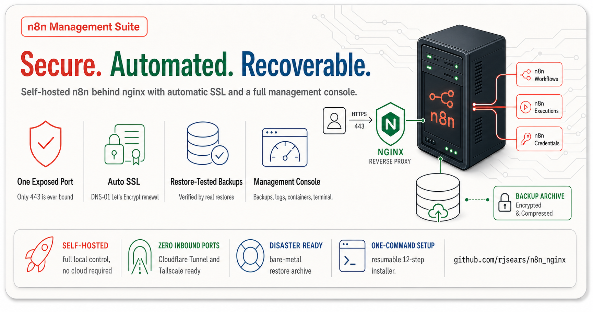
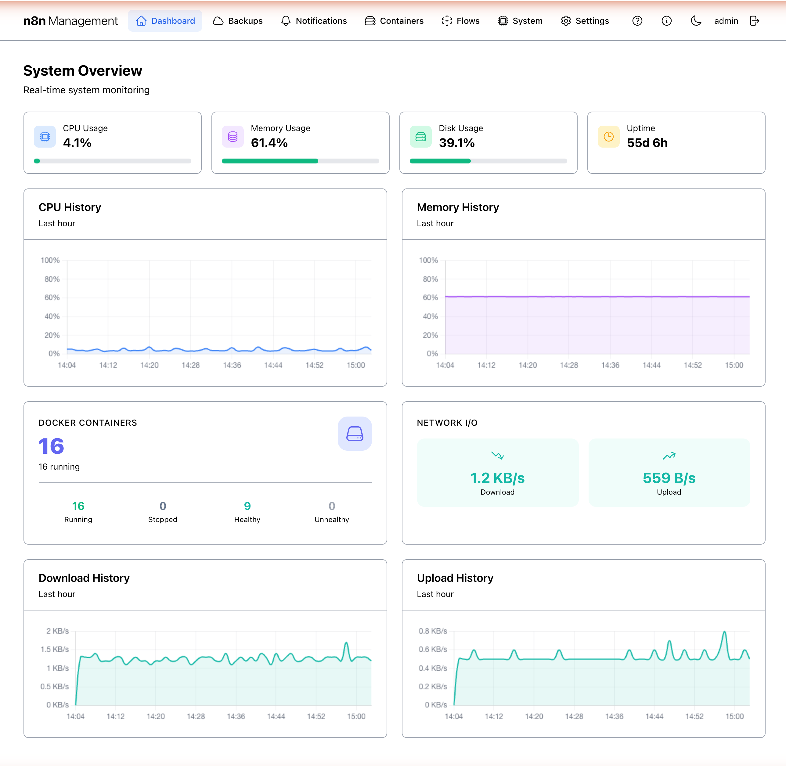
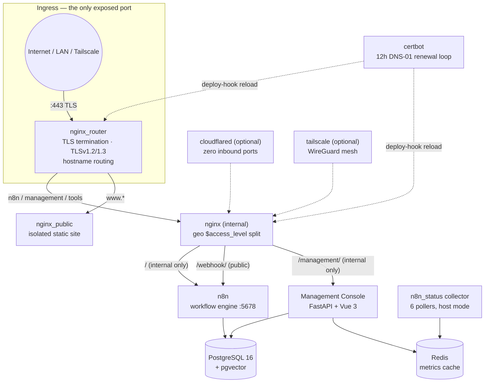
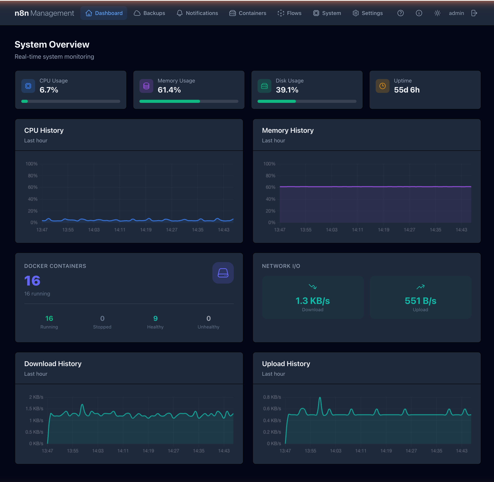
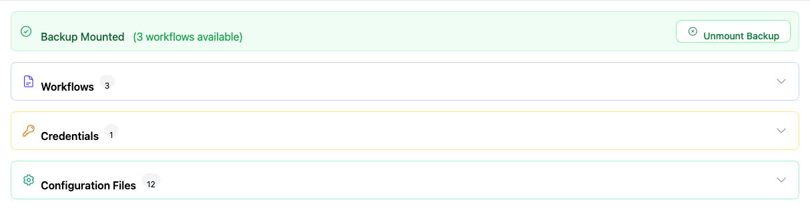
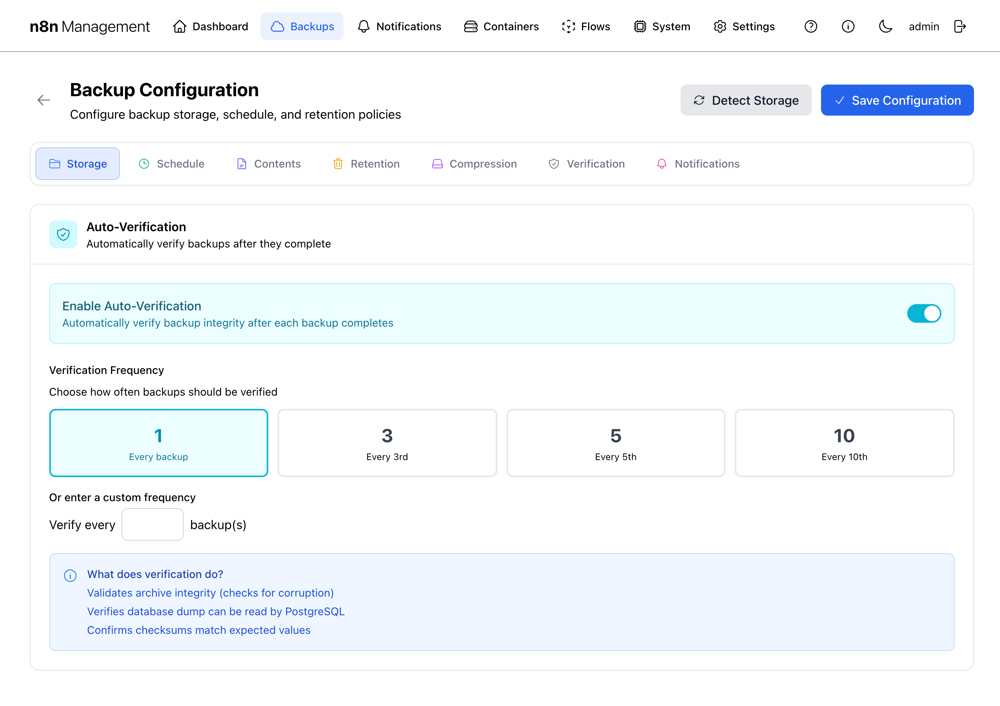
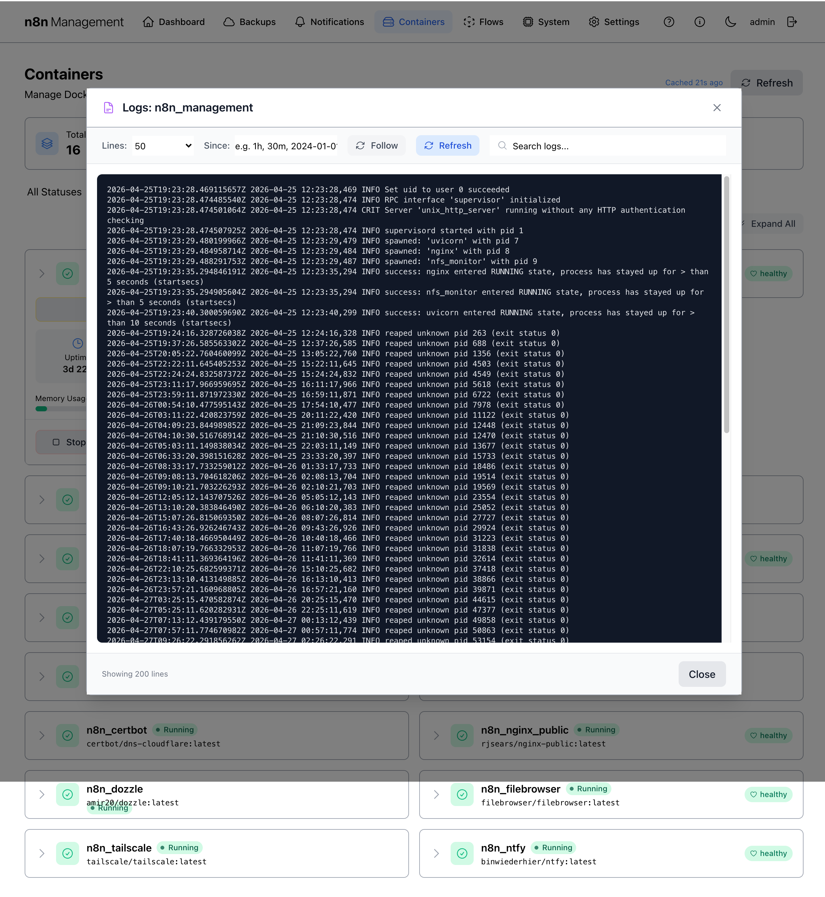
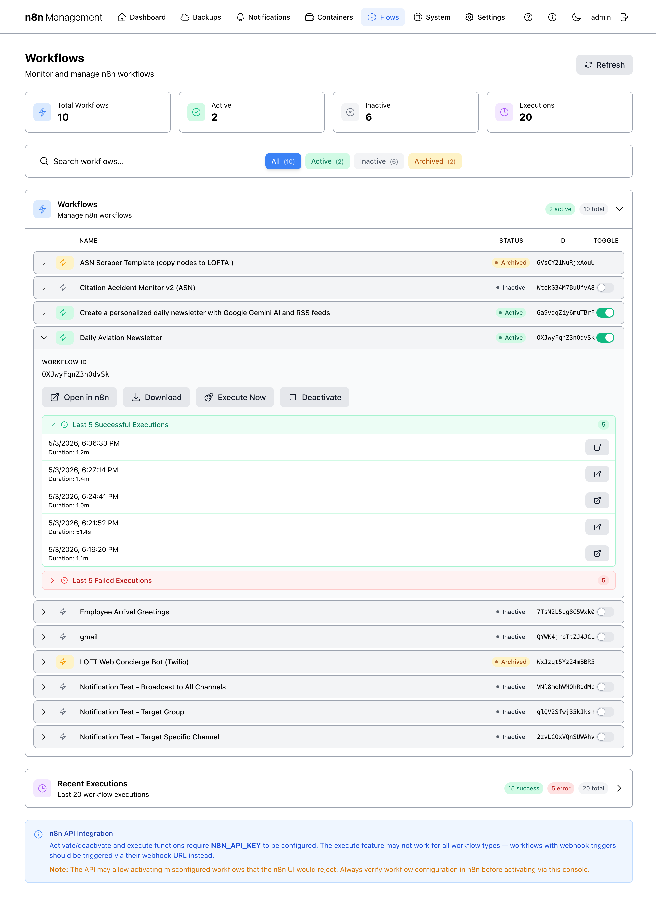
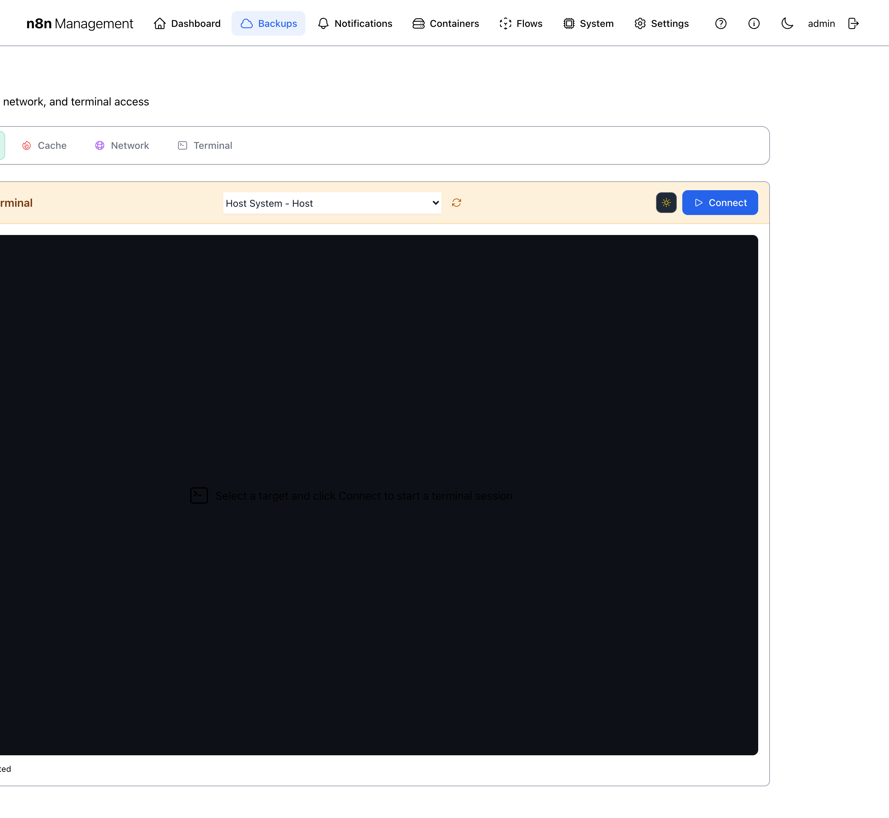
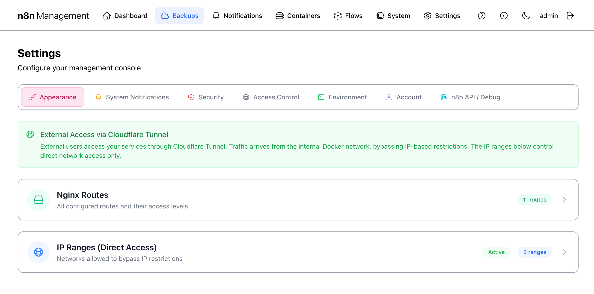

<!-- -=-=-=-=-=-=-=-=-=-=-=-=-=-=-=-=-=-=-=-=-=-=-=
     /README.md

     Part of the "n8n_nginx/n8n_management" suite
     Version 3.0.0

     Richard J. Sears
     richard@n8nmanagement.net
     https://github.com/rjsears
     -=-=-=-=-=-=-=-=-=-=-=-=-=-=-=-=-=-=-=-=-=-=-= -->

<p align="center">
  <picture>
    <source media="(prefers-color-scheme: dark)" srcset="images/n8n_repo_banner_dark.png">
    <source media="(prefers-color-scheme: light)" srcset="images/n8n_repo_banner_light.png">
    
  </picture>
</p>

# n8n Management Suite

<p align="center">
  <a href="https://rjsears.github.io/n8n_nginx/"></a>
  <a href="https://github.com/rjsears/n8n_nginx/releases"></a>
  <a href="https://github.com/rjsears/n8n_nginx/commits/main"></a>
  <a href="LICENSE"></a>
  <a href="https://github.com/rjsears/n8n_nginx/issues"></a>
  <a href="https://github.com/rjsears/n8n_nginx/pulls"></a>
</p>

<p align="center">
  <a href="https://github.com/rjsears/n8n_nginx/actions/workflows/docker-build-management.yml"></a>
  <a href="https://github.com/rjsears/n8n_nginx/actions/workflows/lint.yml"></a>
  <a href="https://hub.docker.com/r/rjsears/n8n_management"></a>
  <a href="https://github.com/rjsears/n8n_nginx"></a>
</p>

<p align="center">
  <a href="https://n8n.io"></a>
  <a href="https://www.postgresql.org"></a>
  <a href="https://nginx.org"></a>
  <a href="https://letsencrypt.org"></a>
  <a href="https://www.docker.com"></a>
</p>

<p align="center">
  <a href="https://fastapi.tiangolo.com"></a>
  <a href="https://vuejs.org"></a>
  <a href="https://redis.io"></a>
  <a href="https://tailscale.com"></a>
  <a href="https://www.cloudflare.com"></a>
</p>

<p align="center">
  <strong><a href="https://rjsears.github.io/n8n_nginx/">View Full Documentation</a></strong>
</p>

A production-grade, self-hosted **n8n** deployment that treats the unglamorous parts — TLS renewal, backups that actually restore, reverse-proxy webhook plumbing, disaster recovery — as first-class engineering problems. One interactive `setup.sh` deploys n8n, PostgreSQL 16 + pgvector, nginx, Certbot, Redis, and a full FastAPI/Vue.js management console, all behind **a single exposed port**.

This is not a `docker run n8nio/n8n` wrapper. It is the infrastructure you build *around* n8n once you depend on it: automatic DNS-01 certificates with a renewal path that provably fires, restore-tested backup verification, selective per-workflow restore, bare-metal recovery archives, 21 notification event types with escalation, and a management console that replaces a half-dozen SSH sessions.

<p align="center">
  
</p>

---

## Table of Contents

- [Why This Exists](#why-this-exists)
- [What Makes It Different](#what-makes-it-different)
- [Architecture](#architecture)
- [Quick Start](#quick-start)
- [Day-2 Operations](#day-2-operations)
- [The Management Console](#the-management-console)
- [Security Posture](#security-posture)
- [Supported Platforms](#supported-platforms)
- [CLI Reference](#cli-reference)
- [Documentation](#documentation)
- [Troubleshooting](#troubleshooting)
- [Contributing & Support](#contributing--support)
- [License & Author](#license--author)

---

## Why This Exists

Self-hosting n8n is easy. *Operating* it is not:

- **Webhook URLs break behind reverse proxies.** n8n must be told its external identity or every webhook shown in the editor is wrong. Solved here with `WEBHOOK_URL`, `N8N_EDITOR_BASE_URL`, and `N8N_TRUST_PROXY` wired correctly out of the box.
- **Certificates expire silently.** Cert renewal that "should work" and renewal that provably fires are very different things (see [the deploy-hook story](#-ssl-renewal-that-provably-renews) below).
- **An untested backup is a rumor.** Most self-host stacks stop at `pg_dump`. This one restores every backup into a throwaway PostgreSQL and compares row counts before calling it verified.
- **Exposing the n8n editor to the internet is a bad default.** Webhooks must be public; the editor must not be. The nginx layer enforces that split by source address.

If you run n8n for anything you'd be upset to lose, this repo is the difference between a container and a deployment.

---

## What Makes It Different

### 🔐 SSL renewal that provably renews

Certbot validates `--deploy-hook` commands **before** attempting renewal. On stock certbot images, a hook that calls `docker` fails validation — and every renewal silently aborts before it begins. No error, no log noise, nothing until the cert expires. This stack installs `docker-cli` inside the certbot container at startup and runs renewal in a long-lived 12-hour loop:

```yaml
entrypoint: /bin/sh -c "apk add --no-cache docker-cli >/dev/null 2>&1; trap exit TERM;
  while :; do certbot renew --no-random-sleep-on-renew ${DNS_CERTBOT_FLAGS:-}
    --deploy-hook 'docker exec n8n_nginx nginx -s reload;
                   docker exec n8n_nginx_router nginx -s reload || true' || true;
  sleep 12h & wait ${!}; done;"
```

The hook reloads **both** nginx instances, because the router terminates TLS in public-website topology and would otherwise keep serving the old certificate from memory. Certificates are issued via **DNS-01 challenges** (Cloudflare, AWS Route 53, Google Cloud DNS, DigitalOcean), so port 80 is never opened and wildcard certs are supported.

### 💾 Backups verified by real restores

Verification is not a checksum. On demand or on a schedule, the console:

1. Spins up a **temporary PostgreSQL container**
2. Performs a **real restore** of the backup into it
3. Validates table existence and **compares row counts** against the source
4. Tears the container down and records `passed` / `failed`

On top of that: four backup types (full cluster, n8n DB, config, individual flows), hourly-to-monthly scheduling with tiered retention, four independent pruning modes with emergency low-disk handling, **selective restore** (mount a backup, browse workflows/credentials/config, restore one item with rename/overwrite/skip conflict handling), and a **bare-metal recovery archive** that embeds its own `restore.sh` — recovery does not depend on having this repo checked out.

```bash
tar -xzf n8n-baremetal-2026-07-31.tar.gz
cd n8n-baremetal-2026-07-31
./restore.sh
```

### 🛡️ One exposed port — and a deliberate public/private split

The entire stack binds exactly two host ports: `443` (nginx router) and `127.0.0.1:6379` (Redis, loopback only). Port 80 is never bound — DNS-01 makes it unnecessary. Inside, nginx classifies every request by source address before routing:

```nginx
geo $access_level {
    default        "external";
    127.0.0.1/32   "internal";
    10.0.0.0/8     "internal";
    172.16.0.0/12  "internal";
    192.168.0.0/16 "internal";
    100.64.0.0/10  "internal";   # Tailscale CGNAT — VPN clients are internal automatically
}
```

`/webhook/` stays reachable from anywhere so third-party services can deliver callbacks. The n8n editor, management console, and admin tools are internal-only. With Cloudflare Tunnel or Tailscale enabled, you can run with **zero inbound ports**.

### 🧩 Proxmox LXC support that actually detects the problem

Docker inside an LXC container fails with AppArmor policy errors that platform-string guessing can't reliably predict. `setup.sh` runs an actual **runtime probe** — it launches a throwaway Alpine container, reads the error, and only then reacts:

```bash
if ! probe_output=$($DOCKER_SUDO docker run --rm --name n8n_apparmor_probe alpine:latest true 2>&1); then
    if echo "$probe_output" | grep -qiE "apparmor|policy admin"; then
        APPARMOR_UNCONFINED="true"
```

If the probe trips, every generated compose service gets `security_opt: apparmor:unconfined` and all helper `docker run` invocations carry the matching flag. Hosts that pass the probe keep full AppArmor confinement — the relaxation is never applied globally. And because `setup.sh` injects the fix into generated configs, it **survives regeneration** instead of being a manual edit that the next config rebuild silently clobbers.

### 🔁 An installer you can Ctrl-C

`setup.sh` is a **12-step state machine** that saves progress to `.n8n_setup_state` (chmod 600) after every step. An interrupted install resumes where it stopped. It pre-flights DNS with multi-tool fallback chains (`dig` → `nslookup` → `host` → `getent`), validates your domain actually points at the machine, offers a v2→v3 migration with a **30-day rollback window**, and supports fully unattended installs from a config file.

---

## Architecture


```mermaid
flowchart TB
    subgraph ingress["Ingress — the only exposed port"]
        INET(("Internet / LAN / Tailscale")) -->|":443 TLS"| ROUTER["nginx_router<br/>TLS termination · TLSv1.2/1.3<br/>hostname routing"]
    end

    ROUTER -->|"n8n / management / tools"| NGINX["nginx (internal)<br/>geo $access_level split"]
    ROUTER -->|"www.*"| PUB["nginx_public<br/>isolated static site"]

    NGINX -->|"/ (internal only)"| N8N["n8n<br/>workflow engine :5678"]
    NGINX -->|"/webhook/ (public)"| N8N
    NGINX -->|"/management/ (internal only)"| MGMT["Management Console<br/>FastAPI + Vue 3"]

    N8N --> PG[("PostgreSQL 16<br/>+ pgvector")]
    MGMT --> PG
    MGMT --> REDIS[("Redis<br/>metrics cache")]
    STATUS["n8n_status collector<br/>6 pollers, host mode"] --> REDIS

    CERTBOT["certbot<br/>12h DNS-01 renewal loop"] -.->|"deploy-hook reload"| ROUTER
    CERTBOT -.->|"deploy-hook reload"| NGINX

    CF["cloudflared (optional)<br/>zero inbound ports"] -.-> NGINX
    TS["tailscale (optional)<br/>WireGuard mesh"] -.-> NGINX
```

| Component | Container | Purpose |
|---|---|---|
| **nginx router** | `n8n_nginx_router` | The single host-exposed service — TLS termination and hostname routing |
| **nginx** | `n8n_nginx` | Internal proxy: access-level enforcement, webhook/editor split, security headers |
| **n8n** | `n8n` | Workflow engine, proxy-aware (`N8N_TRUST_PROXY`, correct `WEBHOOK_URL`) |
| **PostgreSQL 16 + pgvector** | `n8n_postgres` | n8n data, console data, and vector storage for AI/RAG workflows |
| **Management Console** | `n8n_management` | FastAPI backend + Vue 3 frontend — backups, containers, flows, notifications, terminal |
| **Certbot** | `n8n_certbot` | Long-lived DNS-01 renewal loop with dual-nginx deploy hook |
| **Redis** | `n8n_redis` | Metrics cache (loopback-bound) — dashboard reads cache, never computes per request |
| **Status collector** | `n8n_status` | Six pollers feeding Redis with TTL-based staleness detection |
| **Tailscale / Cloudflared** | optional | Remote access with zero inbound ports |
| **NTFY / Portainer / Adminer / Dozzle / FileBrowser** | optional | Push notifications, container / DB / log / file UIs behind console SSO |

---

## Quick Start

### Before you begin

You need three things — have them ready and the install takes about 10–15 minutes:

1. **A domain** (e.g. `n8n.example.com`) pointed at your server
2. **A DNS provider API token** for certificate issuance — Cloudflare, Route 53, Google Cloud DNS, or DigitalOcean
3. **Port 443** reachable (or skip that entirely with Cloudflare Tunnel / Tailscale)

### One-liner

```bash
curl -fsSL https://raw.githubusercontent.com/rjsears/n8n_nginx/main/install.sh | bash
```

This installs `git` if needed, clones the repo, and drops you into the install directory. It deliberately does **not** run setup for you — you kick that off yourself:

```bash
./setup.sh
```

### Manual clone

```bash
git clone https://github.com/rjsears/n8n_nginx.git
cd n8n_nginx
./setup.sh
```

The wizard walks a 12-step, resumable flow: environment detection (including the LXC/AppArmor probe), Docker installation, DNS validation, certificate issuance, config generation, deployment, and HTTPS verification. When it finishes:

1. Open `https://n8n.your-domain.com` and create your n8n owner account
2. Open `https://n8n.your-domain.com/management` and log in with the admin credentials you chose

### Unattended install

```bash
cp setup-config.example setup-config
$EDITOR setup-config
./setup.sh --config setup-config
```

A minimal working config for a Cloudflare install — blank credential fields are auto-generated with strong values:

```ini
DOMAIN=n8n.example.com
SSL_METHOD=certbot
LETSENCRYPT_EMAIL=admin@example.com

DNS_PROVIDER=cloudflare
CLOUDFLARE_API_TOKEN=your_zone_dns_edit_token_here

POSTGRES_PASSWORD=            # blank = auto-generate
N8N_ENCRYPTION_KEY=           # blank = auto-generate
MGMT_SECRET_KEY=              # blank = auto-generate

ADMIN_USER=admin
ADMIN_PASS=a-long-passphrase-you-choose
ADMIN_EMAIL=admin@example.com

N8N_TIMEZONE=America/Los_Angeles
INTERNAL_IP_RANGES=100.64.0.0/10 172.16.0.0/12 10.0.0.0/8 192.168.0.0/16
AUTO_CONFIRM=true
```

Optional services are enabled by presence of their credential: set `TAILSCALE_AUTH_KEY` and Tailscale joins; set `CLOUDFLARE_TUNNEL_TOKEN` and the tunnel starts; set `NFS_SERVER` + `NFS_PATH` and backup storage mounts.

Full walkthrough: [Installation Guide](https://rjsears.github.io/n8n_nginx/getting-started/installation/).

---

## Day-2 Operations

The commands you'll actually run once it's deployed.

### Health checks — human, JSON, or cron

```bash
./scripts/health_check.sh                 # full human-readable sweep
./scripts/health_check.sh --check ssl     # one component: docker, n8n, postgres, nginx,
                                          # management, resources, ssl, network, backups, logs
./scripts/health_check.sh --json          # machine-readable, for monitoring agents
```

Silent cron check that alerts only on failure (exit `0` healthy, `1` unhealthy):

```bash
*/10 * * * * cd /opt/n8n_nginx && ./scripts/health_check.sh --quiet || \
  /usr/local/bin/notify "n8n stack unhealthy"
```

### Testing SSL renewal without burning rate limits

```bash
docker exec n8n_certbot certbot renew --dry-run     # safe staging dry-run
docker exec n8n_certbot certbot certificates        # what certbot manages + expiry
```

Inspect the certificate nginx is *actually serving* (the live volume, not certbot's bookkeeping):

```bash
docker exec n8n_nginx openssl x509 \
  -in /etc/letsencrypt/live/n8n.example.com/fullchain.pem \
  -noout -subject -dates
```

### Forcing a real renewal

```bash
FORCE_SSL_RENEWAL=true ./setup.sh                                    # setup knows your DNS flags
FORCE_SSL_RENEWAL=true NON_INTERACTIVE=true ./setup.sh               # fully non-interactive
```

### Reading logs — including the one that isn't where you expect

```bash
docker compose logs -f n8n
docker compose logs --tail 200 certbot
```

The management API is the exception — uvicorn logs to a file inside the container, not stdout:

```bash
docker exec n8n_management tail -f /app/logs/uvicorn.log
```

### Changing the IP allowlist after install

```bash
./setup.sh --update-access

# or non-interactively:
INTERNAL_IP_RANGES="10.0.0.0/8 192.168.0.0/16 203.0.113.7/32" ./setup.sh --update-access

# always test before reload — a malformed geo block takes the proxy down:
docker exec n8n_nginx nginx -t && docker exec n8n_nginx nginx -s reload
```

### Driving backups from the API

The console exposes a REST API (~130 endpoints, interactive OpenAPI docs at `/api/docs`):

```bash
TOKEN=$(curl -sk -X POST https://n8n.example.com/api/auth/login \
  -H 'Content-Type: application/json' \
  -d '{"username":"admin","password":"your-password"}' \
  | python3 -c 'import sys,json; print(json.load(sys.stdin)["access_token"])')

curl -sk -X POST https://n8n.example.com/api/backups/run \
  -H "Authorization: Bearer $TOKEN" \
  -H 'Content-Type: application/json' \
  -d '{"backup_type":"full"}'
```

### Upgrading n8n

```bash
docker exec n8n_postgres pg_dump -U n8n -Fc n8n > pre-upgrade-$(date +%F).dump   # safety net first
$EDITOR docker-compose.yaml            # bump the n8n image tag
docker compose pull n8n && docker compose up -d n8n
./scripts/health_check.sh
```

> **Preserve `N8N_ENCRYPTION_KEY` across every upgrade.** All credentials stored in n8n are encrypted with it; losing it makes them unrecoverable. Note that `docker-compose.yaml` is regenerated by `setup.sh` — record manual edits somewhere durable.

### Proxmox LXC hosts

`setup.sh` detects and handles AppArmor automatically. If Docker-in-LXC fails before setup can run, add to the container config on the Proxmox node (`/etc/pve/lxc/<id>.conf`):

```
lxc.apparmor.profile: unconfined
lxc.cgroup2.devices.allow: a
lxc.cap.drop:
features: nesting=1,keyctl=1
```

Verify what the probe would decide on your host:

```bash
docker run --rm alpine:latest true && echo "AppArmor OK — no workaround needed"
```

### Running the test suite

```bash
./tests/test_installation.sh --group syntax            # fast: shell syntax across all scripts
./tests/test_installation.sh --group security --junit results.xml
./tests/test_installation.sh --integration --verbose   # everything
```

---

## The Management Console

Ten screens replacing a half-dozen SSH sessions — dark/light themes, top or sidebar navigation, live WebSocket updates.

| Screen | What it does |
|---|---|
| **Dashboard** | Host CPU/memory/disk cards, container rollup, recent activity — all served from the Redis metrics cache |
| **Backups** | Scheduling, tiered retention, restore-tested verification, selective restore, bare-metal archive |
| **Containers** | Start/stop/restart, live stats, per-container log viewer and terminal |
| **Flows** | n8n workflow inventory with activate/deactivate toggles and execution history |
| **Notifications** | 80+ services via Apprise, native NTFY push, channels/groups, L1→L2 escalation, quiet hours, flapping detection |
| **System** | Health cards (incl. SSL expiry with Force Renew), Redis cache status, network tools, host terminal, file manager |
| **Settings** | CIDR access control, n8n API key, categorized `.env` editor with validation |

Adminer, Dozzle, Portainer, and FileBrowser inherit console login via nginx `auth_request` — one session, every tool.

<details>
<summary><strong>📸 Screenshot gallery — click to expand</strong></summary>

<br/>

**Dashboard — dark mode**
<p align="center"></p>

**Backups — selective restore from a mounted backup**
<p align="center"></p>

**Backups — restore-tested verification config**
<p align="center"></p>

**Containers — live logs**
<p align="center"></p>

**Flows — execution history**
<p align="center"></p>

**System — built-in terminal**
<p align="center"></p>

**Settings — access control**
<p align="center"></p>

</details>

---

## Security Posture

Honest accounting — what's enforced today, where it lives, and what's on the roadmap.

| Control | Status | Where |
|---|---|---|
| Single exposed port (443); Redis loopback-only | ✅ | `docker-compose.yaml` |
| Port 80 never bound (DNS-01, no HTTP-01) | ✅ | Certbot DNS-01 flow |
| Zero-inbound-port operation | ✅ optional | Cloudflare Tunnel / Tailscale |
| TLS 1.2/1.3 only, ECDHE AEAD ciphers | ✅ | `nginx.conf` / `nginx-router.conf` |
| Editor internal-only, `/webhook/` public | ✅ | nginx `geo $access_level` |
| Security headers (`nosniff`, `X-Frame-Options`, `X-XSS-Protection`) | ✅ | `nginx.conf` |
| bcrypt password hashing (12 rounds) | ✅ | console `security.py` |
| DB-backed opaque session tokens (`secrets.token_urlsafe(48)`) | ✅ | console auth |
| Exponential login lockout (capped at 48 min) | ✅ | console auth |
| Two-tier rate limiting (nginx 5r/m auth + in-process) | ✅ | `management/nginx.conf` |
| AES-256-GCM encryption for stored secrets | ✅ | console settings |
| Docker socket mounted **read-only** | ✅ | compose |
| Secrets files chmod 600, gitignored | ✅ | `setup.sh` |
| Audit logging of console actions | ✅ | console DB |
| HSTS header | 🔜 roadmap | — |
| CSRF tokens / multi-user RBAC / 2FA | 🔜 roadmap | — |

> **Know what you're enabling:** the console's host terminal is a real admin feature — it launches a privileged container chrooted to the host. It sits behind console authentication and the internal-only nginx ACL, but treat console credentials like root credentials, because on the System → Terminal tab, they are.

---

## Supported Platforms

| Operating System | Versions | Notes |
|---|---|---|
| Ubuntu | 20.04, 22.04, 24.04 | Recommended |
| Debian | 11, 12 | Fully supported |
| Proxmox LXC | — | **Auto-detected** — runtime AppArmor probe, no manual compose edits |
| CentOS / RHEL / Rocky / Alma | 8, 9 | Enterprise Linux family |
| Fedora | 38+ | Latest releases |
| macOS | 10.15+ | Requires Docker Desktop |
| Windows 10/11 | — | Via WSL2 with Docker Desktop |

**Minimums:** 2 CPU cores, 4 GB RAM, 20 GB storage (4+ cores / 8 GB / 50 GB SSD recommended). Full details: [Requirements](https://rjsears.github.io/n8n_nginx/getting-started/requirements/).

---

## CLI Reference

```
./setup.sh                     Interactive 12-step install (resumable)
./setup.sh --config <file>     Unattended install from a pre-configuration file
./setup.sh --update-access     Update the internal IP allowlist, no reinstall
./setup.sh --rollback          Roll back a v2→v3 migration (30-day window)
./setup.sh --version           Version info

./scripts/health_check.sh      Full stack health sweep
    --check <component>        One of: docker n8n postgres nginx management
                               resources ssl network backups logs
    --json                     Machine-readable output
    --quiet                    Exit code only (0 healthy / 1 unhealthy)

./scripts/fix_ssl.sh <domain>  Six-step certificate diagnostic

./tests/test_installation.sh   Bash test suites
    --group <group>            prerequisites structure syntax backend frontend
                               docker security notifications migration nfs state all
    --integration --verbose --junit <file>
```

Environment switches: `FORCE_SSL_RENEWAL=true` (force cert renewal), `NON_INTERACTIVE=true` (no prompts), `BRANCH=dev` (install from a branch via the one-liner).

---

## Documentation

Everything below lives on the full docs site — **[rjsears.github.io/n8n_nginx](https://rjsears.github.io/n8n_nginx/)** — built with MkDocs Material, including an illustrated 8-page user manual.

| | |
|---|---|
| [Getting Started](https://rjsears.github.io/n8n_nginx/getting-started/installation/) | Requirements, installation, architecture |
| [User Manual](https://rjsears.github.io/n8n_nginx/manual/welcome/) | Every console screen, illustrated |
| [Backup & Restore Guide](https://rjsears.github.io/n8n_nginx/BACKUP_GUIDE/) | Backup types, scheduling, verification, NFS storage |
| [Notifications Guide](https://rjsears.github.io/n8n_nginx/NOTIFICATIONS/) | Apprise, NTFY, escalation, quiet hours |
| [SSL / Certbot Guide](https://rjsears.github.io/n8n_nginx/CERTBOT/) | Let's Encrypt, DNS-01 providers, renewal |
| [Cloudflare Tunnel](https://rjsears.github.io/n8n_nginx/CLOUDFLARE/) · [Tailscale VPN](https://rjsears.github.io/n8n_nginx/TAILSCALE/) | Zero-inbound-port remote access |
| [API Reference](https://rjsears.github.io/n8n_nginx/API/) | ~130 REST endpoints, plus live Swagger at `/api/docs` |
| [Troubleshooting](https://rjsears.github.io/n8n_nginx/TROUBLESHOOTING/) | Common issues and diagnostics |

---

## Troubleshooting

| Symptom | First move |
|---|---|
| Stack seems unhealthy | `./scripts/health_check.sh` — it checks all ten components |
| Certificate problems | `./scripts/fix_ssl.sh your-domain.com`, then `docker exec n8n_certbot certbot certificates` |
| Renewal seems stuck | `docker compose logs --tail 200 certbot` — look for deploy-hook validation errors |
| Management console errors | `docker exec n8n_management tail -200 /app/logs/uvicorn.log` (not `docker logs`) |
| Webhooks failing externally | `docker exec n8n printenv WEBHOOK_URL N8N_TRUST_PROXY` — verify n8n knows its external identity |
| Docker-in-LXC won't start containers | AppArmor — see [Proxmox LXC hosts](#proxmox-lxc-hosts) above |
| Locked out after IP change | `./setup.sh --update-access` from the host |

Full guide: [Troubleshooting](https://rjsears.github.io/n8n_nginx/TROUBLESHOOTING/).

---

## Contributing & Support

- **Bugs & feature requests:** [GitHub Issues](https://github.com/rjsears/n8n_nginx/issues)
- **Changelog:** [docs/CHANGELOG.md](docs/CHANGELOG.md)
- **Before submitting a PR:** `./tests/test_installation.sh --group syntax` catches most script regressions in seconds

---

## License & Author

MIT License — see [LICENSE](LICENSE).

Developed and maintained by **Richard J. Sears** ([@rjsears](https://github.com/rjsears)).

Built on the shoulders of [n8n](https://n8n.io), [PostgreSQL](https://www.postgresql.org) / [pgvector](https://github.com/pgvector/pgvector), [Nginx](https://nginx.org), [Let's Encrypt](https://letsencrypt.org), [FastAPI](https://fastapi.tiangolo.com), [Vue.js](https://vuejs.org), [Redis](https://redis.io), and [Apprise](https://github.com/caronc/apprise).

---

## Special Thanks

- **My amazing and loving family!** They put up with all my coding and automation projects and encourage me in everything. Without them, my projects would not be possible.
- **My brother James**, who is a continual source of inspiration to me and others. Everyone should have a brother as awesome as mine!
