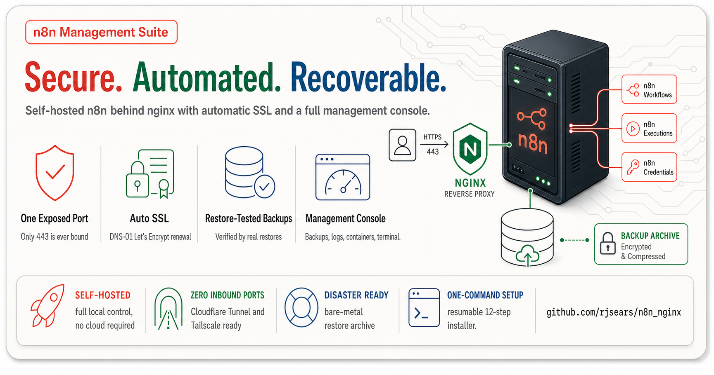
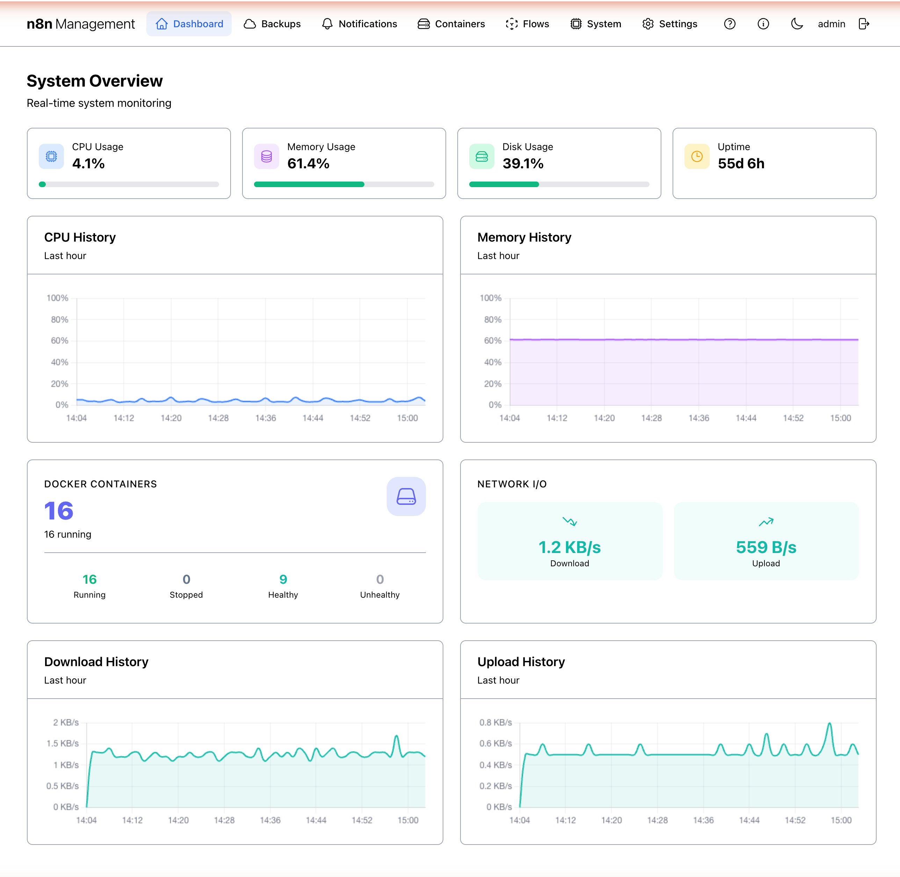
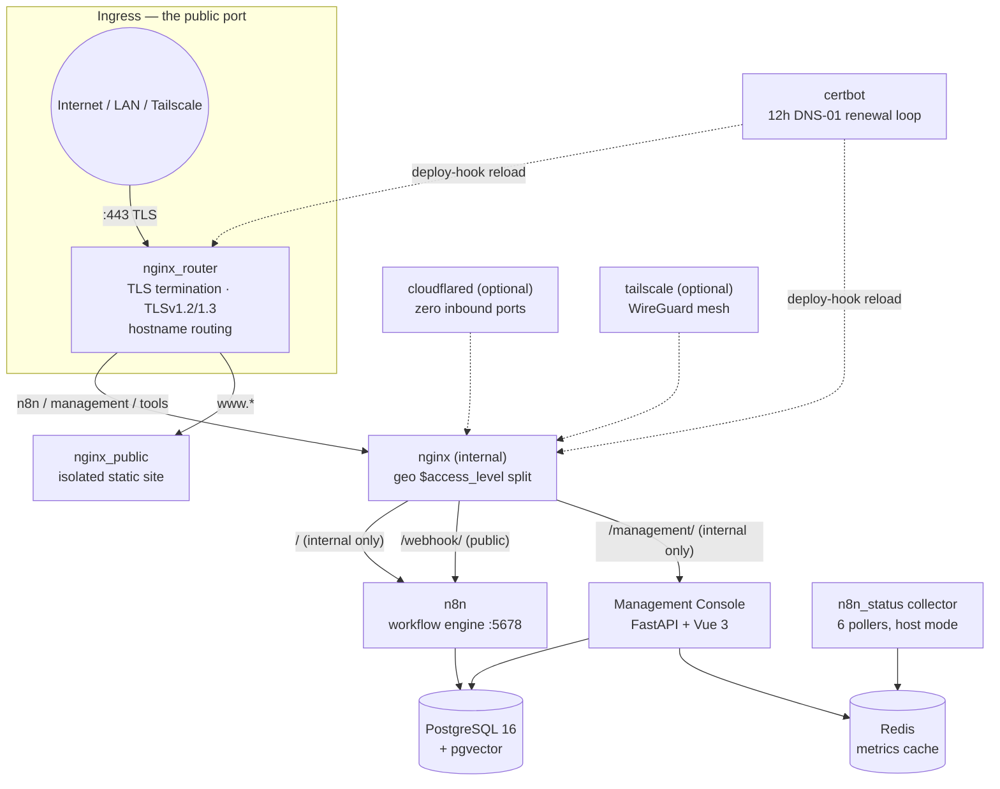
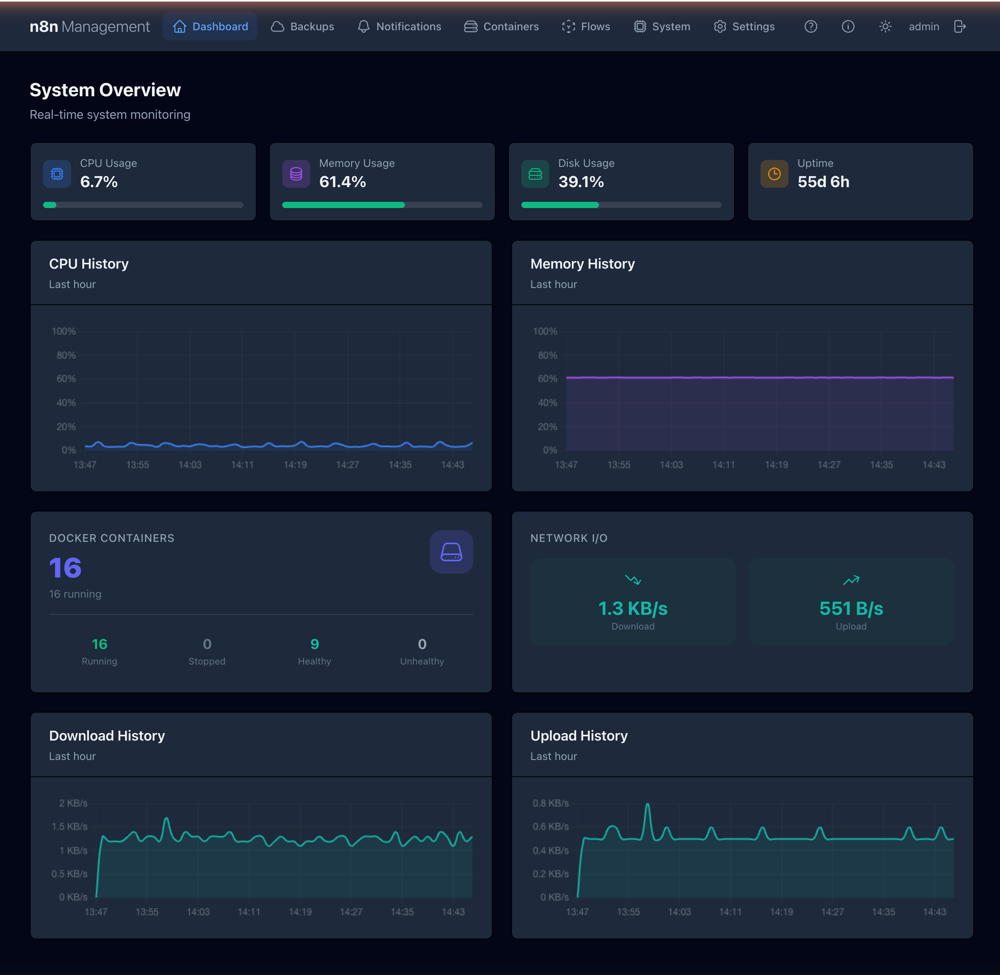
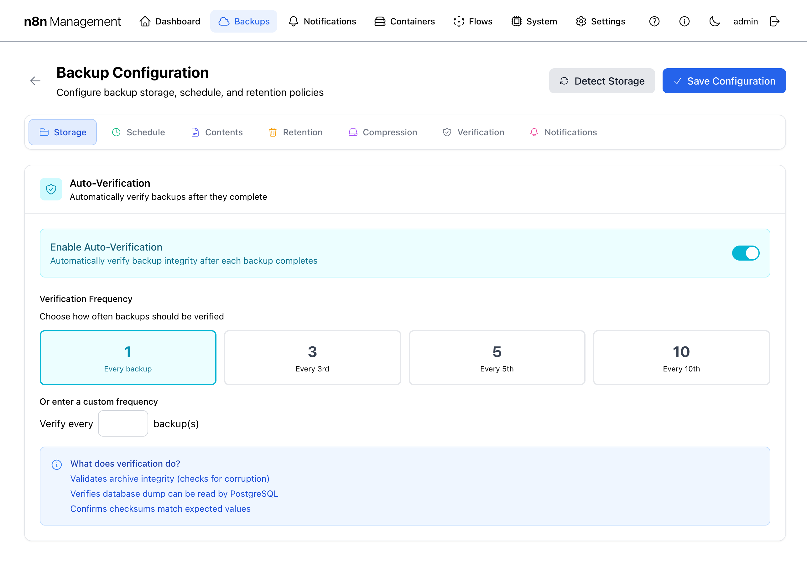
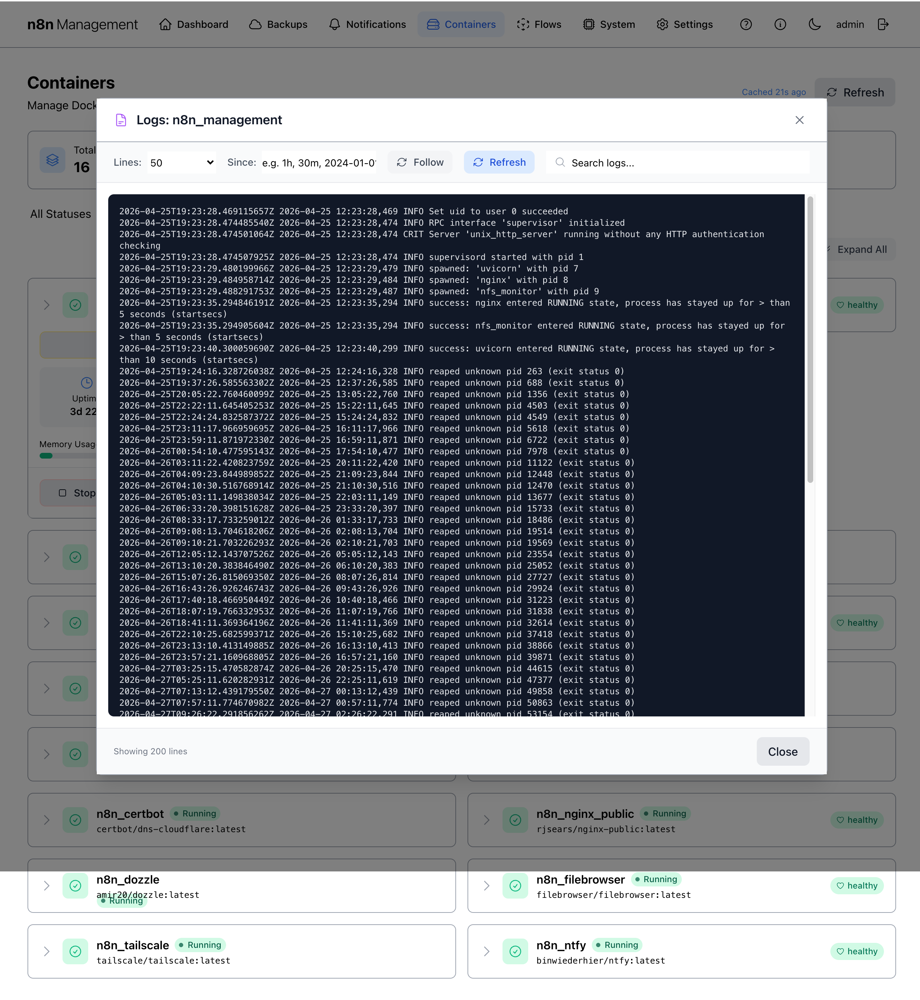
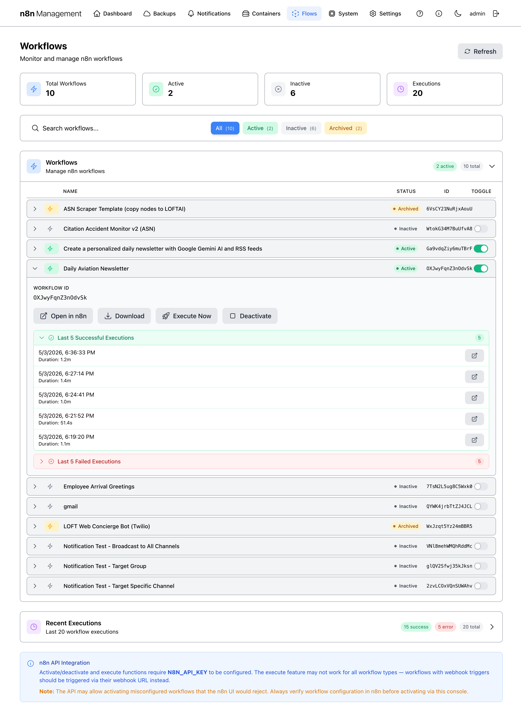
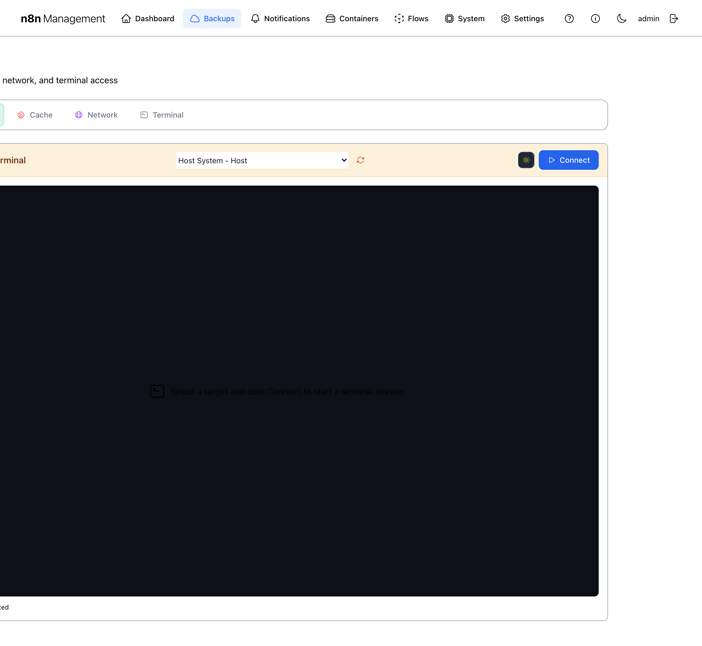
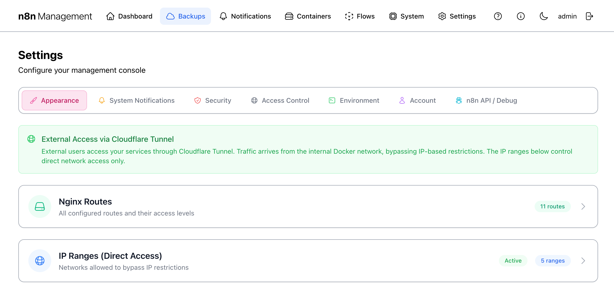

<!-- -=-=-=-=-=-=-=-=-=-=-=-=-=-=-=-=-=-=-=-=-=-=-=
     /README.md

     Part of the "n8n_nginx/n8n_management" suite
     Version 3.0.0

     Richard J. Sears
     richard@n8nmanagement.net
     https://github.com/rjsears
     -=-=-=-=-=-=-=-=-=-=-=-=-=-=-=-=-=-=-=-=-=-=-= -->

<p align="center">
  <picture>
    <source media="(prefers-color-scheme: dark)" srcset="images/n8n_repo_banner_dark.png">
    <source media="(prefers-color-scheme: light)" srcset="images/n8n_repo_banner_light.png">
    
  </picture>
</p>

# n8n Management Suite

<p align="center">
  <a href="https://rjsears.github.io/n8n_nginx/"></a>
  <a href="https://github.com/rjsears/n8n_nginx/releases"></a>
  <a href="https://github.com/rjsears/n8n_nginx/commits/main"></a>
  <a href="LICENSE"></a>
  <a href="https://github.com/rjsears/n8n_nginx/issues"></a>
  <a href="https://github.com/rjsears/n8n_nginx/pulls"></a>
</p>

<p align="center">
  <a href="https://github.com/rjsears/n8n_nginx/actions/workflows/docker-build-management.yml"></a>
  <a href="https://github.com/rjsears/n8n_nginx/actions/workflows/test.yml"></a>
  <a href="https://github.com/rjsears/n8n_nginx/actions/workflows/lint.yml"></a>
  <a href="https://hub.docker.com/r/rjsears/n8n_management"></a>
  <a href="https://github.com/rjsears/n8n_nginx"></a>
</p>

<p align="center">
  <a href="https://n8n.io"></a>
  <a href="https://www.postgresql.org"></a>
  <a href="https://nginx.org"></a>
  <a href="https://letsencrypt.org"></a>
  <a href="https://www.docker.com"></a>
</p>

<p align="center">
  <a href="https://fastapi.tiangolo.com"></a>
  <a href="https://vuejs.org"></a>
  <a href="https://redis.io"></a>
  <a href="https://tailscale.com"></a>
  <a href="https://www.cloudflare.com"></a>
</p>

<p align="center">
  <strong><a href="https://rjsears.github.io/n8n_nginx/">View Full Documentation</a></strong>
</p>

A production-grade, self-hosted **n8n** deployment that treats the unglamorous parts — TLS renewal, backups that actually restore, reverse-proxy webhook plumbing, disaster recovery — as first-class engineering problems. One interactive `setup.sh` deploys n8n, PostgreSQL 16 + pgvector, nginx, Certbot, Redis, and a full FastAPI/Vue.js management console, all behind **one public HTTPS port** (443).

This is not a `docker run n8nio/n8n` wrapper. It is the infrastructure you build *around* n8n once you depend on it: automatic DNS-01 certificates with a renewal path that provably fires, restore-tested backup verification, selective per-workflow restore, bare-metal recovery archives, 22 notification event types with escalation, and a management console that replaces a half-dozen SSH sessions.

<p align="center">
  
</p>

---

## Table of Contents

- [Why This Exists](#why-this-exists)
- [What Makes It Different](#what-makes-it-different)
- [Architecture](#architecture)
- [Quick Start](#quick-start)
- [Day-2 Operations](#day-2-operations)
- [The Management Console](#the-management-console)
- [Security Posture](#security-posture)
- [Supported Platforms](#supported-platforms)
- [CLI Reference](#cli-reference)
- [Documentation](#documentation)
- [Troubleshooting](#troubleshooting)
- [Contributing & Support](#contributing--support)
- [License & Author](#license--author)

---

## Why This Exists

Self-hosting n8n is easy. *Operating* it is not:

- **Webhook URLs break behind reverse proxies.** n8n must be told its external identity or every webhook shown in the editor is wrong. Solved here with `WEBHOOK_URL`, `N8N_EDITOR_BASE_URL`, and `N8N_TRUST_PROXY` wired correctly out of the box.
- **Certificates expire silently.** Cert renewal that "should work" and renewal that provably fires are very different things (see [the deploy-hook story](#-ssl-renewal-that-provably-renews) below).
- **An untested backup is a rumor.** Most self-host stacks stop at `pg_dump`. This one restores every backup into a throwaway PostgreSQL and compares row counts before calling it verified.
- **Exposing the n8n editor to the internet is a bad default.** Webhooks must be public; the editor must not be. The nginx layer enforces that split by source address.

If you run n8n for anything you'd be upset to lose, this repo is the difference between a container and a deployment.

---

## What Makes It Different

### 🔐 SSL renewal that provably renews

Certificates are issued straight into the `letsencrypt` volume, so certbot's `live/ → archive/` symlinks stay intact (copying them with `cp -L` makes certbot skip the lineage forever). The certbot container (`restart: unless-stopped`) runs [`scripts/certbot/renew-loop.sh`](scripts/certbot/renew-loop.sh): `certbot renew` every 12 hours, failures logged loudly to `docker logs n8n_certbot` and `/etc/letsencrypt/n8n-renewal.log` and retried hourly, and a deploy hook that reloads nginx through the Docker API with plain Python (no Docker CLI to install at start-up). Each provider's credentials file is mounted where the renewal config expects it (`DNS_CREDENTIALS_FILE` / `DNS_CREDENTIALS_TARGET` in `.env`), and `setup.sh` finishes with a `certbot renew --dry-run` to show that renewal actually works. Older installs can be checked and repaired with `./scripts/repair_ssl_lineage.sh`.

The hook reloads **both** nginx instances, because the router terminates TLS in public-website topology and would otherwise keep serving the old certificate from memory. Certificates are issued via **DNS-01 challenges** (Cloudflare, AWS Route 53, Google Cloud DNS, DigitalOcean), so port 80 is never opened and wildcard certs are supported.

### 💾 Backups verified by real restores

Verification is not a checksum. On demand or on a schedule, the console:

1. Spins up a **temporary PostgreSQL container**
2. Performs a **real restore** of the backup into it
3. Validates table existence and **compares row counts** against the source
4. Tears the container down and records `passed` / `failed`

On top of that: four backup types (full cluster, n8n DB, config, individual flows), hourly-to-monthly scheduling with tiered retention, four independent pruning modes with emergency low-disk handling, **selective restore** (mount a backup, browse workflows/credentials/config, restore one item with rename/overwrite/skip conflict handling), and a **bare-metal recovery archive** that embeds its own `restore.sh` — recovery does not depend on having this repo checked out.

```bash
mkdir n8n-restore && tar -xzf backup_20260731_020000.n8n_backup.tar.gz -C n8n-restore
cd n8n-restore
sudo ./restore.sh --dry-run   # preview, then run without --dry-run
```

`restore.sh` starts only PostgreSQL, restores every database in a single transaction (stopping on the first error), and only then brings up the rest of the stack. **Archives created before restore script v3.2.0 embed a `restore.sh` that cannot complete** — download the current one from *Backups → Bare Metal → Download latest restore.sh* (or `GET /api/backups/restore-script`), copy it over the one in the extracted archive, and take a fresh backup after upgrading. The in-app restore only restores the n8n database (stopping n8n, with a safety dump and the previous database kept); the management database is restored with `restore.sh`. See the [Backup Guide](docs/BACKUP_GUIDE.md#restoring-data).

### 🛡️ One public port — and a deliberate public/private split

The only port published for clients is `443` (`n8n_nginx`, or `nginx_router` when the public website is enabled). Port 80 is never bound — DNS-01 makes it unnecessary. Redis is published on `127.0.0.1:6379` only. Two more listeners exist on the host and should be firewalled from untrusted networks: the status collector (`n8n_status`, host networking) serves unauthenticated `/health` and `/metrics` on `0.0.0.0:8080`, and the optional Portainer agent listens on `PORTAINER_AGENT_BIND:9001` (default `127.0.0.1`). See [Security Posture](#security-posture). Inside, nginx classifies every request by source address before routing:

```nginx
geo $access_level {
    default          "external";
    127.0.0.1/32     "internal";
    10.0.0.0/8       "internal";   # your LAN
    172.16.0.0/12    "internal";   # your LAN
    192.168.0.0/16   "internal";   # your LAN
    100.64.0.0/10    "internal";   # host-level Tailscale (CGNAT)
    172.30.0.0/24    "external";   # the stack's own Docker network (pinned subnet)
    172.30.0.12/32   "internal";   # the Tailscale container (Tailscale Serve)
}
```

`geo` is longest-prefix match, so the pinned Docker network (`N8N_NETWORK_SUBNET`, default `172.30.0.0/24`) overrides the broad private ranges: anything that reaches nginx through a Docker hop — Cloudflare Tunnel, Docker's port proxy (IPv6 clients, `localhost`), any other container such as an n8n HTTP Request node — is **external**. The only trusted Docker addresses are the Tailscale container and, via `set_real_ip_from`, the `X-Real-IP` set by `nginx_router` from its static IP.

`/webhook/` and `/form/` stay reachable from anywhere so third-party services can deliver callbacks, and `/ntfy/` is public but ntfy itself denies anonymous access. The n8n editor, management console, and admin tools are internal-only. Cloudflare Tunnel points at a separate webhook-only listener (`n8n_nginx:8080`, not published on the host) that serves only `/webhook*` and `/form*` and drops everything else. With Cloudflare Tunnel or Tailscale enabled, you can run with **zero inbound ports**.

### 🧩 Proxmox LXC support that actually detects the problem

Docker inside an LXC container fails with AppArmor policy errors that platform-string guessing can't reliably predict. `setup.sh` runs an actual **runtime probe** — it launches a throwaway Alpine container, reads the error, and only then reacts:

```bash
if ! probe_output=$($DOCKER_SUDO docker run --rm --name n8n_apparmor_probe "$ALPINE_IMAGE" true 2>&1); then
    if echo "$probe_output" | grep -qiE "apparmor|policy admin"; then
        APPARMOR_UNCONFINED="true"
```

If the probe trips, every generated compose service gets `security_opt: apparmor:unconfined` and all helper `docker run` invocations carry the matching flag. On hosts that pass the probe the generated compose file keeps Docker's default AppArmor profile. Two exceptions: the `docker-compose.yaml` committed to the repo is a reference file that lists `apparmor:unconfined` on every service (`setup.sh` replaces it with the generated one), and the console's host terminal, when enabled, always runs unconfined. And because `setup.sh` injects the fix into generated configs, it **survives regeneration** instead of being a manual edit that the next config rebuild silently clobbers.

### 🔁 An installer you can Ctrl-C

`setup.sh` is a **12-step state machine** that saves progress to `.n8n_setup_state` (chmod 600) after every step. An interrupted install resumes where it stopped. It pre-flights DNS with multi-tool fallback chains (`dig` → `nslookup` → `host` → `getent`), validates your domain actually points at the machine, offers a v2→v3 migration with a **30-day rollback window**, and supports fully unattended installs from a config file.

---

## Architecture


```mermaid
flowchart TB
    subgraph ingress["Ingress — the public port"]
        INET(("Internet / LAN / Tailscale")) -->|":443 TLS"| ROUTER["nginx_router<br/>TLS termination · TLSv1.2/1.3<br/>hostname routing"]
    end

    ROUTER -->|"n8n / management / tools"| NGINX["nginx (internal)<br/>geo $access_level split"]
    ROUTER -->|"www.*"| PUB["nginx_public<br/>isolated static site"]

    NGINX -->|"/ (internal only)"| N8N["n8n<br/>workflow engine :5678"]
    NGINX -->|"/webhook/ (public)"| N8N
    NGINX -->|"/management/ (internal only)"| MGMT["Management Console<br/>FastAPI + Vue 3"]

    N8N --> PG[("PostgreSQL 16<br/>+ pgvector")]
    MGMT --> PG
    MGMT --> REDIS[("Redis<br/>metrics cache")]
    STATUS["n8n_status collector<br/>6 pollers, host mode"] --> REDIS

    CERTBOT["certbot<br/>12h DNS-01 renewal loop"] -.->|"deploy-hook reload"| ROUTER
    CERTBOT -.->|"deploy-hook reload"| NGINX

    CF["cloudflared (optional)<br/>zero inbound ports"] -.-> NGINX
    TS["tailscale (optional)<br/>WireGuard mesh"] -.-> NGINX
```

| Component | Container | Purpose |
|---|---|---|
| **nginx router** | `n8n_nginx_router` | Public website topology only: publishes `443`, TLS termination and hostname routing (otherwise `n8n_nginx` publishes `443` itself) |
| **nginx** | `n8n_nginx` | Internal proxy: access-level enforcement, webhook/editor split, security headers |
| **n8n** | `n8n` | Workflow engine, proxy-aware (`N8N_TRUST_PROXY`, correct `WEBHOOK_URL`) |
| **PostgreSQL 16 + pgvector** | `n8n_postgres` | n8n data, console data, and vector storage for AI/RAG workflows |
| **Management Console** | `n8n_management` | FastAPI backend + Vue 3 frontend — backups, containers, flows, notifications, terminal |
| **Certbot** | `n8n_certbot` | Long-lived DNS-01 renewal loop with dual-nginx deploy hook |
| **Redis** | `n8n_redis` | Metrics cache (loopback-bound) — dashboard reads cache, never computes per request |
| **Status collector** | `n8n_status` | Six pollers feeding Redis with TTL-based staleness detection |
| **Tailscale / Cloudflared** | optional | Remote access with zero inbound ports |
| **NTFY / Portainer / Adminer / Dozzle / FileBrowser** | optional | Push notifications (ntfy: login or token required), container / DB / log / file UIs; internal-only, File Browser / Adminer / Dozzle also behind the console login |

---

## Quick Start

### Before you begin

You need three things — have them ready and the install takes about 10–15 minutes:

1. **A domain** (e.g. `n8n.example.com`) pointed at your server
2. **A DNS provider API token** for certificate issuance — Cloudflare, Route 53, Google Cloud DNS, or DigitalOcean
3. **Port 443** reachable (or skip that entirely with Cloudflare Tunnel / Tailscale)

### One-liner

```bash
curl -fsSL https://raw.githubusercontent.com/rjsears/n8n_nginx/main/install.sh | bash
```

This installs `git` if needed, clones the repo, and drops you into the install directory. It deliberately does **not** run setup for you — you kick that off yourself:

```bash
./setup.sh
```

### Manual clone

```bash
git clone https://github.com/rjsears/n8n_nginx.git
cd n8n_nginx
./setup.sh
```

The wizard walks a 12-step, resumable flow: environment detection (including the LXC/AppArmor probe), Docker installation, DNS validation, certificate issuance, config generation, deployment, and HTTPS verification. When it finishes:

1. Open `https://n8n.your-domain.com` and create your n8n owner account
2. Open `https://n8n.your-domain.com/management` and log in with the admin credentials you chose

### Unattended install

```bash
cp setup-config.example setup-config
$EDITOR setup-config
./setup.sh --config setup-config
```

A minimal working config for a Cloudflare install — blank credential fields are auto-generated with strong values:

```ini
DOMAIN=n8n.example.com
SSL_METHOD=certbot
LETSENCRYPT_EMAIL=admin@example.com

DNS_PROVIDER=cloudflare
CLOUDFLARE_API_TOKEN=your_zone_dns_edit_token_here

POSTGRES_PASSWORD=            # blank = auto-generate
N8N_ENCRYPTION_KEY=           # blank = auto-generate
MGMT_SECRET_KEY=              # blank = auto-generate

ADMIN_USER=admin
ADMIN_PASS=a-long-passphrase-you-choose
ADMIN_EMAIL=admin@example.com

N8N_TIMEZONE=America/Los_Angeles
INTERNAL_IP_RANGES="127.0.0.1/32 100.64.0.0/10 172.16.0.0/12 10.0.0.0/8 192.168.0.0/16"
N8N_NETWORK_SUBNET=172.30.0.0/24   # pinned Docker network, always "external" in nginx
AUTO_CONFIRM=true
```

Optional services are enabled by presence of their credential: set `TAILSCALE_AUTH_KEY` and Tailscale joins; set `CLOUDFLARE_TUNNEL_TOKEN` and the tunnel starts; set `NFS_SERVER` + `NFS_PATH` and backup storage mounts.

Full walkthrough: [Installation Guide](https://rjsears.github.io/n8n_nginx/getting-started/installation/).

---

## Day-2 Operations

The commands you'll actually run once it's deployed.

### Health checks — human, JSON, or cron

```bash
./scripts/health_check.sh                 # full human-readable sweep
./scripts/health_check.sh --check ssl     # one component: docker, n8n, postgres, nginx,
                                          # management, resources, ssl, network, backups, logs
./scripts/health_check.sh --json          # machine-readable, for monitoring agents
```

Silent cron check that alerts only on failure (exit `0` healthy, `1` unhealthy). With `--alert` the script POSTs a plain-text alert to `ALERT_FALLBACK_URL` (from the environment or `.env`; an ntfy topic URL works as is), repeats it every `ALERT_REPEAT_MINUTES` (default 60) while the stack stays unhealthy and sends one recovery message. It runs on the host, so it still reports when PostgreSQL or the management container is down:

```bash
# /etc/cron.d/n8n-health
*/5 * * * * root /opt/n8n_nginx/scripts/health_check.sh --quiet --alert
```

The backups check fails when the newest successful backup is older than `BACKUP_MAX_AGE_HOURS` (default 192); if the database is unreachable it looks at archives under `BACKUP_HOST_DIR` (default `/opt/n8n_backups`) instead.

For "the whole host is gone" alerts, set `HEARTBEAT_URL` (a healthchecks.io check or an Uptime Kuma push monitor): while the stack is healthy the management console pings it every `HEARTBEAT_INTERVAL_MINUTES` (default 5) and the external service alerts when the pings stop. When a notification cannot be sent because the database is unreachable, the console posts it to `ALERT_FALLBACK_URL` instead. All of these are optional `.env` keys and are read when used (no restart needed); see [docs/ENVIRONMENTAL_VARIABLES.md](docs/ENVIRONMENTAL_VARIABLES.md).

### Testing SSL renewal without burning rate limits

```bash
docker exec n8n_certbot certbot renew --dry-run     # safe staging dry-run
docker exec n8n_certbot certbot certificates        # what certbot manages + expiry
```

Inspect the certificate nginx is *actually serving* (the live volume, not certbot's bookkeeping):

```bash
docker exec n8n_nginx openssl x509 \
  -in /etc/letsencrypt/live/n8n.example.com/fullchain.pem \
  -noout -subject -dates
```

### Forcing a real renewal

```bash
FORCE_SSL_RENEWAL=true ./setup.sh                                    # setup knows your DNS flags
FORCE_SSL_RENEWAL=true NON_INTERACTIVE=true ./setup.sh               # fully non-interactive
```

### Reading logs — including the one that isn't where you expect

```bash
docker compose logs -f n8n
docker compose logs --tail 200 certbot
```

The management API is the exception — uvicorn logs to a file inside the container, not stdout:

```bash
docker exec n8n_management tail -f /app/logs/uvicorn.log
```

### Changing the IP allowlist after install

```bash
./setup.sh --update-access

# or non-interactively:
INTERNAL_IP_RANGES="10.0.0.0/8 192.168.0.0/16 203.0.113.7/32" ./setup.sh --update-access

# always test before reload — a malformed geo block takes the proxy down:
docker exec n8n_nginx nginx -t && docker exec n8n_nginx nginx -s reload
```

### Upgrading an existing install (pinned Docker network)

Older installs let Docker pick the `n8n_network` subnet and trusted all of `172.16.0.0/12` / `10.0.0.0/8` — which includes every Docker address, so Cloudflare Tunnel, the router and IPv6 clients were all "internal". To move to the fixed layout:

```bash
git pull
./setup.sh                        # choose "7) Regenerate all config files"
docker compose down               # the network must be recreated: Docker cannot change a network's subnet
docker compose up -d
```

`setup.sh` does the `down` for you when it deploys and detects the old network. Then, in Cloudflare Zero Trust, change the tunnel's public hostname for your n8n domain to **HTTP → `n8n_nginx:8080`** (see [docs/CLOUDFLARE.md](docs/CLOUDFLARE.md)). Tailscale users should browse the Tailscale Serve URL (`https://<hostname>.<tailnet>.ts.net`). If `172.30.0.0/24` clashes with a network you already use, set `N8N_NETWORK_SUBNET` (in `.n8n_setup_config`) before regenerating — `setup.sh` checks the existing Docker networks before it stops anything, and refuses to deploy (suggesting a free `/24`) if the subnet overlaps one.

**Management image:** File Browser (`/files/`) now authenticates through the management console: nginx calls `/api/auth/verify`, which must return an `X-Auth-User` header, and the console's internal nginx now takes the client address from `n8n_nginx`'s `X-Real-IP`. Both changes live in the management image. With `USE_PREBUILT_MANAGEMENT=true` (the default) compose uses `rjsears/n8n_management:latest` (or the release set in `MGMT_VERSION` in `.env`) and pulls it on every `docker compose up -d`. With a local build, rebuild it (`docker compose build n8n_management n8n_status`). An older prebuilt image breaks File Browser logins.

### Driving backups from the API

The console exposes a REST API (interactive OpenAPI docs at `/management/api/docs`). Login returns the session only as an HttpOnly cookie, so use a cookie jar; state-changing requests made with the cookie must send `X-Requested-With` (CSRF check). Like the console, the API answers internal clients only.

```bash
BASE=https://n8n.example.com/management/api
curl -sk -c cookies.txt -X POST "$BASE/auth/login" \
  -H 'Content-Type: application/json' \
  -d '{"username":"admin","password":"your-password"}'

curl -sk -b cookies.txt -X POST "$BASE/backups/run" \
  -H 'X-Requested-With: XMLHttpRequest' \
  -H 'Content-Type: application/json' \
  -d '{"backup_type":"full"}'
```

### Upgrading n8n

Every image is pinned to an explicit version; nothing follows `:latest`, so a `docker compose pull` never upgrades n8n by surprise. n8n database migrations are one-way, so upgrade deliberately:

```bash
# 1. back up (and keep the dump until the new version has run for a while)
docker exec n8n_postgres pg_dump -U n8n -Fc n8n > pre-upgrade-$(date +%F).dump
# 2. read the release notes for every version between the current and the target one
#    https://docs.n8n.io/release-notes/
# 3. set the version in .env (empty = the version pinned in docker-compose.yaml)
sed -i 's/^N8N_VERSION=.*/N8N_VERSION=2.42.1/' .env    # example tag
# 4. pull and restart
docker compose pull n8n && docker compose up -d n8n
# 5. verify
./scripts/health_check.sh
```

`NGINX_VERSION` works the same way. The management console and status collector follow `latest`, which CI publishes on every release; `docker compose up -d` pulls the new image. Set `MGMT_VERSION` to pin a release instead. `setup.sh` keeps these keys when it rewrites `.env`. To roll back, set the previous version and restore the dump: a newer n8n may already have migrated the schema.

> **Preserve `N8N_ENCRYPTION_KEY` across every upgrade.** All credentials stored in n8n are encrypted with it; losing it makes them unrecoverable. Note that `docker-compose.yaml` is regenerated by `setup.sh` — record manual edits somewhere durable.

### Proxmox LXC hosts

`setup.sh` detects and handles AppArmor automatically. If Docker-in-LXC fails before setup can run, add to the container config on the Proxmox node (`/etc/pve/lxc/<id>.conf`):

```
lxc.apparmor.profile: unconfined
lxc.cgroup2.devices.allow: a
lxc.cap.drop:
features: nesting=1,keyctl=1
```

Verify what the probe would decide on your host:

```bash
docker run --rm alpine:3.24.2 true && echo "AppArmor OK — no workaround needed"
```

### Running the test suite

CI (`.github/workflows/test.yml`) runs on every pull request and push to `main`, and the image builds only run after it passes:

```bash
(cd management && pip install -r requirements.txt -r requirements-dev.txt && python -m pytest -q)
bash tests/test_env_helpers.sh      # .env writer: secrets and custom keys survive re-runs
bash tests/test_setup_flows.sh      # cert lineage, v2 -> v3 migration rollback, --config loading
shellcheck -S error setup.sh scripts/*.sh tests/*.sh
```

`tests/test_installation.sh` is a smoke check for a live host (it expects Docker and a deployed stack) and is not part of CI:

```bash
./tests/test_installation.sh --group syntax
./tests/test_installation.sh --integration --verbose
```

---

## The Management Console

Ten screens replacing a half-dozen SSH sessions — dark/light themes, top or sidebar navigation, live WebSocket updates.

| Screen | What it does |
|---|---|
| **Dashboard** | Host CPU/memory/disk cards, container rollup, recent activity — all served from the Redis metrics cache |
| **Backups** | Scheduling, tiered retention, restore-tested verification, selective restore, bare-metal archive |
| **Containers** | Start/stop/restart, live stats, per-container log viewer and terminal |
| **Flows** | n8n workflow inventory with activate/deactivate toggles and execution history |
| **Notifications** | 80+ services via Apprise, native NTFY push, channels/groups, L1→L2 escalation, quiet hours, rate limiting, maintenance windows |
| **System** | Health cards (incl. SSL expiry with Force Renew), Redis cache status, network tools, container terminal (host terminal only with `ENABLE_HOST_TERMINAL=true`), file manager |
| **Settings** | CIDR access control, n8n API key, categorized `.env` editor with validation |

File Browser, Adminer and Dozzle are gated by the console login via nginx `auth_request` (one session for all three). Portainer is internal-only but keeps its own login.

<details>
<summary><strong>📸 Screenshot gallery — click to expand</strong></summary>

<br/>

**Dashboard — dark mode**
<p align="center"></p>

**Backups — selective restore from a mounted backup**
<p align="center"></p>

**Backups — restore-tested verification config**
<p align="center"></p>

**Containers — live logs**
<p align="center"></p>

**Flows — execution history**
<p align="center"></p>

**System — built-in terminal**
<p align="center"></p>

**Settings — access control**
<p align="center"></p>

</details>

---

## Security Posture

What is enforced in the code today, where it lives, and what is not.

**Exposure**

| Control | Status | Where |
|---|---|---|
| Public port: `443` only (`n8n_nginx`, or `nginx_router` with the public website); port 80 never bound (DNS-01) | ✅ | generated `docker-compose.yaml` |
| Redis published on `127.0.0.1:6379` only, no password | ✅ loopback | compose |
| Status collector (`n8n_status`) uses host networking and serves unauthenticated `/health`, `/metrics` on `0.0.0.0:8080` | ⚠️ firewall it | `n8n_status/src/main.py` |
| Portainer agent (optional) on `PORTAINER_AGENT_BIND:9001` (default `127.0.0.1`), requires `AGENT_SECRET` | ✅ | compose |
| Docker's published ports bypass host `ufw`/`firewalld` INPUT rules; use the `DOCKER-USER` chain if you need to restrict `443` | ℹ️ | Docker |
| Editor, management console and admin tools internal-only; `/webhook/`, `/form/` public | ✅ | nginx `geo $access_level` |
| Docker hops (tunnel, docker-proxy, other containers) never internal: pinned `n8n_network` subnet listed as `external` | ✅ | `geo` + `N8N_NETWORK_SUBNET` |
| Cloudflare Tunnel target `n8n_nginx:8080` (not published) serves only webhooks, forms and `/ntfy/` | ✅ | `nginx.conf` |
| Zero inbound ports with Cloudflare Tunnel / Tailscale | ✅ optional | |
| ntfy denies anonymous access (`NTFY_AUTH_DEFAULT_ACCESS` defaults to `deny-all`; a value in `.env` overrides it); provisioned admin user and token | ✅ | compose, `NTFY_ADMIN_*`, `NTFY_TOKEN` |

**Console authentication**

| Control | Status | Where |
|---|---|---|
| Opaque DB-backed session token (`secrets.token_urlsafe(48)`), 24 h lifetime, only in an `HttpOnly; Secure; SameSite=Strict` cookie (never in `localStorage`) | ✅ | `routers/auth.py`, `security.py` |
| bcrypt password hashing, cost 12 | ✅ | `security.py` |
| Lockout after 5 failed passwords: 30 min, doubling per further failure, capped at 24 h | ✅ | `security.calculate_lockout_expiry` |
| Login rate limit 5/min per client IP (burst 3); API 30 r/s per IP (burst 50) | ✅ | `management/nginx.conf` |
| CSRF: cookie-authenticated `POST`/`PUT`/`PATCH`/`DELETE` need `X-Requested-With`, and an `Origin` header (if sent) must match | ✅ | `main.CSRFMiddleware` |
| CORS off unless `ALLOWED_ORIGINS` is set | ✅ | `main.py` |
| CSP, `X-Frame-Options`, `nosniff`, `Referrer-Policy` on the console | ✅ | `management/nginx.conf` |
| Settings → Security values (timeout, attempts, lockout) | ❌ stored but not enforced; the built-in values above apply | |
| Audit log | ⚠️ partial: logins, lockouts, password changes and terminal sessions only, not other console actions | `audit_log` table |
| HSTS, multi-user RBAC, 2FA | ❌ not implemented | |

**Secrets**

| Control | Status | Where |
|---|---|---|
| `.env`, DNS credential files, setup state/config files chmod 600 and gitignored | ✅ | `setup.sh`, `.gitignore` |
| `.env` holds DB password, `N8N_ENCRYPTION_KEY`, admin password, ntfy and Portainer agent secrets **in plain text** | ⚠️ protect the host | `.env` |
| Email provider secrets (`smtp_password`, `api_key`) encrypted at rest with AES-256-GCM (key derived from `MGMT_ENCRYPTION_KEY`, default `N8N_ENCRYPTION_KEY`) | ✅ | `security.EncryptionService` |
| Notification channel secrets (tokens, webhook URLs) stored unencrypted in PostgreSQL, redacted in every API response | ⚠️ | `notification_secrets.py` |
| Portainer admin password passed as a Docker secret file (`portainer_password.txt`, chmod 600), not on the command line; bcrypt hashes generated by `setup.sh` (Dozzle, ntfy) use cost 12 | ✅ | compose, `setup.sh` |
| Backup archives contain `.env`, TLS private keys and the databases. They are written mode 0600 and are GPG-encrypted (AES-256) **only if `BACKUP_ENCRYPTION_PASSPHRASE` is set**; encryption is off by default | ⚠️ opt-in | `backup_service.py` |
| Backup verification container: no published port, no network, random password | ✅ | `verification_service.py` |
| All images pinned to explicit versions; images built and published only after CI passes, `latest` only on release tags | ✅ | compose, `.github/workflows/` |

> **The console is root on the host.** `n8n_management` (and `n8n_status`, `certbot`, `dozzle`) mount `/var/run/docker.sock`. The `:ro` flag only makes the socket file read-only; it does not restrict the Docker API, and anyone who can use the API can start a privileged container. Treat console credentials like root credentials. The per-container terminal is available to logged-in users, except into containers that amount to host root (privileged, host PID/network namespace, or the Docker socket or `/` mounted): those are refused unless the host terminal is enabled, because a shell in them would bypass the flag. The **host terminal** (a privileged, AppArmor-unconfined container with `/` mounted, PID and network namespaces of the host) is off unless `ENABLE_HOST_TERMINAL=true`, checks the session cookie and the `Origin` header, and, like every terminal session, is recorded in the audit log. Community nodes installed in n8n run inside the n8n container with access to its credentials and network.

---

## Supported Platforms

| Operating System | Versions | Notes |
|---|---|---|
| Ubuntu | 20.04, 22.04, 24.04 | Recommended |
| Debian | 11, 12 | Fully supported |
| Proxmox LXC | — | **Auto-detected** — runtime AppArmor probe, no manual compose edits |
| CentOS / RHEL / Rocky / Alma | 8, 9 | Enterprise Linux family |
| Fedora | 38+ | Latest releases |
| macOS | 10.15+ | Requires Docker Desktop |
| Windows 10/11 | — | Via WSL2 with Docker Desktop |

**Minimums:** 2 CPU cores, 4 GB RAM, 20 GB storage (4+ cores / 8 GB / 50 GB SSD recommended). Full details: [Requirements](https://rjsears.github.io/n8n_nginx/getting-started/requirements/).

---

## CLI Reference

```
./setup.sh                     Interactive 12-step install (resumable)
./setup.sh --config <file>     Unattended install from a pre-configuration file
./setup.sh --update-access     Update the internal IP allowlist, no reinstall
./setup.sh --rollback          Roll back a v2→v3 migration (30-day window)
./setup.sh --version           Version info

./scripts/health_check.sh      Full stack health sweep
    --check <component>        One of: docker n8n postgres nginx management
                               resources ssl network backups logs
    --json                     Machine-readable output
    --quiet                    Exit code only (0 healthy / 1 unhealthy)

./scripts/fix_ssl.sh <domain>  Six-step certificate diagnostic

./tests/test_installation.sh   Bash test suites
    --group <group>            prerequisites structure syntax backend frontend
                               docker security notifications migration nfs state all
    --integration --verbose --junit <file>
```

Environment switches: `FORCE_SSL_RENEWAL=true` (force cert renewal), `NON_INTERACTIVE=true` (no prompts), `BRANCH=dev` (install from a branch via the one-liner).

---

## Documentation

Everything below lives on the full docs site — **[rjsears.github.io/n8n_nginx](https://rjsears.github.io/n8n_nginx/)** — built with MkDocs Material, including an illustrated 8-page user manual.

| | |
|---|---|
| [Getting Started](https://rjsears.github.io/n8n_nginx/getting-started/installation/) | Requirements, installation, architecture |
| [User Manual](https://rjsears.github.io/n8n_nginx/manual/welcome/) | Every console screen, illustrated |
| [Backup & Restore Guide](https://rjsears.github.io/n8n_nginx/BACKUP_GUIDE/) | Backup types, scheduling, verification, NFS storage |
| [Notifications Guide](https://rjsears.github.io/n8n_nginx/NOTIFICATIONS/) | Apprise, NTFY, escalation, quiet hours |
| [SSL / Certbot Guide](https://rjsears.github.io/n8n_nginx/CERTBOT/) | Let's Encrypt, DNS-01 providers, renewal |
| [Cloudflare Tunnel](https://rjsears.github.io/n8n_nginx/CLOUDFLARE/) · [Tailscale VPN](https://rjsears.github.io/n8n_nginx/TAILSCALE/) | Zero-inbound-port remote access |
| [API Reference](https://rjsears.github.io/n8n_nginx/API/) | ~130 REST endpoints, plus live Swagger at `/api/docs` |
| [Troubleshooting](https://rjsears.github.io/n8n_nginx/TROUBLESHOOTING/) | Common issues and diagnostics |

---

## Troubleshooting

| Symptom | First move |
|---|---|
| Stack seems unhealthy | `./scripts/health_check.sh` — it checks all ten components |
| Certificate problems | `./scripts/fix_ssl.sh your-domain.com`, then `docker exec n8n_certbot certbot certificates` |
| Renewal seems stuck | `docker compose logs --tail 200 certbot` — look for `ERROR: certbot renew FAILED` / broken lineage; `./scripts/repair_ssl_lineage.sh --check` |
| Management console errors | `docker exec n8n_management tail -200 /app/logs/uvicorn.log` (not `docker logs`) |
| Webhooks failing externally | `docker exec n8n printenv WEBHOOK_URL N8N_TRUST_PROXY` — verify n8n knows its external identity |
| Docker-in-LXC won't start containers | AppArmor — see [Proxmox LXC hosts](#proxmox-lxc-hosts) above |
| Locked out after IP change | `./setup.sh --update-access` from the host |

Full guide: [Troubleshooting](https://rjsears.github.io/n8n_nginx/TROUBLESHOOTING/).

---

## Contributing & Support

- **Bugs & feature requests:** [GitHub Issues](https://github.com/rjsears/n8n_nginx/issues)
- **Changelog:** [docs/CHANGELOG.md](docs/CHANGELOG.md)
- **Before submitting a PR:** `./tests/test_installation.sh --group syntax` catches most script regressions in seconds

---

## License & Author

MIT License — see [LICENSE](LICENSE).

Developed and maintained by **Richard J. Sears** ([@rjsears](https://github.com/rjsears)).

Built on the shoulders of [n8n](https://n8n.io), [PostgreSQL](https://www.postgresql.org) / [pgvector](https://github.com/pgvector/pgvector), [Nginx](https://nginx.org), [Let's Encrypt](https://letsencrypt.org), [FastAPI](https://fastapi.tiangolo.com), [Vue.js](https://vuejs.org), [Redis](https://redis.io), and [Apprise](https://github.com/caronc/apprise).

---

## Special Thanks

- **My amazing and loving family!** They put up with all my coding and automation projects and encourage me in everything. Without them, my projects would not be possible.
- **My brother James**, who is a continual source of inspiration to me and others. Everyone should have a brother as awesome as mine!
