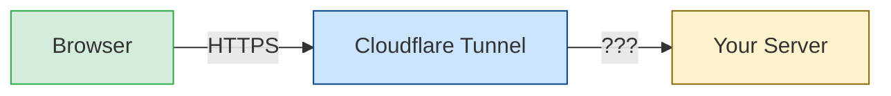
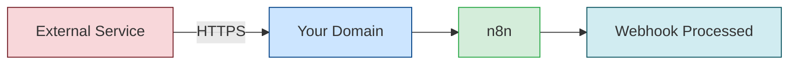
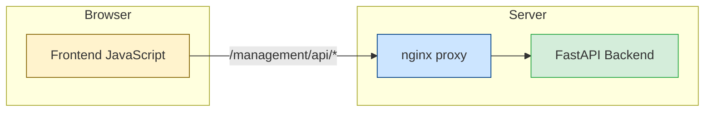
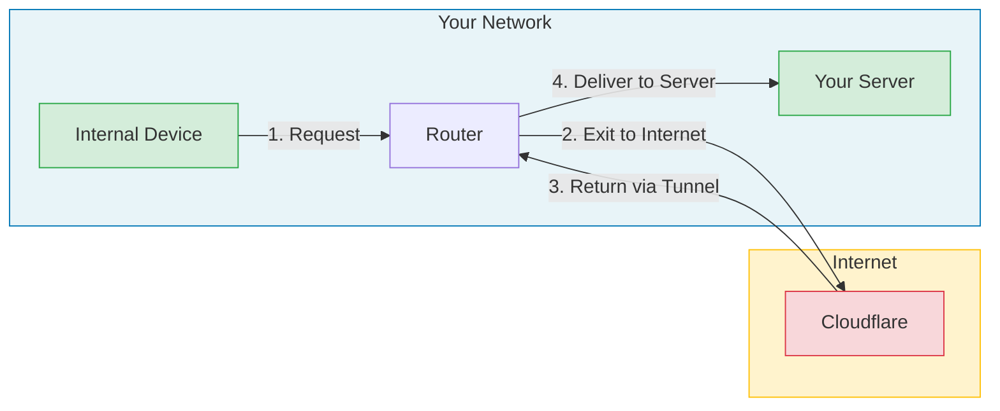
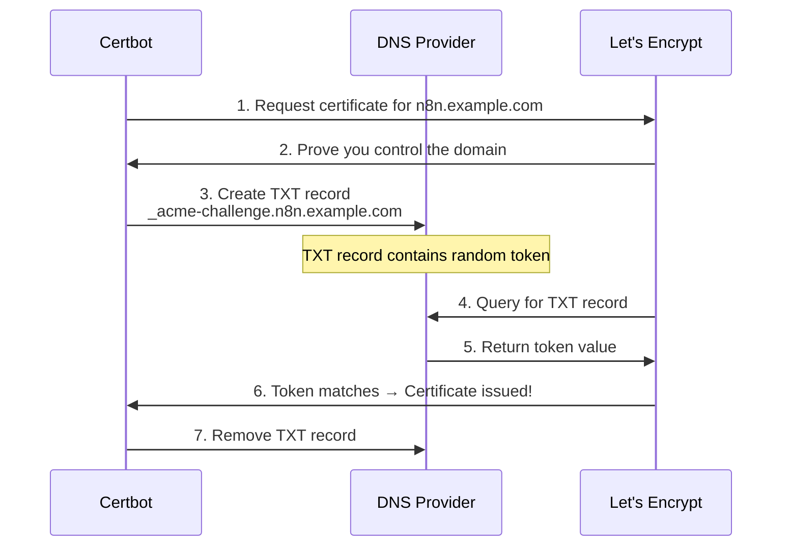

# SSL Certificates with Certbot & Let's Encrypt

## Overview

This guide explains why SSL certificates are essential for the n8n Management Suite, even when using Tailscale or Cloudflare Tunnel. Understanding the "why" helps you make informed decisions about your security architecture.

---

## Table of Contents

1. [Why SSL Certificates Are Required](#why-ssl-certificates-are-required)
2. [The Hairpinning Alternative](#the-hairpinning-alternative)
3. [How DNS-01 Challenge Works](#how-dns-01-challenge-works)
4. [Supported DNS Providers](#supported-dns-providers)
5. [Configuration During Setup](#configuration-during-setup)
6. [How Certificates Are Used](#how-certificates-are-used)
7. [Automatic Renewal](#automatic-renewal)
8. [Manual Certificate Management](#manual-certificate-management)
9. [Troubleshooting](#troubleshooting)

### Other Documentation

- [API Reference](./API.md) - REST API documentation
- [Backup Guide](./BACKUP_GUIDE.md) - Backup and restore procedures
- [Cloudflare Guide](./CLOUDFLARE.md) - Cloudflare Tunnel setup
- [Migration Guide](./MIGRATION.md) - Upgrading from v2.0 to v3.0
- [Notifications Guide](./NOTIFICATIONS.md) - Alert and notification setup
- [Tailscale Guide](./TAILSCALE.md) - Tailscale VPN integration
- [Troubleshooting](./TROUBLESHOOTING.md) - Common issues and solutions

---

## Why SSL Certificates Are Required

### The Short Answer

Even with Tailscale or Cloudflare Tunnel providing encrypted transport, **you still need valid SSL certificates on nginx** for your services to work correctly. This is primarily due to **CORS (Cross-Origin Resource Sharing)** requirements and browser security policies.

### The Technical Explanation

#### 1. CORS and Browser Security

Modern browsers enforce strict security policies:



When you access `https://n8n.yourdomain.com`:

1. Your browser connects to Cloudflare (HTTPS)
2. Cloudflare terminates SSL and proxies to your origin server
3. **Your origin server must also speak HTTPS** for the full chain to work

Without valid SSL on your origin:
- n8n webhooks may fail silently
- The Management Console API calls may be blocked
- WebSocket connections (used for real-time updates) will fail
- Browsers will show mixed-content warnings

#### 2. n8n Webhook Requirements

n8n requires HTTPS for production webhooks:



If the SSL chain is broken, webhook payloads may:
- Be rejected by n8n
- Fail CORS preflight checks
- Timeout during SSL handshake

#### 3. Management Console Communication

The Management Console frontend makes API calls to its backend:



Browsers require:
- Same-origin policy compliance
- Valid SSL certificates
- Proper CORS headers

Without valid SSL, these internal API calls fail with cryptic errors.

### What Happens Without Valid SSL?

| Symptom | Root Cause |
|---------|------------|
| Webhooks not triggering | CORS preflight fails |
| "Mixed content" warnings | HTTP/HTTPS mismatch |
| API calls returning 0 bytes | Browser blocks insecure request |
| WebSocket disconnects | WSS requires valid cert |
| "NET::ERR_CERT_AUTHORITY_INVALID" | Self-signed cert rejected |
| Management Console blank screen | JavaScript API calls blocked |

---

## The Hairpinning Alternative

### What is Hairpinning?

If you really don't want to set up local SSL certificates, there's an alternative called "hairpinning" or "NAT loopback":



With hairpinning:
1. Internal device makes request to `https://n8n.yourdomain.com`
2. Traffic exits your network to the internet
3. Reaches Cloudflare Tunnel
4. Returns through Cloudflare to your server
5. Response makes the reverse trip

### Why Hairpinning is Inefficient

| Issue | Impact |
|-------|--------|
| **Latency** | Every request takes a round-trip to Cloudflare |
| **Bandwidth** | Uses your internet upload/download for internal traffic |
| **Reliability** | Depends on internet connectivity for local access |
| **Speed** | 10-100x slower than local communication |
| **Data caps** | May consume metered bandwidth unnecessarily |

### Example Latency Comparison

| Access Method | Typical Latency |
|--------------|-----------------|
| Direct local (with SSL) | 1-5ms |
| Hairpinning via Cloudflare | 50-200ms |
| Via Tailscale (encrypted) | 5-20ms |

### When Hairpinning Might Be Acceptable

- Very low-traffic internal use
- No latency-sensitive operations
- Unlimited internet bandwidth
- Highly reliable internet connection
- Temporary/testing setup

### The Recommended Approach

Use **local SSL certificates** from Let's Encrypt:
- Fast local access (1-5ms)
- No internet dependency for internal traffic
- Zero cost (Let's Encrypt is free)
- Automatic renewal
- Proper CORS compliance

---

## How DNS-01 Challenge Works

### Why DNS-01?

The n8n Management Suite uses **DNS-01 challenge** rather than HTTP-01 because:

1. **No port 80 exposure required** - Your firewall can block all inbound traffic
2. **Works behind NAT** - No port forwarding needed
3. **Wildcard certificates** - Can issue `*.yourdomain.com` if needed
4. **More secure** - No web server exposure during validation

### The DNS-01 Process



### DNS Propagation

After Certbot creates the TXT record, it waits for DNS propagation:

| Provider | Typical Wait Time |
|----------|-------------------|
| Cloudflare | 60 seconds |
| Route53 | 60 seconds |
| Google Cloud DNS | 120 seconds |
| DigitalOcean | 60 seconds |

The setup configures appropriate propagation delays automatically.

---

## Supported DNS Providers

### Cloudflare (Recommended)

**Why Cloudflare is recommended:**
- Fast DNS propagation
- Easy API token generation
- Free tier available
- Same provider as Cloudflare Tunnel (if using)

**Setup during installation:**
```
  DNS Provider Selection:
    1. Cloudflare
    2. AWS Route 53
    3. Google Cloud DNS
    4. DigitalOcean
    5. Other (Manual DNS)

  Enter choice [1]: 1

  Cloudflare API Token: [paste your token]
```

**API Token Requirements:**

1. Go to [Cloudflare Dashboard](https://dash.cloudflare.com/profile/api-tokens)
2. Click **Create Token**
3. Use the **Edit zone DNS** template, or create custom with:
   - **Zone:DNS:Edit** permission
   - **Zone:Zone:Read** permission
4. Limit to your specific zone (domain) for security

**Credentials file created:** `cloudflare.ini`
```ini
dns_cloudflare_api_token = your-api-token-here
```

### AWS Route 53

**Setup:**
```
  AWS Access Key ID: AKIA...
  AWS Secret Access Key: [hidden]
```

**IAM Policy Required:**
```json
{
  "Version": "2012-10-17",
  "Statement": [
    {
      "Effect": "Allow",
      "Action": [
        "route53:ListHostedZones",
        "route53:GetChange"
      ],
      "Resource": "*"
    },
    {
      "Effect": "Allow",
      "Action": [
        "route53:ChangeResourceRecordSets"
      ],
      "Resource": "arn:aws:route53:::hostedzone/YOUR_ZONE_ID"
    }
  ]
}
```

**Credentials file created:** `route53.ini`
```ini
[default]
aws_access_key_id = AKIA...
aws_secret_access_key = your-secret-key
```

### Google Cloud DNS

**Setup:**
```
  Path to Google Cloud service account JSON: /path/to/credentials.json
```

**Service Account Requirements:**
1. Create service account in Google Cloud Console
2. Grant **DNS Administrator** role
3. Create and download JSON key file
4. Provide path during setup

**Credentials file created:** `google.json` (copied from your file)

### DigitalOcean

**Setup:**
```
  DigitalOcean API Token: dop_v1_...
```

**Token Requirements:**
1. Go to [DigitalOcean API Tokens](https://cloud.digitalocean.com/account/api/tokens)
2. Generate new token with **Write** scope
3. Token needs access to DNS management

**Credentials file created:** `digitalocean.ini`
```ini
dns_digitalocean_token = dop_v1_your-token-here
```

### Manual DNS (Other Providers)

For DNS providers without Certbot plugins:

```
  ⚠️ Manual DNS configuration selected
  You'll need to manually add TXT records during certificate issuance
```

**Manual process:**
1. Certbot will display the required TXT record
2. You add it to your DNS provider's control panel
3. Wait for propagation
4. Press Enter to continue validation
5. Remove the TXT record after completion

> **Manual certificates do NOT renew automatically.** Certbot has no API access to your DNS, so it cannot answer the renewal challenge on its own. The certificate expires after 90 days; before then, re-run `./setup.sh` (Reconfigure → option 1, answer "yes" to request a new certificate) and add the new TXT record. Once the certificate enters its renewal window (30 days before expiry) `docker logs n8n_certbot` and `/etc/letsencrypt/n8n-renewal.log` show a renewal error every hour as a reminder. Manual mode needs an interactive terminal and cannot be used with auto-confirm (`PRECONFIG_AUTO_CONFIRM=true`). Prefer a provider with a certbot DNS plugin whenever possible.

**Use manual mode for:**
- GoDaddy
- Namecheap
- Hover
- Other providers without API plugins

---

## Configuration During Setup

### Interactive Setup Flow

When running `./setup.sh`, the DNS configuration happens early:

```
╔══════════════════════════════════════════════════════════════╗
║              DNS Provider for SSL Certificates               ║
╚══════════════════════════════════════════════════════════════╝

  Select your DNS provider for Let's Encrypt DNS-01 challenge:

    1. Cloudflare (recommended)
    2. AWS Route 53
    3. Google Cloud DNS
    4. DigitalOcean
    5. Other (Manual DNS)

  Enter choice [1]:
```

### Pre-configured Setup

If using a config file, set these variables:

```bash
# In your config file
DNS_PROVIDER=cloudflare
CLOUDFLARE_API_TOKEN=your-api-token

# Or for Route53
DNS_PROVIDER=route53
AWS_ACCESS_KEY_ID=AKIA...
AWS_SECRET_ACCESS_KEY=your-secret-key

# Or for Google Cloud DNS
DNS_PROVIDER=google
GOOGLE_CREDENTIALS_FILE=/path/to/credentials.json

# Or for DigitalOcean
DNS_PROVIDER=digitalocean
DIGITALOCEAN_TOKEN=dop_v1_...
```

### Environment Variables Set by Setup

After configuration, these variables are set in your `.env`:

| Variable | Example | Purpose |
|----------|---------|---------|
| `DNS_PROVIDER` | `cloudflare` | Which DNS provider plugin to use |
| `DNS_CERTBOT_IMAGE` | `certbot/dns-cloudflare:v5.8.0` | Docker image for Certbot |
| `DNS_CERTBOT_FLAGS` | `--dns-cloudflare ...` | CLI flags for certificate issuance |
| `DNS_CREDENTIALS_FILE` | `cloudflare.ini` | Credentials file (relative to the install directory) mounted into the certbot container |
| `DNS_CREDENTIALS_TARGET` | `/credentials.ini` | Where that file is mounted inside the certbot container (`/credentials.ini` for Cloudflare/DigitalOcean/manual, `/credentials.json` for Google, `/root/.aws/credentials` for Route 53). Must match the path used at issuance, which certbot records in `renewal/<domain>.conf` |

> Installs made before `DNS_CREDENTIALS_FILE`/`DNS_CREDENTIALS_TARGET` were written to `.env` always mounted `cloudflare.ini` at `/credentials.ini`, so Route 53, Google and DigitalOcean renewals could not authenticate. Re-run `./setup.sh` → Reconfigure → option 7 (Regenerate all config files), or add the two lines to `.env` by hand, then `docker compose up -d certbot`.

---

## How Certificates Are Used

### Certificate Storage

Certificates are stored in the `letsencrypt` Docker volume:

```
letsencrypt/
├── live/
│   └── n8n.yourdomain.com/
│       ├── fullchain.pem    # Certificate + intermediate certs
│       ├── privkey.pem      # Private key
│       ├── cert.pem         # Just the certificate
│       └── chain.pem        # Intermediate certificates
├── archive/                  # All versions of certs
├── renewal/                  # Renewal configuration
└── accounts/                 # Let's Encrypt account info
```

### nginx Configuration

The certificates are mounted into the nginx container:

```yaml
# docker-compose.yaml
nginx:
  volumes:
    - letsencrypt:/etc/letsencrypt:ro
```

> **Public Website installs:** the `n8n_nginx_router` container also mounts the certificates and is the one that terminates SSL on port 443 (the main `n8n_nginx` becomes internal-only on port 80). Anything that renews a certificate must therefore reload the router as well — the deploy hook does this automatically.

And referenced in nginx.conf:

```nginx
server {
    listen 443 ssl http2;
    server_name n8n.yourdomain.com;

    ssl_certificate /etc/letsencrypt/live/n8n.yourdomain.com/fullchain.pem;
    ssl_certificate_key /etc/letsencrypt/live/n8n.yourdomain.com/privkey.pem;

    # Modern SSL configuration
    ssl_protocols TLSv1.2 TLSv1.3;
    ssl_ciphers ECDHE-ECDSA-AES128-GCM-SHA256:ECDHE-RSA-AES128-GCM-SHA256:...;
    ssl_prefer_server_ciphers off;

    # Security headers
    add_header Strict-Transport-Security "max-age=31536000" always;
}
```

### Shared Certificate

The same certificate is used for all services:
- n8n (main application)
- Management Console (`/management`)
- Adminer (`/adminer`)
- Portainer (`/portainer`)
- Dozzle (`/dozzle`)

This simplifies management - one certificate covers everything.

---

## Automatic Renewal

### How Renewal Works

The Certbot container runs continuously and checks for renewal:

```yaml
# docker-compose.yaml
certbot:
  image: ${DNS_CERTBOT_IMAGE:-certbot/certbot:v5.8.0}
  restart: unless-stopped
  environment:
    - NGINX_CONTAINER=${NGINX_CONTAINER:-n8n_nginx}
  volumes:
    - letsencrypt:/etc/letsencrypt
    - ./${DNS_CREDENTIALS_FILE:-cloudflare.ini}:${DNS_CREDENTIALS_TARGET:-/credentials.ini}:ro
    - ./scripts/certbot:/opt/n8n-certbot:ro
    - /var/run/docker.sock:/var/run/docker.sock:ro
  entrypoint: ["/bin/sh", "/opt/n8n-certbot/renew-loop.sh"]
```

**Process** (`scripts/certbot/renew-loop.sh`):
1. On start, the loop installs `scripts/certbot/reload-nginx-hook.py` as `/etc/letsencrypt/renewal-hooks/deploy/n8n-reload-nginx`. Certbot runs everything in that directory after **every** successful `certbot renew` — the background loop, the Management Console's *Force Renewal*, or a manual `docker exec`. The hook sends `SIGHUP` (the same as `nginx -s reload`) to `n8n_nginx` and, if it exists, `n8n_nginx_router` through the Docker API on the mounted socket. It uses only Python's standard library, which every certbot image ships, so nothing is installed at container start (older versions ran `apk add docker-cli` on every start, which needed network access and hid its failures).
2. Every 12 hours, `certbot renew` checks every certificate. It re-uses the DNS plugin and credentials path recorded in `renewal/<domain>.conf` when the certificate was issued, which is why the credentials file must be mounted at `DNS_CREDENTIALS_TARGET`.
3. Certificates are renewed when less than 30 days remain.
4. After renewal, the deploy hook reloads nginx. No downtime: nginx reloads gracefully.
5. **Failures are visible**: certbot's output and a clear `ERROR: certbot renew FAILED` line go to `docker logs n8n_certbot` and to `/etc/letsencrypt/n8n-renewal.log` in the volume. The latest result is written to `/etc/letsencrypt/n8n-renewal-status.json` (`{"status": "ok"|"failed", "exit_code": ..., "last_run": ..., "broken_lineages": ...}`). After a failure the loop retries every hour instead of waiting 12 hours, and it keeps running.
6. The loop also checks every lineage on each run and logs an error if `live/<domain>/*.pem` are not symlinks (see [Repairing a Broken Certificate Lineage](#repairing-a-broken-certificate-lineage)).
7. `restart: unless-stopped` brings the container back after a crash or a host reboot.

Intervals can be tuned with `RENEW_INTERVAL` (default `12h`) and `RENEW_RETRY_INTERVAL` (default `1h`) in the certbot service's `environment:`.

**At the end of `setup.sh`** the installer runs `certbot renew --dry-run` in the certbot container (against the Let's Encrypt staging server) and reports whether automatic renewal works. If it detects a broken lineage left by an older install it offers to repair it first.

### Renewal Timeline

```
Certificate Issued          Renewal Window Opens       Expires
       │                           │                      │
       ├───────────── 60 days ─────┼─────── 30 days ──────┤
       │                           │                      │
       │                           └── Certbot renews ────┘
       │                               (any check in this window)
```

### Verifying Renewal Configuration

```bash
# Check Certbot container is running
docker ps | grep certbot

# View renewal configuration
docker exec n8n_certbot cat /etc/letsencrypt/renewal/n8n.yourdomain.com.conf

# Test renewal (dry run)
docker exec n8n_certbot certbot renew --dry-run

# Result of the last automatic renewal run, and its log
docker exec n8n_certbot cat /etc/letsencrypt/n8n-renewal-status.json
docker exec n8n_certbot tail -n 50 /etc/letsencrypt/n8n-renewal.log

# Check that the lineage is intact (every file must be a symlink "-> ../../archive/...")
docker exec n8n_certbot ls -l /etc/letsencrypt/live/n8n.yourdomain.com/
```

---

## Manual Certificate Management

### Force Renewal

From the Management Console:
1. Go to **System** → **SSL/TLS**
2. Click **Force Renewal**

The Management Console waits up to 5 minutes for the renewal to complete and uses `--no-random-sleep-on-renew` to skip certbot's default random delay.

Or via command line:
```bash
docker exec n8n_certbot certbot renew --force-renewal --no-random-sleep-on-renew
docker exec n8n_nginx nginx -s reload

# Public Website installs only: also reload the SSL-terminating router
docker exec n8n_nginx_router nginx -s reload
```

> **Why `--no-random-sleep-on-renew`?** By default, certbot adds a random delay of up to 8 minutes before each renewal to spread load on Let's Encrypt's servers. For interactive force-renewals this causes long waits and HTTP timeouts. The flag is now used everywhere — both on-demand renewals and the scheduled 12-hour background loop.

### View Certificate Details

```bash
# Check certificate expiration
docker exec n8n_nginx openssl x509 -in /etc/letsencrypt/live/n8n.yourdomain.com/fullchain.pem -noout -dates

# View full certificate info
docker exec n8n_nginx openssl x509 -in /etc/letsencrypt/live/n8n.yourdomain.com/fullchain.pem -noout -text
```

### Replace with Custom Certificate

If you have certificates from another CA:

1. Stop nginx:
   ```bash
   docker compose stop nginx
   ```

2. Copy certificates into the volume:
   ```bash
   # Create directory structure
   docker run --rm -v letsencrypt:/etc/letsencrypt alpine mkdir -p /etc/letsencrypt/live/n8n.yourdomain.com

   # Copy certificate files
   docker cp fullchain.pem n8n_certbot:/etc/letsencrypt/live/n8n.yourdomain.com/
   docker cp privkey.pem n8n_certbot:/etc/letsencrypt/live/n8n.yourdomain.com/
   ```

3. Start nginx:
   ```bash
   docker compose start nginx
   ```

> A custom certificate is not managed by certbot and is never renewed automatically. Because its `live/` files are regular files, the certbot container logs it as a "broken lineage" on every run; stop the certbot container (`docker compose stop certbot`) if you manage certificates yourself. Never copy certbot-managed certificates with `cp -L`/`cp -rL` or `docker cp`: that replaces the `live/` symlinks with plain files and certbot stops renewing them. Use `cp -a src/. dst/` to keep symlinks.

---

## Troubleshooting

### Certificate Issuance Failed

**Check Certbot logs:**
```bash
docker logs n8n_certbot
```

**Common issues:**

| Error | Cause | Solution |
|-------|-------|----------|
| `DNS problem: NXDOMAIN` | Domain doesn't exist in DNS | Verify domain is configured |
| `Invalid API token` | Wrong credentials | Regenerate API token |
| `Rate limited` | Too many requests | Wait 1 hour, check rate limits |
| `CAA record issue` | CAA DNS record blocks Let's Encrypt | Add `0 issue "letsencrypt.org"` |
| `Timeout during connect` | Network issues | Check internet connectivity |
| `The requested dns-cloudflare plugin does not appear to be installed` | Wrong certbot image | Set `DNS_CERTBOT_IMAGE=certbot/dns-cloudflare` in `.env` and recreate the certbot container |
| `Unable to find deploy-hook command docker in the PATH` | Old compose file: the renew loop passed a `docker exec` deploy hook but the certbot image has no Docker CLI, so **renewal is never attempted** | Update to the current compose file (the hook now uses the Docker API from Python, no CLI needed), then `docker compose up -d --force-recreate certbot` |
| `Renewal configuration file ... is broken` / `expected ... to be a symlink` | Broken lineage: `live/*.pem` are regular files | See [Repairing a Broken Certificate Lineage](#repairing-a-broken-certificate-lineage) |
| `Unable to locate credentials` (Route 53) or `... credentials file ... not found` | Wrong credentials file mounted (older installs always mounted `cloudflare.ini`) | Set `DNS_CREDENTIALS_FILE` / `DNS_CREDENTIALS_TARGET` in `.env` (see [Environment Variables Set by Setup](#environment-variables-set-by-setup)), then `docker compose up -d certbot` |

### Renewals Silently Failing (Older Installs)

**Symptoms:** the certificate creeps toward expiry although the certbot container is running, and nothing obvious appears in the logs. Installs made before this fix had four independent problems, each of which stopped renewals:

1. **Broken lineage.** The installer issued the certificate into `./letsencrypt-temp` and copied it into the volume with `cp -rL`, turning `live/<domain>/*.pem` into regular files. Certbot considers such a lineage broken and skips it.
2. **Errors were hidden.** The renew loop ended in `|| true` and discarded all output.
3. **Missing Docker CLI.** The deploy hook needed `docker`, installed by `apk add docker-cli` at every start with its errors discarded; if that failed, certbot refused to run the hook and did not renew at all.
4. **Wrong DNS credentials.** `DNS_CREDENTIALS_FILE` was never written to `.env`, so the container always mounted `cloudflare.ini` at `/credentials.ini`; Route 53, Google and DigitalOcean renewals could not authenticate.

**Solution:**
```bash
cd /path/to/n8n_nginx
git pull                                   # get the fixed compose file and scripts/
./setup.sh                                 # Reconfigure -> 7 (Regenerate all config files), redeploy
                                           #   (writes DNS_CREDENTIALS_FILE/TARGET, runs the dry-run check,
                                           #    offers to repair a broken lineage)
# or, without re-running setup:
./scripts/repair_ssl_lineage.sh            # repair lineage + certbot renew --dry-run
docker compose up -d --force-recreate certbot
docker logs -f n8n_certbot                 # should end with "certbot renew finished successfully"
```

### Repairing a Broken Certificate Lineage

Certbot keeps every issued certificate in `archive/<domain>/certN.pem` (and `chainN`, `fullchainN`, `privkeyN`) and points `live/<domain>/*.pem` at the newest version with **symlinks**. If those are plain files, certbot will not renew the certificate.

**Detect:**
```bash
./scripts/repair_ssl_lineage.sh --check
# or
docker exec n8n_certbot ls -l /etc/letsencrypt/live/your-domain.com/   # every entry must be "-> ../../archive/..."
```

**Repair in place (no request to Let's Encrypt, no rate limit used):**
```bash
./scripts/repair_ssl_lineage.sh
```
For every broken lineage the script backs up `live/<domain>/` to `/etc/letsencrypt/lineage-repair-backup/` in the volume, re-creates `live/<domain>/*.pem` as symlinks to the newest archive version (or adds the current live files as a new archive version if they differ), runs `certbot renew --dry-run` with your provider's credentials, and restarts the certbot container. Add `--force-renew` to also issue a fresh certificate immediately (`certbot renew --force-renewal --cert-name <domain>`; nginx is reloaded by the deploy hook).

**Re-issue from scratch** (lineage cannot be repaired, e.g. the renewal config is missing):
```bash
./scripts/repair_ssl_lineage.sh --reissue your-domain.com
```
This moves the old lineage aside (kept in `lineage-repair-backup/`) and runs `certbot certonly --force-renewal --cert-name your-domain.com` with the domains of the current certificate directly into the `letsencrypt` volume, then reloads nginx. If issuance fails, the previous files are put back so nginx keeps serving the old certificate. The equivalent manual command for Cloudflare is:
```bash
docker run --rm -v letsencrypt:/etc/letsencrypt -v "$PWD/cloudflare.ini:/credentials.ini:ro" \
  certbot/dns-cloudflare certonly --dns-cloudflare --dns-cloudflare-credentials /credentials.ini \
  --dns-cloudflare-propagation-seconds 60 --cert-name your-domain.com \
  -d your-domain.com -d '*.your-domain.com' --force-renewal --non-interactive --agree-tos
```
(move `live/`, `archive/` and `renewal/` entries for the domain aside first, otherwise certbot creates `your-domain.com-0001`, which nginx does not use).

Running `./setup.sh` and requesting a new certificate does the same automatically: a broken lineage for the certificate domain is moved aside and a clean one is issued straight into the volume.

### Force Renewal Times Out in Management Console

**Symptoms:** "Force Renewal" returns a timeout error in the UI, but the certificate was renewed successfully when checked manually.

**Cause:** Older builds did not pass `--no-random-sleep-on-renew` to certbot, so the random delay (up to 8 minutes) exceeded the web request timeout.

**Solution:** Pull the latest Management image — both the flag and a 5-minute frontend timeout are now included:
```bash
docker compose pull n8n_management
docker compose up -d n8n_management
```

### Broken Certificate Symlinks After Manual Renewal

**Symptoms:** nginx serves an expired certificate even after `certbot renew --force-renewal` reports success.

**Cause:** `/etc/letsencrypt/live/<domain>/*.pem` are symlinks into `/etc/letsencrypt/archive/<domain>/`. If they point to an older `cert1.pem` instead of the freshly issued `cert2.pem`, nginx keeps serving the old cert.

**Diagnosis:**
```bash
docker exec n8n_certbot ls -la /etc/letsencrypt/live/your-domain.com/
docker exec n8n_certbot ls -la /etc/letsencrypt/archive/your-domain.com/
```

**Solution:** Recreate the symlinks to the highest-numbered file in `archive/`:
```bash
docker exec n8n_certbot sh -c '
  cd /etc/letsencrypt/live/your-domain.com &&
  ln -sf ../../archive/your-domain.com/cert2.pem cert.pem &&
  ln -sf ../../archive/your-domain.com/chain2.pem chain.pem &&
  ln -sf ../../archive/your-domain.com/fullchain2.pem fullchain.pem &&
  ln -sf ../../archive/your-domain.com/privkey2.pem privkey.pem
'
docker exec n8n_nginx nginx -s reload
```

### Certificate Not Updating in nginx

nginx only reads certificate files at startup or reload — a renewed cert on disk is not served until the SSL-terminating container reloads.

```bash
# Reload nginx manually
docker exec n8n_nginx nginx -s reload

# Public Website installs: n8n_nginx_router terminates SSL on port 443 —
# it must be reloaded too, or it keeps serving the old cert from memory
docker exec n8n_nginx_router nginx -s reload

# Or restart nginx container
docker compose restart nginx

# Verify certificate is current
curl -v https://n8n.yourdomain.com 2>&1 | grep "expire date"
```

### Mixed Content Warnings

If you see mixed content warnings:

1. Ensure all services use HTTPS internally
2. Check nginx proxy settings use `https://` for upstream
3. Clear browser cache and retry

### CORS Errors in Console

```
Access to fetch at 'https://...' from origin 'https://...' has been blocked by CORS policy
```

**Solutions:**
1. Verify SSL certificate is valid (not self-signed)
2. Check certificate matches the domain being accessed
3. Ensure nginx is properly configured with correct server_name
4. For a browser calling an n8n webhook from another site: set the Webhook node's **Allowed Origins (CORS)** option in n8n. nginx does not add CORS headers to `/webhook/` or `/form/` responses; n8n sets them per webhook.

### Rate Limits

Let's Encrypt has rate limits:

| Limit | Value | Reset |
|-------|-------|-------|
| Certificates per domain | 50/week | Rolling 7 days |
| Failed validations | 5/hour | 1 hour |
| Duplicate certificates | 5/week | Rolling 7 days |

**If rate limited:**
1. Wait for the limit to reset
2. Use staging environment for testing:
   ```bash
   certbot certonly --staging ...
   ```

### Verify Certificate Chain

```bash
# Check the full chain is valid
docker exec n8n_nginx openssl verify -CAfile /etc/ssl/certs/ca-certificates.crt /etc/letsencrypt/live/n8n.yourdomain.com/fullchain.pem

# Test SSL configuration
curl -I https://n8n.yourdomain.com

# External SSL test
# Visit: https://www.ssllabs.com/ssltest/analyze.html?d=n8n.yourdomain.com
```

---

## Quick Reference

### Commands

```bash
# View certificate expiration
docker exec n8n_nginx openssl x509 -in /etc/letsencrypt/live/YOUR_DOMAIN/fullchain.pem -noout -enddate

# Force certificate renewal
docker exec n8n_certbot certbot renew --force-renewal --no-random-sleep-on-renew

# Test renewal (dry run)
docker exec n8n_certbot certbot renew --dry-run

# Reload nginx after renewal
docker exec n8n_nginx nginx -s reload

# Public Website installs: also reload the SSL-terminating router
docker exec n8n_nginx_router nginx -s reload

# View Certbot logs (renewal failures are logged as "ERROR: certbot renew FAILED")
docker logs n8n_certbot
docker exec n8n_certbot cat /etc/letsencrypt/n8n-renewal-status.json

# Detect / repair a broken certificate lineage (live/*.pem not symlinks)
./scripts/repair_ssl_lineage.sh --check
./scripts/repair_ssl_lineage.sh

# Check certificate from outside
echo | openssl s_client -connect YOUR_DOMAIN:443 2>/dev/null | openssl x509 -noout -dates
```

### File Locations

| File | Location | Purpose |
|------|----------|---------|
| Credentials | `./cloudflare.ini` (or similar) | DNS API credentials |
| Certificate | `letsencrypt:/etc/letsencrypt/live/DOMAIN/fullchain.pem` | SSL certificate |
| Private key | `letsencrypt:/etc/letsencrypt/live/DOMAIN/privkey.pem` | SSL private key |
| Renewal config | `letsencrypt:/etc/letsencrypt/renewal/DOMAIN.conf` | Certbot renewal settings |
| Renewal log | `letsencrypt:/etc/letsencrypt/n8n-renewal.log` | Output of every automatic renewal run |
| Renewal status | `letsencrypt:/etc/letsencrypt/n8n-renewal-status.json` | Result of the last automatic renewal run |
| Deploy hook | `letsencrypt:/etc/letsencrypt/renewal-hooks/deploy/n8n-reload-nginx` | Reloads nginx after renewal (installed from `scripts/certbot/`) |

### Environment Variables

| Variable | Example | Purpose |
|----------|---------|---------|
| `DNS_PROVIDER` | `cloudflare` | DNS provider selection |
| `DNS_CERTBOT_IMAGE` | `certbot/dns-cloudflare:v5.8.0` | Certbot Docker image |
| `DNS_CERTBOT_FLAGS` | `--dns-cloudflare --dns-cloudflare-credentials /credentials.ini` | Certbot CLI flags |
| `DNS_CREDENTIALS_FILE` | `cloudflare.ini` | Credentials file name |
| `DNS_CREDENTIALS_TARGET` | `/credentials.ini` | Mount path of the credentials file inside the certbot container |

