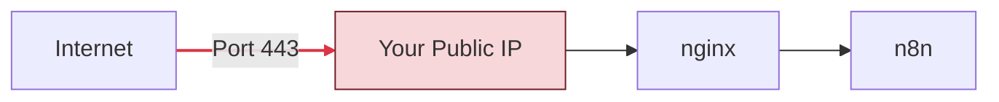
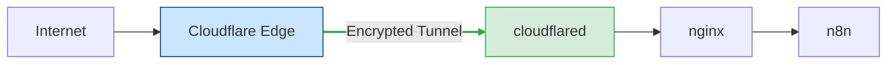
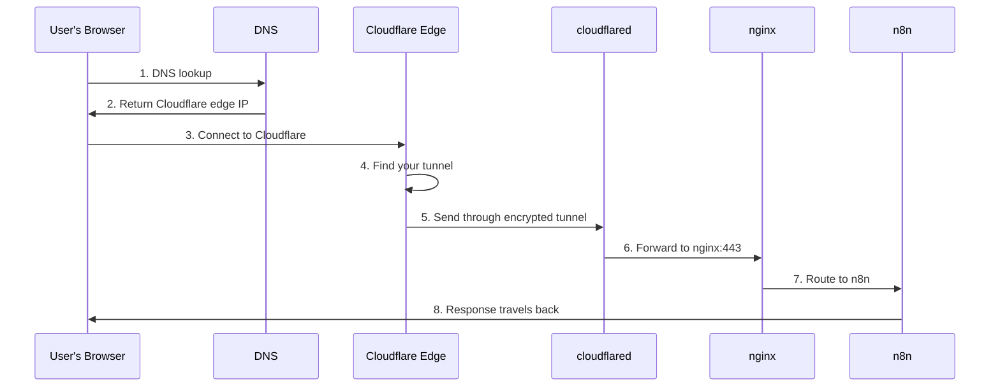

# Cloudflare Tunnel Integration Guide

## Overview

Cloudflare Tunnel (formerly Argo Tunnel) provides secure, outbound-only access to your n8n installation without exposing any ports to the internet. This guide covers everything from creating a Cloudflare account to advanced access policies.

---

## Table of Contents

1. [What is Cloudflare Tunnel?](#what-is-cloudflare-tunnel)
2. [Creating a Cloudflare Account](#creating-a-cloudflare-account)
3. [Adding Your Domain to Cloudflare](#adding-your-domain-to-cloudflare)
4. [Setting Up Zero Trust](#setting-up-zero-trust)
5. [Creating a Tunnel](#creating-a-tunnel)
6. [Public Website Hosting](#public-website-hosting)
7. [Generating the Tunnel Token](#generating-the-tunnel-token)
8. [Configuration in n8n Management](#configuration-in-n8n-management)
9. [Understanding How Tunnels Work](#understanding-how-tunnels-work)
10. [Zero Trust Access Policies](#zero-trust-access-policies)
11. [Security Best Practices](#security-best-practices)
12. [Troubleshooting](#troubleshooting)

### Other Documentation

- [API Reference](./API.md) - REST API documentation
- [Backup Guide](./BACKUP_GUIDE.md) - Backup and restore procedures
- [Certbot Guide](./CERTBOT.md) - SSL certificate management
- [Migration Guide](./MIGRATION.md) - Upgrading from v2.0 to v3.0
- [Notifications Guide](./NOTIFICATIONS.md) - Alert and notification setup
- [Tailscale Guide](./TAILSCALE.md) - Tailscale VPN integration
- [Troubleshooting](./TROUBLESHOOTING.md) - Common issues and solutions

---

## What is Cloudflare Tunnel?

Cloudflare Tunnel creates a secure, encrypted connection between your server and Cloudflare's edge network. Unlike traditional setups:

### Traditional Setup (Without Tunnel)


> ⚠️ **Risk**: Your public IP is exposed to attacks

### With Cloudflare Tunnel


> ✅ **Secure**: Outbound only, no exposed ports

### Key Benefits

| Feature | Benefit |
|---------|---------|
| **No Open Ports** | Your server has no inbound ports exposed |
| **DDoS Protection** | Cloudflare filters malicious traffic |
| **Free SSL** | Automatic certificate management |
| **Access Control** | Require authentication before access |
| **Performance** | Cloudflare's CDN and optimization |
| **Zero Config DNS** | Automatic DNS record management |

---

## Creating a Cloudflare Account

### Step 1: Sign Up

1. Visit [https://dash.cloudflare.com/sign-up](https://dash.cloudflare.com/sign-up)
2. Enter your email address
3. Create a password (minimum 8 characters)
4. Click **Create Account**
5. Verify your email address

### Step 2: Choose a Plan

For most n8n installations, the **Free** plan is sufficient:

| Feature | Free | Pro ($20/mo) |
|---------|------|--------------|
| Cloudflare Tunnel | ✅ Unlimited | ✅ Unlimited |
| Zero Trust (50 users) | ✅ Free | ✅ Free |
| DDoS Protection | ✅ Basic | ✅ Enhanced |
| SSL Certificates | ✅ Universal | ✅ Advanced |

### Step 3: Complete Account Setup

1. Log into [dash.cloudflare.com](https://dash.cloudflare.com)
2. Click on your profile icon (top right)
3. Go to **My Profile** > **Account**
4. Add 2FA for security (highly recommended)

---

## Adding Your Domain to Cloudflare

Before creating a tunnel, your domain must be on Cloudflare.

### Step 1: Add Your Site

1. In Cloudflare dashboard, click **Add site**
2. Enter your domain name (e.g., `example.com`)
3. Select the **Free** plan
4. Click **Continue**

### Step 2: Review DNS Records

Cloudflare scans your existing DNS records:

1. Review the imported records
2. Ensure your main records are present
3. Click **Continue**

### Step 3: Change Nameservers

Cloudflare provides two nameservers. Update them at your domain registrar:

**Example:**
```
ns1.cloudflare.com
ns2.cloudflare.com
```

**Where to update nameservers:**
- GoDaddy: Domain Settings > Nameservers
- Namecheap: Domain List > Manage > Nameservers
- Google Domains: DNS > Custom nameservers

### Step 4: Wait for Propagation

- Nameserver changes take 1-48 hours
- Cloudflare emails you when active
- Check status in dashboard: should show **Active**

---

## Setting Up Zero Trust

Cloudflare Zero Trust is the platform for managing tunnels and access policies.

### Step 1: Access Zero Trust Dashboard

1. Go to [https://one.dash.cloudflare.com](https://one.dash.cloudflare.com)
2. Or from main dashboard: **Zero Trust** (left sidebar)

### Step 2: Initial Setup

First time accessing Zero Trust:

1. Click **Get started**
2. Enter a **team name** (this becomes your access URL: `teamname.cloudflareaccess.com`)
3. Select the **Free** plan (up to 50 users)
4. Click **Complete setup**

### Step 3: Verify Setup

Your Zero Trust dashboard should show:
- **Tunnels**: For creating connections
- **Access**: For authentication policies
- **Gateway**: For DNS filtering (optional)

---

## Creating a Tunnel

### Step 1: Navigate to Tunnels

1. In Zero Trust dashboard, go to **Networks** > **Tunnels**
2. Click **Create a tunnel**

### Step 2: Choose Connector Type

Select **Cloudflared** (the recommended connector)

### Step 3: Name Your Tunnel

1. Enter a name: e.g., `n8n-tunnel`
2. Click **Save tunnel**

### Step 4: Install Connector (Skip This)

Cloudflare shows installation instructions. **Skip this step** - the n8n docker setup handles this automatically.

Click **Next** to continue.

### Step 5: Add Public Hostnames

Configure what services are accessible through the tunnel:

**For n8n:**
| Field | Value |
|-------|-------|
| Subdomain | `n8n` (or leave blank for root) |
| Domain | `example.com` (your domain) |
| Type | `HTTPS` |
| URL | `nginx:443` |

This creates: `n8n.example.com` → your n8n instance

**Available Services (Path-Based Routing):**

The n8n Management Suite uses nginx reverse proxy with path-based routing - no ports required:

| Service | URL |
|---------|-----|
| **n8n** | `https://n8n.example.com` |
| **Management Console** | `https://n8n.example.com/management` |
| **Adminer** (optional) | `https://n8n.example.com/adminer` |
| **Portainer** (optional) | `https://n8n.example.com/portainer` |
| **Dozzle** (optional) | `https://n8n.example.com/dozzle` |

> **Note**: All services are accessed via paths on your single domain. The tunnel only needs to expose one hostname - nginx handles routing to the appropriate service.

**Additional Options (click "Additional application settings"):**

| Setting | Recommended | Purpose |
|---------|-------------|---------|
| TLS > No TLS Verify | ✅ Enable | Accept self-signed certs from nginx |
| TLS > Origin Server Name | `your-domain.com` | SNI for the connection |
| HTTP Settings > HTTP Host Header | `your-domain.com` | Preserve host header |

### Step 6: Save the Tunnel

1. Review your configuration
2. Click **Save tunnel**

---

## Public Website Hosting

If you enabled the **Public Website** feature during setup, you must configure Cloudflare Tunnel to route traffic for your website (`www.yourdomain.com` or `yourdomain.com`).

### Why is this needed?
The `n8n` public hostname (e.g., `n8n.example.com`) only routes traffic to the n8n application. To serve your static website, you need separate public hostnames pointing to the same tunnel.

### Configuration Steps

1. Go to **Networks** > **Tunnels**
2. Select your `n8n-tunnel` > **Configure**
3. Go to **Public Hostname** tab
4. Click **Add a public hostname**

**For www subdomain:**
| Field | Value |
|-------|-------|
| Subdomain | `www` |
| Domain | `example.com` |
| Path | (leave empty) |
| Type | `HTTPS` |
| URL | `n8n_nginx:443` |

**For root domain (optional):**
| Field | Value |
|-------|-------|
| Subdomain | (leave empty) |
| Domain | `example.com` |
| Type | `HTTPS` |
| URL | `n8n_nginx:443` |

### Important Settings
For both hostnames, you **must** enable this setting under **Additional application settings > TLS**:
- **No TLS Verify**: ✅ Enabled

---

## Generating the Tunnel Token

### Step 1: Find Your Tunnel

1. Go to **Networks** > **Tunnels**
2. Click on your tunnel name (`n8n-tunnel`)

### Step 2: Copy the Token

1. In the tunnel overview, you'll see the **Install connector** section
2. Look for the token in the command shown:
   ```
   cloudflared service install eyJhIjoiMj...very-long-token...
   ```
3. Copy just the token part (starts with `eyJ`)

**Or use the "Copy" button** next to the token

### Token Format

The token is a base64-encoded JSON string containing:
- Account ID
- Tunnel ID
- Tunnel secret

Example token start: `eyJhIjoiMjM0NTY3ODkwIiwidCI6Ij...`

### Step 3: Store the Token

Add to your n8n `.env` file:
```env
CLOUDFLARE_TUNNEL_TOKEN=eyJhIjoiMjM0NTY3ODkwIiwidCI6IjEyMzQ1Njc4OTAi...
```

> ⚠️ **Security Note**: Never share or commit tunnel tokens. They grant full access to your tunnel.

---

## Configuration in n8n Management

### Environment Variables

Add to your `.env` file:

```env
# Cloudflare Tunnel token (from dashboard)
CLOUDFLARE_TUNNEL_TOKEN=eyJhIjoixxxxxxx...

# Your domain (used for nginx configuration)
N8N_DOMAIN=n8n.example.com
```

### Docker Compose Configuration

The cloudflared container is configured in `docker-compose.yml`:

```yaml
n8n_cloudflared:
  image: cloudflare/cloudflared:latest
  container_name: n8n_cloudflared
  command: tunnel --no-autoupdate run
  environment:
    - TUNNEL_TOKEN=${CLOUDFLARE_TUNNEL_TOKEN}
  networks:
    - n8n_network
  restart: unless-stopped
  depends_on:
    - n8n_nginx
```

### Starting the Tunnel

After configuration:

```bash
docker compose up -d n8n_cloudflared
```

Verify the connection:
```bash
docker logs n8n_cloudflared
```

Look for:
```
INF Connection established connIndex=0 connection=xxxx
INF Connection established connIndex=1 connection=xxxx
```

---

## Understanding How Tunnels Work

### Connection Flow

1. **Cloudflared starts** and connects to Cloudflare's edge
2. **4 connections** are established (for redundancy)
3. **Tunnel becomes active** in Cloudflare dashboard
4. **DNS is updated** to route traffic through the tunnel

### Request Flow

When a user visits `n8n.example.com`:



### Tunnel Redundancy

Cloudflared maintains multiple connections:
- Primary: 2 connections
- Backup: 2 connections
- If one fails, traffic shifts automatically

### No Open Ports Required

Your server firewall can block ALL inbound traffic:

```bash
# Example: UFW configuration
ufw default deny incoming
ufw default allow outgoing
ufw enable
```

The tunnel works because:
- Connection is **outbound** from your server
- Cloudflare's edge **accepts** the connection
- Traffic flows **through** the established connection

---

## Zero Trust Access Policies

Secure your n8n with authentication requirements.

### Step 1: Create an Application

1. Go to **Access** > **Applications**
2. Click **Add an application**
3. Select **Self-hosted**

### Step 2: Configure the Application

| Field | Value |
|-------|-------|
| Application name | `n8n` |
| Session Duration | `24 hours` (adjust as needed) |
| Application domain | `n8n.example.com` |
| Path | Leave empty (protect entire domain) |

### Step 3: Add Access Policies

Create a policy to control who can access:

**Example: Email-based access**
| Field | Value |
|-------|-------|
| Policy name | `Allowed Users` |
| Action | `Allow` |
| Selector | `Emails` |
| Value | `user@example.com, admin@example.com` |

**Example: Domain-based access**
| Field | Value |
|-------|-------|
| Policy name | `Company Employees` |
| Action | `Allow` |
| Selector | `Emails ending in` |
| Value | `@yourcompany.com` |

**Example: IP-based access**
| Field | Value |
|-------|-------|
| Policy name | `Office IP` |
| Action | `Allow` |
| Selector | `IP ranges` |
| Value | `203.0.113.0/24` |

### Step 4: Configure Identity Providers

Set up how users authenticate:

1. Go to **Settings** > **Authentication**
2. Add identity providers:
   - **One-time PIN** (email code, easiest)
   - **Google** (for Google Workspace)
   - **GitHub** (for GitHub organizations)
   - **SAML** (for enterprise SSO)

### Step 5: Save and Test

1. Save the application
2. Open an incognito window
3. Visit `n8n.example.com`
4. You should see the Cloudflare Access login page
5. Authenticate with allowed credentials

---

## Security Best Practices

### 1. Enable Access for n8n

Always require authentication for production:
- Prevents unauthorized access
- Logs all access attempts
- Can revoke access instantly

### 2. Use Service Tokens for Automation

For API access or automation:

1. Go to **Access** > **Service Auth**
2. Create a service token
3. Add the token to your API client:
   ```
   CF-Access-Client-Id: xxx
   CF-Access-Client-Secret: xxx
   ```

### 3. Monitor Access Logs

1. Go to **Logs** > **Access**
2. Review login attempts
3. Set up alerts for suspicious activity

### 4. Rotate Tunnel Tokens

Periodically regenerate tunnel tokens:

1. Go to **Tunnels** > Your tunnel
2. Click **Configure**
3. Generate new credentials
4. Update your `.env` file
5. Restart cloudflared

### 5. Use Separate Tunnels for Services

Consider separate tunnels for:
- Production n8n
- Development/staging
- Management console (if exposed)

### 6. Implement Device Posture (Pro Feature)

Require devices to meet security requirements:
- OS up to date
- Disk encryption enabled
- Corporate device only

---

## Troubleshooting

### Tunnel Shows "Inactive"

**Check container is running:**
```bash
docker ps | grep cloudflared
```

**Check logs for errors:**
```bash
docker logs n8n_cloudflared
```

**Common causes:**
- Invalid tunnel token
- Network connectivity issues
- Token expired or regenerated

### Connection Refused Errors

**Verify nginx is accessible from cloudflared:**
```bash
docker exec n8n_cloudflared wget -q -O- https://nginx:443 --no-check-certificate
```

**Check tunnel configuration:**
1. Go to tunnel in Cloudflare dashboard
2. Verify the **URL** is correct (`nginx:443`)
3. Ensure **No TLS Verify** is enabled

### 502 Bad Gateway

This indicates cloudflared can reach your server, but something is wrong:

**Check nginx is running:**
```bash
docker logs n8n_nginx
```

**Verify SSL configuration:**
```bash
docker exec n8n_nginx nginx -t
```

### DNS Not Resolving

**Check DNS records:**
1. Go to **DNS** in Cloudflare dashboard
2. Look for the CNAME record created by the tunnel
3. Should show: `n8n.example.com CNAME <tunnel-id>.cfargotunnel.com`

**Force DNS refresh:**
```bash
# Clear local DNS cache
# macOS
sudo dscacheutil -flushcache

# Linux
sudo systemd-resolve --flush-caches

# Windows
ipconfig /flushdns
```

### Access Policy Not Working

**Check policy order:**
- Policies are evaluated in order
- First matching policy wins
- Put most restrictive first

**Verify session:**
1. Open incognito window
2. Clear `CF_Authorization` cookie
3. Try again

### SSL Certificate Errors

**If using self-signed certs on nginx:**
1. Go to tunnel configuration
2. Enable **No TLS Verify** in additional settings
3. Save and wait for propagation

**If using Let's Encrypt:**
- Ensure certificate is valid: `docker exec n8n_nginx cat /etc/letsencrypt/live/*/fullchain.pem | openssl x509 -noout -dates`

### Container Restart Loop

**Check token validity:**
```bash
# Decode token (first 100 chars visible)
echo $CLOUDFLARE_TUNNEL_TOKEN | cut -c1-100 | base64 -d
```

**Regenerate token:**
1. Go to tunnel in dashboard
2. Get new token
3. Update `.env`
4. Restart container

---

## Quick Reference

### Commands

```bash
# Check tunnel status
docker logs n8n_cloudflared

# Restart tunnel
docker compose restart n8n_cloudflared

# Test connectivity
docker exec n8n_cloudflared wget -q -O- https://nginx:443 --no-check-certificate
```

### URLs

| Resource | URL |
|----------|-----|
| Zero Trust Dashboard | https://one.dash.cloudflare.com |
| Main Dashboard | https://dash.cloudflare.com |
| Tunnels | https://one.dash.cloudflare.com/networks/tunnels |
| Access Applications | https://one.dash.cloudflare.com/access/apps |

### Environment Variables

| Variable | Example | Purpose |
|----------|---------|---------|
| `CLOUDFLARE_TUNNEL_TOKEN` | `eyJhIjoixxx` | Tunnel authentication |
| `N8N_DOMAIN` | `n8n.example.com` | Your n8n domain |

---

## Comparison: Cloudflare Tunnel vs Tailscale

| Feature | Cloudflare Tunnel | Tailscale |
|---------|-------------------|-----------|
| **Public Access** | ✅ Yes | ❌ Requires Tailscale |
| **Authentication** | ✅ Built-in | ❌ Separate setup needed |
| **SSH Access** | ❌ No | ✅ Yes |
| **Port Exposure** | None | None |
| **Cost** | Free (50 users) | Free (personal) |
| **Best For** | Public-facing n8n | Private/team access |

**Recommendation**: Use both!
- Cloudflare Tunnel for public access
- Tailscale for SSH and admin access

