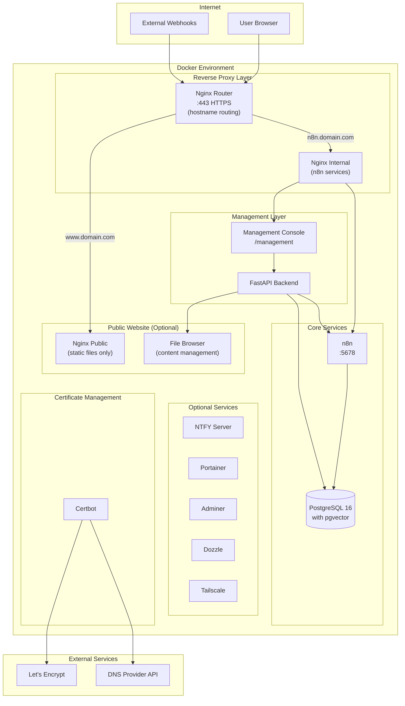

# Architecture

How n8n Management Suite's Docker services fit together — the reverse-proxy layer, core services, management console, and optional add-ons — along with the technology stack behind them.

## Architecture Overview

> **Security Note**: When public website hosting is enabled, the `nginx_router` container handles hostname-based routing. The `nginx_public` container serving www.yourdomain.com has **no network access** to internal services (n8n, PostgreSQL, Management Console). This isolation ensures that even if the public website were compromised, attackers cannot reach your workflow automation infrastructure.

### Component Overview

| Component              | Purpose                                                                 |
|------------------------|-------------------------------------------------------------------------|
| **Nginx**              | Reverse proxy handling HTTPS termination, routing, and security headers |
| **n8n**                | Workflow automation engine                                              |
| **PostgreSQL**         | Primary database with pgvector for AI/ML vector operations              |
| **Management Console** | Web-based administration interface                                      |
| **FastAPI Backend**    | REST API powering the management console                                |
| **Redis**              | Status caching for sub-50ms response times on system metrics            |
| **n8n_status**         | Continuous system metrics collector feeding Redis cache                 |
| **Certbot**            | Optional Automatic SSL certificate acquisition and renewal              |
| **NTFY**               | Optional self-hosted push notification server                           |
| **Portainer**          | Optional container management UI                                        |
| **Adminer**            | Optional database administration UI                                     |
| **Dozzle**             | Optional real-time log viewer                                           |
| **Tailscale**          | Optional VPN for secure remote access                                   |
| **Cloudflared**        | Optional Cloudflare Tunnel for external access without port forwarding  |
| **nginx_router**       | Optional hostname-based routing for public website isolation            |
| **nginx_public**       | Optional static file server for public website (network-isolated)       |
| **File Browser**       | Optional web-based file management for public website content           |

## Technology Stack

### Backend Technologies

| Technology | Version | Purpose |
|------------|---------|---------|
| Python | 3.11+ | Management console backend |
| FastAPI | Latest | Async web framework for REST API |
| SQLAlchemy | 2.0 | Async ORM for database operations |
| PostgreSQL | 16 | Primary database |
| pgvector | Latest | Vector embeddings for AI/RAG |
| APScheduler | Latest | Task scheduling for backups |
| Bcrypt | Latest | Password hashing |
| Cryptography | Latest | AES-256 encryption |

### Frontend Technologies

| Technology | Version | Purpose |
|------------|---------|---------|
| Vue.js | 3 | Frontend framework |
| Vite | Latest | Build tool |
| Pinia | Latest | State management |
| Vue Router | Latest | Client-side routing |
| Tailwind CSS | Latest | Styling framework |
| Chart.js | Latest | Metrics visualization |
| Axios | Latest | HTTP client |

### Infrastructure Technologies

| Technology | Purpose |
|------------|---------|
| Docker | Container runtime |
| Docker Compose | Container orchestration |
| Nginx | Reverse proxy and SSL termination |
| Certbot | Let's Encrypt certificate automation |
| Let's Encrypt | Free SSL/TLS certificates |

