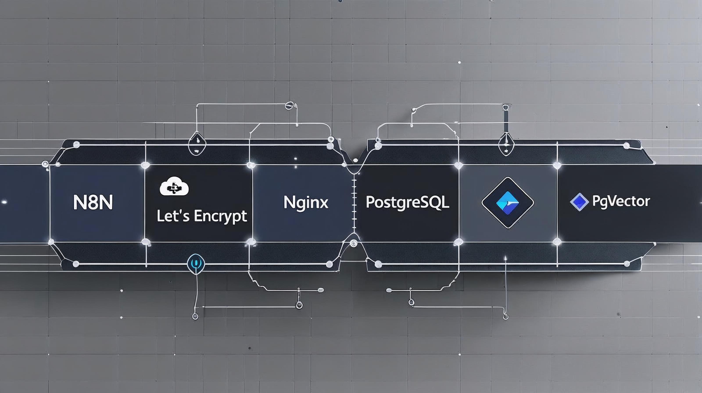

# n8n Management Suite

The n8n Management Suite is a comprehensive, production-ready solution designed to automate the deployment and maintenance of self-hosted n8n workflow environments. This suite leverages a robust technology stack — including Docker, Nginx, and PostgreSQL 16 — to provide enterprise-grade features such as automated SSL certificate management and a dedicated FastAPI-driven management console. Key functional areas include a sophisticated backup and disaster recovery system, multi-channel notifications via Apprise and NTFY, and optional public website hosting with isolated network security. Users can monitor system health through real-time performance dashboards and manage Docker containers directly via a web interface.

<p align="center">
  
</p>

<div class="grid cards" markdown>

-   :material-rocket-launch:{ .lg .middle } __Getting Started__

    ---

    Requirements, pre-installation prep, and the interactive `setup.sh` wizard from clone to a fully deployed, HTTPS-secured stack.

    [:octicons-arrow-right-24: Installation Guide](getting-started/installation.md)

-   :material-book-open-variant:{ .lg .middle } __User Manual__

    ---

    The complete operator's guide to the Management Console — dashboard, containers, flows, backups, notifications, system, and settings.

    [:octicons-arrow-right-24: Read the Manual](manual/welcome.md)

-   :material-backup-restore:{ .lg .middle } __Backups__

    ---

    Scheduled and on-demand backups, GFS retention, integrity verification, and selective or bare-metal restoration.

    [:octicons-arrow-right-24: Backup & Restore Guide](BACKUP_GUIDE.md)

-   :material-bell:{ .lg .middle } __Notifications__

    ---

    Multi-channel alerting via Apprise (80+ providers) and native NTFY push notifications, configured entirely from the console UI.

    [:octicons-arrow-right-24: Notification System Guide](NOTIFICATIONS.md)

-   :material-lock:{ .lg .middle } __SSL / Certbot__

    ---

    Automated SSL/TLS certificate acquisition and renewal via Let's Encrypt, with DNS-01 support for multiple providers.

    [:octicons-arrow-right-24: SSL Certificates Guide](CERTBOT.md)

-   :material-wrench:{ .lg .middle } __Troubleshooting__

    ---

    Quick diagnostics and solutions for container, database, SSL, network, backup, and management console issues.

    [:octicons-arrow-right-24: Troubleshooting Guide](TROUBLESHOOTING.md)

-   :material-api:{ .lg .middle } __API Reference__

    ---

    Complete REST API documentation for the FastAPI-driven Management Console, including JWT authentication.

    [:octicons-arrow-right-24: API Reference](API.md)

</div>

---

## Quick Start

The fastest way to get started is the one-line installer, which checks for `git`, clones the repository, and launches the setup wizard:

```bash
curl -fsSL https://raw.githubusercontent.com/rjsears/n8n_nginx/main/install.sh | bash
```

See the [Installation Guide](getting-started/installation.md) for the full pre-installation checklist and walkthrough.

---

## About

n8n Management Suite is developed and maintained by Richard J. Sears.

[:octicons-mark-github-16: rjsears/n8n_nginx](https://github.com/rjsears/n8n_nginx)
