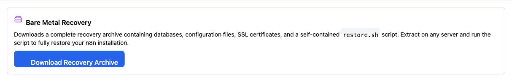
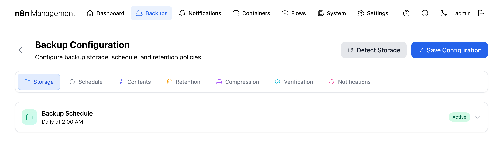
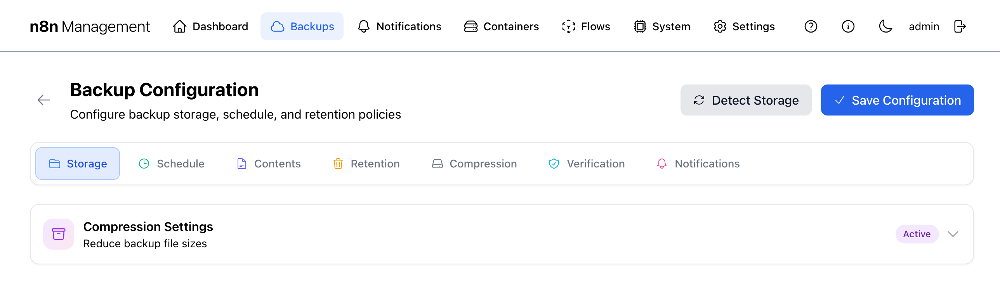
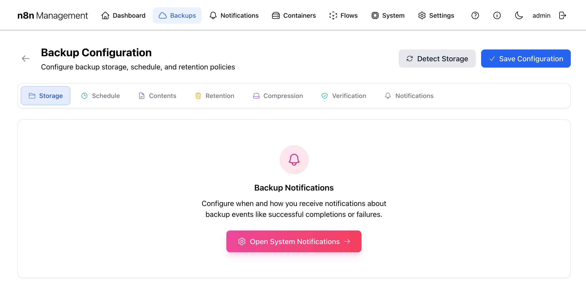

# Backups

The Backups area is the most consequential part of the management console. It captures and verifies database dumps, configuration files, certificates, and public-website data on a schedule, applies a Grandfather-Father-Son retention policy, and lets you trigger ad-hoc backups when something major is about to change.

## Overview

The main Backups page is a dashboard view: header with two action buttons, four summary cards, a configuration summary panel, the active backup schedule, and an expandable backup history. Anything you change live (turn the schedule off, change retention, etc.) happens on the dedicated **Backup Configuration** sub-page, reached via the **Configure** button.

*Figure 1: Backups page — full overview.*

## Configure & Backup Now {: #header-actions }

Two buttons live in the top-right of the page header.

### Configure {: #header-configure }

Opens the dedicated Backup Configuration page (`/management/backup-settings`). Every parameter that controls *how, when, and what* the backup engine does lives there, organized into seven tabs. See [Backup Configuration](#configure) below for the full tour.

### Backup Now

Triggers a one-off backup immediately, using the current configuration. The button changes to a progress indicator while the backup runs. The new backup then appears in the [Backup History](#history) with status `Running` while it executes, then `Success` (and `Verified` if auto-verification is enabled) once complete.

!!! tip

    Hit **Backup Now** before any major change — version upgrade, schema migration, certificate renewal — so you have a known-good restore point from *just before* the change.

!!! warning

    Backup Now uses the same destination, contents, compression, and verification settings as scheduled backups. If your schedule is configured to back up only the n8n database but you need a full backup right now, change the [Contents](#config-contents) first.

## Summary cards

Four cards across the top show backup counts and footprint at a glance.

| Card | Counts |
|---|---|
| **Total Backups** | Every backup on disk regardless of status. |
| **Successful** | Backups whose run completed and (if auto-verification was enabled) verified clean. Lower than Total when some are still running, failed, or pending. |
| **Failed** | Backup runs that errored. **Investigate immediately if non-zero.** |
| **Total Size** | On-disk footprint of all retained backups, in human-readable units. |

## Configuration summary {: #config-summary }

Below the stats, a read-only summary panel shows the three most important configuration choices side by side: **DESTINATION** (where backups land — local disk or NFS), **WORKFLOW** (Stage & Copy vs. Direct), and **STAGING** (whether a temporary local staging area is in use).

!!! note

    This panel is read-only. To change any of these, click **Configure** at the top of the page.

## Backup Schedule {: #schedule }

The Backup Schedule card displays the active cron schedule, the retention policy in effect (as **Daily 7** / **Weekly 4** / **Monthly 6** pills by default), and whether the schedule is currently enabled.

!!! tip

    Disabling the schedule (in the Configure → Schedule tab) stops automatic backups but does *not* delete existing ones. Use this when running maintenance or test cycles.

## Backup History {: #history }

The Backup History card lists every retained backup. Collapsed by default — click anywhere on the card to expand. When expanded, the panel exposes status filters (All Statuses / Successful / Failed / Running / Pending), date filters (From / To), a per-page selector (10 / 20 / 50 / 100), and a sort toggle (Date / Size).

Each row shows: type icon, backup type label (e.g., `postgres_full Backup`), status pill (Success / Failed / Running / Pending), verification badge (`Verified` if integrity-checked), date+time+size, and a chevron on the right that expands to per-backup actions.

## Per-row actions {: #row-actions }

Clicking the chevron on a backup row reveals seven action buttons:

| Action | Effect |
|---|---|
| **Verify** | Re-runs integrity checks against this specific backup. Validates archive integrity, confirms the database dump can be re-read by PostgreSQL, and compares stored checksums. The `Verified` badge on the row reflects the most recent verification result. |
| **Protect** | Marks this backup as "do not auto-delete." Even when retention policy would normally rotate this backup out, a protected backup stays put until you manually unprotect or delete it. Toggles state — clicking once protects, clicking again unprotects. |
| **View Backup Contents** | Opens an inline panel showing what's actually inside the backup archive — workflows, credentials, configuration files, and public website files — with sub-tabs for each category. Read-only inspection, no restore. |
| **Selective Restore** | Cherry-pick individual workflows, credentials, or config files from the backup. See [below](#selective-restore) for the full flow. |
| **Download Backup** | Streams the entire compressed backup archive to your browser as a single `.tar.gz` file. Use this for off-site copies or laptop-side inspection. |
| **Bare Metal** | Downloads a complete recovery archive with a self-contained restore script. See [below](#bare-metal). |
| **Delete** | Removes the backup file from disk and the history record. Cannot be undone (the retention policy will eventually rotate old backups out automatically — only delete manually if you really need the disk space back right now). |

!!! tip

    Run **Verify** on any backup you're about to restore from — especially if the backup is more than a few weeks old. Storage media bit-rots; verification is your last line of defense before pulling the trigger on a restore.

!!! danger

    Restoring a workflow, credential, or full snapshot *overwrites the live version*. Run a fresh **Backup Now** immediately before restoring so you have an emergency exit if the wrong backup is restored.

!!! danger

    **Delete** is final. Deleted backups cannot be recovered through the UI. Deleting a **protected** backup requires you to unprotect it first.

## Selective Restore

**Selective Restore** lets you cherry-pick individual workflows, credentials, or config files from a backup and restore just those, leaving the rest of your live data untouched. This is the safe option compared to a full restore.

### Step 1 — Mount the backup

The first time you click Selective Restore, the panel asks you to **Mount** the backup. Mounting spins up a temporary `n8n_postgres_restore` container and extracts the archive into it so individual items can be browsed and restored. This is a one-time setup per restore session.

### Step 2 — Browse and restore

Once mounted, the panel updates to show three accordion categories — **Workflows**, **Credentials**, **Configuration Files** — each with a live count. An **Unmount Backup** button appears in the top-right.

*Figure 2: Selective Restore — Backup mounted, ready to browse.*

Click any accordion to reveal individual items. Click any item row to surface its restore options.

### Step 3 — Unmount when finished

When you're done restoring items, click **Unmount Backup** in the top-right. This stops and removes the temporary `n8n_postgres_restore` container and frees the resources it was holding.

!!! warning

    Mounting takes 5–30 seconds depending on archive size and host I/O. If the spinner reverts to "Mount Backup" without progressing, see the AppArmor symptom signature in [Troubleshooting](appendix.md#troubleshooting) — this was a real bug fixed in April 2026.

!!! danger

    Restoring a workflow or credential *overwrites the live version* if one with the same ID exists. Read the workflow contents in n8n first, or use n8n's export-to-JSON to keep your own snapshot before restoring an old one.

## Bare Metal

**Bare Metal** generates and downloads a *complete recovery archive* — databases, configuration files, SSL certificates, and a self-contained `restore.sh` script — designed to rebuild your n8n stack on a fresh server from scratch. Use it when migrating to new hardware or recovering from total host loss.

*Figure 3: Bare Metal Recovery panel.*

### What's in the archive

- PostgreSQL dump for both databases (n8n + management).
- n8n configuration files and workflow exports.
- SSL certificates and private keys (Let's Encrypt volume contents).
- `.env` with deployment configuration.
- Public website files if Public Website Files was enabled in [Contents](#config-contents).
- `restore.sh` — a self-contained shell script that takes a fresh host and rebuilds the stack.

### Recovery procedure

1. Provision a fresh host with Docker installed.
2. Copy the downloaded archive to the host (scp, USB stick, etc.).
3. Extract: `tar -xzf bare-metal-recovery-<date>.tar.gz`.
4. `cd` into the extracted directory.
5. Run `./restore.sh` — the script handles everything else.

!!! danger

    The archive contains your entire deployment including *secrets and SSL private keys*. Anyone with this file can stand up a fully functional clone of your stack. Encrypt at rest and treat with the same care as a password vault export.

!!! tip

    Run a Bare Metal download once a quarter and store off-site. Cloud-based backups are great until your billing card expires.

## Backup Configuration {: #configure }

Clicking **Configure** opens a dedicated configuration page (`/management/backup-settings`) with seven tabs. Each tab gates a logical area of behavior. The buttons in the top-right are **Detect Storage** (auto-discover NFS mounts and local volumes) and **Save Configuration** (persist changes).

!!! note

    Changes do not take effect until you click **Save Configuration**. Switching tabs preserves edits, so you can change settings across multiple tabs and save once at the end.

### Storage tab {: #config-storage }

The Storage tab is the entry point — choose where backups go and how they get there.

*Figure 4: Backup Configuration → Storage tab.*

!!! warning "Important Backup Information"

    The system backs up **n8n workflows**, **n8n Management configuration files**, and **Public Website files**. It does **NOT** back up arbitrary additional containers or files you may have layered onto the system yourself. If you've added custom services, plan separate backups for them.

#### The three storage steps

1. **Backup Destination** — pick between Local Storage and Network Storage (NFS). NFS requires the mount to already be configured (see [Settings → Environment → NFS Backup Storage](settings.md#environment)).
2. **Backup Workflow** — choose between `Stage & Copy` (recommended; writes locally first, then transfers) and direct write. Stage & Copy is safer because if NFS is briefly unreachable the backup still completes locally.
3. **Local Staging Area** — points to a writable local path (default `/app/backups`) used as the staging location.

### Schedule tab {: #config-schedule }

The Schedule tab shows the active cron schedule and lets you toggle the automatic schedule on or off.

*Figure 5: Backup Configuration → Schedule tab.*

!!! tip

    The schedule cron expression is set in your `.env` file (see [Settings → Environment Variables](settings.md#environment)). The UI here is the on/off switch and a human-readable summary of what's configured.

### Contents tab {: #config-contents }

The Contents tab is where you choose what goes *into* each backup. Two top-level groups: **Database Backup Type** and **Additional Files**.

*Figure 6: Backup Configuration → Contents tab.*

#### Database Backup Type (radio)

| Option | Includes |
|---|---|
| Full PostgreSQL Backup | Both the n8n and management databases — the standard choice. |
| n8n Database Only | Just n8n's database. Smaller, faster, but loses the management console's own state if restored. |
| Management Database Only | Only the management database. Useful for management-config-only restores. |

#### Additional Files (checkbox)

| Option | What it captures |
|---|---|
| n8n Configuration Files | n8n's workflow settings and node configurations. |
| SSL Certificates | Let's Encrypt certs and private keys. |
| Environment Files | Your `.env` file and friends. |
| Public Website Files | FileBrowser database and the public_web_root volume. |

!!! danger

    Including SSL Certificates and Environment Files means the backup archive contains *secrets* (private keys, API tokens, database passwords). Treat backup files as sensitive — encrypt at rest, restrict access on the destination, never commit to git.

### Retention tab (GFS) {: #config-retention }

Retention controls when backups age out. The console implements a **GFS (Grandfather-Father-Son)** retention policy: keep frequent backups recent, less-frequent backups longer.

*Figure 7: Backup Configuration → Retention tab.*

#### The three GFS tiers

| Tier | Default | Use case |
|---|---|---|
| **Daily (Son)** | Keep 7 daily backups | Quick recovery from yesterday's mistake. |
| **Weekly (Father)** | Keep 4 weekly backups | Recover from issues discovered a week or two later. |
| **Monthly (Grandfather)** | Keep 6 monthly backups | Long-tail archives — quarterly audits, "I need to see what we had in March" requests. |

With defaults, the rotation keeps roughly: 7 days at daily granularity + 4 weeks at weekly + 6 months at monthly = ~6 months of usable history with about 17 backup files retained at any time, regardless of how many runs occur in between.

!!! tip

    If your destination has lots of space and you want longer history, raise Monthly to 12 (a year) before raising Daily — the marginal storage cost of one extra monthly file is much smaller than seven additional daily files.

### Compression tab {: #config-compression }

Toggle compression on or off and (where exposed) pick a compression level. Active by default.

*Figure 8: Backup Configuration → Compression tab.*

!!! tip

    Leave compression on. PostgreSQL dumps compress extremely well (often 5–10× reduction). The CPU cost is negligible compared to the disk and network savings.

### Verification tab {: #config-verification }

Auto-verification re-reads each backup after it's written and confirms it can be restored cleanly. Highly recommended.

*Figure 9: Backup Configuration → Verification tab.*

#### Frequency presets

- **Every backup** — verify every run. Safest, double the I/O.
- **Every 3rd / 5th / 10th** — periodic spot-check. Good middle ground.
- **Custom** — set your own N.

#### What verification actually does

- Validates archive integrity (decompresses without error, no corruption).
- Confirms the database dump can be re-read by PostgreSQL.
- Compares stored checksums against expected values.

!!! warning

    Verification is your only line of defense against silent corruption. An unverified backup can *seem* fine right up until you try to restore it on the worst possible day. Leave Auto-Verification on, even if you set frequency to every 5th.

### Notifications tab {: #config-notifications }

This tab is a pointer rather than a configuration surface — it explains that backup notifications are routed through the global [System Notifications](settings.md#sys-notifications) system and provides a button to open it.

*Figure 10: Backup Configuration → Notifications tab.*

!!! note

    Backup notifications use the same channels and rules as every other system event. Configure them once globally — see [Notifications](notifications.md) and [Settings → System Notifications](settings.md#sys-notifications).
