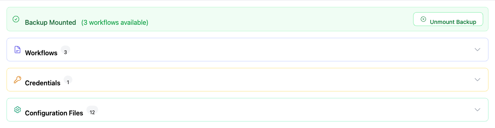
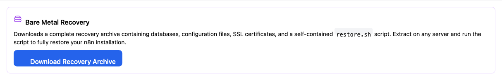
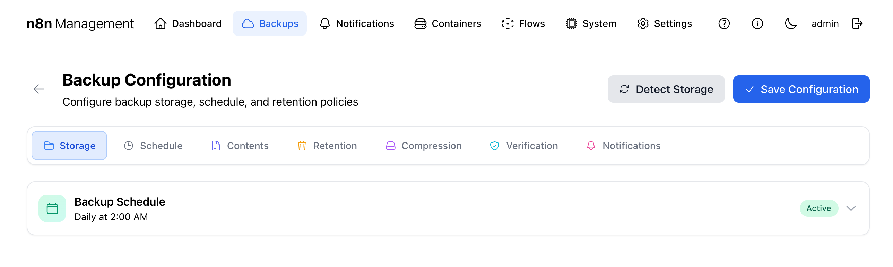
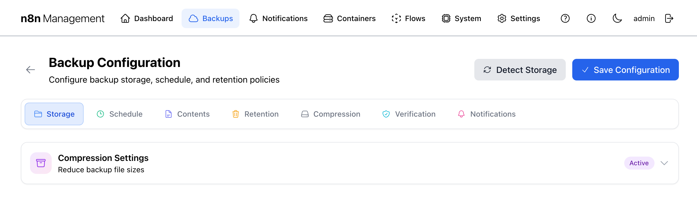
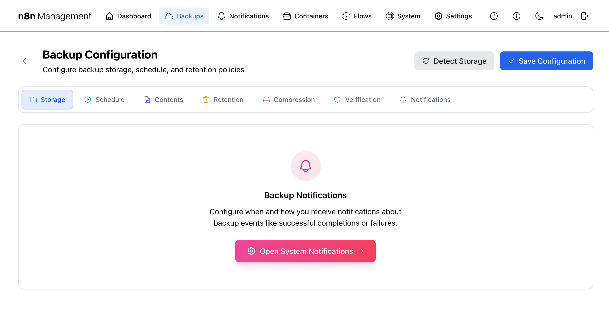

# Backups

The Backups area is the most consequential part of the management console. It captures and verifies database dumps, configuration files, certificates, and public-website data on a schedule, applies a Grandfather-Father-Son retention policy, and lets you trigger ad-hoc backups when something major is about to change.

## Overview

The main Backups page is a dashboard view: header with two action buttons, four summary cards, a configuration summary panel, the active backup schedule, and an expandable backup history. Anything you change live (turn the schedule off, change retention, etc.) happens on the dedicated **Backup Configuration** sub-page, reached via the **Configure** button.


*Figure 1: Backups page — full overview.*

## Configure & Backup Now {: #header-actions }

Two buttons live in the top-right of the page header.

### Configure {: #header-configure }

Opens the dedicated Backup Configuration page (`/management/backup-settings`). Every parameter that controls *how, when, and what* the backup engine does lives there, organized into seven tabs. See [Backup Configuration](#configure) below for the full tour.

### Backup Now

Triggers a one-off backup immediately, using the current configuration. The button changes to a progress indicator while the backup runs. The new backup then appears in the [Backup History](#history) with status `Running` while it executes, then `Success` (and `Verified` if auto-verification is enabled) once complete.

!!! tip

    Hit **Backup Now** before any major change — version upgrade, schema migration, certificate renewal — so you have a known-good restore point from *just before* the change.

!!! warning

    Backup Now uses the same destination, contents, compression, and verification settings as scheduled backups. If your schedule is configured to back up only the n8n database but you need a full backup right now, change the [Contents](#config-contents) first.

## Summary cards

Four cards across the top show backup counts and footprint at a glance.

| Card | Counts |
|---|---|
| **Total Backups** | Every backup on disk regardless of status. |
| **Successful** | Backups whose run completed and (if auto-verification was enabled) verified clean. Lower than Total when some are still running, failed, or pending. |
| **Failed** | Backup runs that errored. **Investigate immediately if non-zero.** |
| **Total Size** | On-disk footprint of all retained backups, in human-readable units. |

## Configuration summary {: #config-summary }

Below the stats, a read-only summary panel shows the three most important configuration choices side by side: **DESTINATION** (where backups land — local disk or NFS), **WORKFLOW** (Stage & Copy vs. Direct), and **STAGING** (whether a temporary local staging area is in use).

!!! note

    This panel is read-only. To change any of these, click **Configure** at the top of the page.

## Backup Schedule {: #schedule }

The Backup Schedule card displays the active cron schedule, the retention policy in effect (as **Daily 7** / **Weekly 4** / **Monthly 6** pills by default), and whether the schedule is currently enabled.

!!! tip

    Disabling the schedule (in the Configure → Schedule tab) stops automatic backups but does *not* delete existing ones. Use this when running maintenance or test cycles.

## Backup History {: #history }

The Backup History card lists every retained backup. Collapsed by default — click anywhere on the card to expand. When expanded, the panel exposes status filters (All Statuses / Successful / Failed / Running / Pending), date filters (From / To), a per-page selector (10 / 20 / 50 / 100), and a sort toggle (Date / Size).

Each row shows: type icon, backup type label (e.g., `postgres_full Backup`), status pill (Success / Failed / Running / Pending), verification badge (`Verified` if integrity-checked), date+time+size, and a chevron on the right that expands to per-backup actions.

## Per-row actions {: #row-actions }

Clicking the chevron on a backup row reveals seven action buttons:

| Action | Effect |
|---|---|
| **Verify** | Runs the comprehensive verification on this backup: archive integrity, then every database dump is restored into a temporary PostgreSQL container (`pg_restore --exit-on-error`, any error fails), tables, row counts, workflow checksums and config file checksums are compared with what was recorded at backup time (see [What verification actually does](#config-verification)). The `Verified` badge on the row reflects the most recent verification result. |
| **Protect** | Marks this backup as "do not auto-delete." Even when retention policy would normally rotate this backup out, a protected backup stays put until you manually unprotect or delete it. Toggles state — clicking once protects, clicking again unprotects. |
| **View Backup Contents** | Opens an inline panel showing what's actually inside the backup archive — workflows, credentials, configuration files, and public website files — with sub-tabs for each category. Read-only inspection, no restore. |
| **Selective Restore** | Cherry-pick individual workflows, credentials, or config files from the backup. See [below](#selective-restore) for the full flow. |
| **Download Backup** | Streams the entire compressed backup archive to your browser as a single `.tar.gz` file. Use this for off-site copies or laptop-side inspection. |
| **Bare Metal** | Downloads a complete recovery archive with a self-contained restore script. See [below](#bare-metal). |
| **Delete** | Removes the backup file from disk and the history record. Cannot be undone (the retention policy will eventually rotate old backups out automatically — only delete manually if you really need the disk space back right now). |

!!! tip

    Run **Verify** on any backup you're about to restore from — especially if the backup is more than a few weeks old. Storage media bit-rots; verification is your last line of defense before pulling the trigger on a restore.

!!! danger

    Restoring a workflow, credential, or full snapshot *overwrites the live version*. Run a fresh **Backup Now** immediately before restoring so you have an emergency exit if the wrong backup is restored.

!!! danger

    **Delete** is final. Deleted backups cannot be recovered through the UI. Deleting a **protected** backup requires you to unprotect it first.

## Selective Restore

**Selective Restore** lets you cherry-pick individual workflows, credentials, or config files from a backup and restore just those, leaving the rest of your live data untouched. This is the safe option compared to a full restore.

### Step 1 — Mount the backup

The first time you click Selective Restore, the panel asks you to **Mount** the backup. Mounting spins up a temporary `n8n_postgres_restore` container and extracts the archive into it so individual items can be browsed and restored. This is a one-time setup per restore session.

### Step 2 — Browse and restore

Once mounted, the panel updates to show three accordion categories — **Workflows**, **Credentials**, **Configuration Files** — each with a live count. An **Unmount Backup** button appears in the top-right.


*Figure 2: Selective Restore — Backup mounted, ready to browse.*

Click any accordion to reveal individual items. Click any item row to surface its restore options.

### Step 3 — Unmount when finished

When you're done restoring items, click **Unmount Backup** in the top-right. This stops and removes the temporary `n8n_postgres_restore` container and frees the resources it was holding.

!!! warning

    Mounting takes 5–30 seconds depending on archive size and host I/O. If the spinner reverts to "Mount Backup" without progressing, see the AppArmor symptom signature in [Troubleshooting](appendix.md#troubleshooting) — this was a real bug fixed in April 2026.

!!! danger

    Restoring a workflow or credential *overwrites the live version* if one with the same ID exists. Read the workflow contents in n8n first, or use n8n's export-to-JSON to keep your own snapshot before restoring an old one.

## Bare Metal

**Bare Metal** generates and downloads a *complete recovery archive* — databases, configuration files, SSL certificates, and a self-contained `restore.sh` script — designed to rebuild your n8n stack on a fresh server from scratch. Use it when migrating to new hardware or recovering from total host loss.


*Figure 3: Bare Metal Recovery panel.*

### What's in the archive

- PostgreSQL dump for both databases (n8n + management).
- `project/` — the project directory: `.env`, `docker-compose.yaml`, every bind-mounted config (`nginx.conf`, `nginx-router.conf`, `nginx-public.conf`, `.filebrowser.json`, `ntfy/`, `dozzle/`, DNS credentials, `tailscale-serve.json`, …), `scripts/certbot/` and the `management/` / `n8n_status/` build contexts (without `.git`, docs, images and `node_modules`). `config/` holds the individual config files as before.
- SSL certificates and private keys: the complete Let's Encrypt tree (`archive/`, `live/`, `renewal/`, …) with symlinks preserved, so restored certificates keep renewing.
- `volumes/` — snapshots of the `n8n_data` volume (`~/.n8n`: n8n's `config` with its `encryptionKey`, binary data stored on the filesystem, installed community nodes) and `ntfy_data` (ntfy users and access rules).
- `metadata.json` — includes the Docker Compose project name, the git commit of the project, and the exact image (registry digest) every service was running.
- Public website files if Public Website Files was enabled in [Contents](#config-contents).
- `restore.sh` — a self-contained shell script that takes a fresh host and rebuilds the stack.

If `BACKUP_ENCRYPTION_PASSPHRASE` is set (see [Encryption](#encryption)), the whole archive is encrypted and named `backup_<date>.n8n_backup.tar.gz.gpg`.

### Recovery procedure

1. Provision a fresh host with Docker installed.
2. Copy the downloaded archive to the host (scp, USB stick, etc.).
3. Extract: `mkdir restore && tar -xzf backup_<date>.n8n_backup.tar.gz -C restore`.
   For an encrypted archive: `mkdir restore && gpg --decrypt backup_<date>.n8n_backup.tar.gz.gpg | tar -xzf - -C restore`
   (gpg asks for the passphrase). Alternatively let the script do it with a separately downloaded `restore.sh`:
   `sudo ./restore.sh --archive backup_<date>.n8n_backup.tar.gz.gpg --passphrase-file /root/backup-passphrase`.
4. `cd restore`.
5. Run `sudo ./restore.sh --dry-run` to preview, then `sudo ./restore.sh`. The script restores the project directory, the Let's Encrypt tree and the `n8n_data`/`ntfy_data` snapshots into the volume names Docker Compose will use for the target directory, and pins every image to the version recorded in the backup (it pulls `image@sha256:…` and tags it, instead of pulling `:latest`). If a stack is already running from the target directory, the script stops it first (`docker compose down`, volumes are kept; it asks unless `--force`/`--auto`, and `--dry-run` only reports it). It then starts only PostgreSQL, waits until it accepts TCP connections (so the image's first-start initialisation has finished), restores each database in a single transaction (any error stops the script and nothing else is started), makes `MGMT_DB_USER` the owner of the restored management tables, then starts the rest of the stack. `MGMT_DB_USER` in `.env` must consist of letters, digits and underscores only; otherwise the script refuses to run.

!!! warning "Archives from older versions"

    Archives created before restore script v3.2.0 embed a `restore.sh` that stops after the first config file. Use **Download latest restore.sh** in the Bare Metal panel, copy it over the `restore.sh` in the extracted archive, and run that instead. After upgrading, take a fresh backup so the newest archive contains the fixed script.

    Archives created before v3.3.0 have no `project/`, `volumes/` or image list: clone the repository into the target directory first (so `nginx-router.conf`, `scripts/certbot` and `management/` exist), expect an empty `n8n_data` (n8n uses `N8N_ENCRYPTION_KEY` from `.env`; reinstall community nodes) and note that missing images are pulled at their current tag.

!!! danger

    The archive contains your entire deployment including *secrets and SSL private keys*. Anyone with this file can stand up a fully functional clone of your stack. Set `BACKUP_ENCRYPTION_PASSPHRASE` (see [Encryption](#encryption)) and treat unencrypted archives with the same care as a password vault export.

### Encryption {: #encryption }

Every archive contains `.env` (`N8N_ENCRYPTION_KEY`, database passwords, DNS API tokens), TLS private keys and the management database (notification channel secrets). Archive files and backup folders are always created owner-only (`0600`/`0700`); archives written by older versions are tightened on the next backup run.

To encrypt archives, add a passphrase of at least 12 characters to `.env` (Settings → Environment, *Backup Encryption Passphrase*, or edit the file):

```bash
BACKUP_ENCRYPTION_PASSPHRASE='a long random passphrase'
```

It is read at the start of every backup, so no restart is needed. Archives are then encrypted with gpg (AES-256, integrity protected) before they reach the backup destination and are named `*.n8n_backup.tar.gz.gpg`. Verification, selective restore, in-app restore and the downloads decrypt them transparently with the passphrase in `.env`. Decrypt by hand with `gpg --decrypt FILE | tar -xzf -`.

!!! danger "Key custody: losing the passphrase means losing every encrypted backup"

    There is no recovery key and no back door. Store the passphrase **off this server** (password manager, printed copy in a safe) before relying on encrypted backups: after a total host loss the copy inside `.env` is gone too. Changing the passphrase does not re-encrypt existing archives — keep every old passphrase until the archives made with it have expired, and test a decrypt (`gpg --decrypt FILE | tar -tzf - | head`) after any change.

!!! tip

    Run a Bare Metal download once a quarter and store off-site. Cloud-based backups are great until your billing card expires.

## Backup Configuration {: #configure }

Clicking **Configure** opens a dedicated configuration page (`/management/backup-settings`) with seven tabs. Each tab gates a logical area of behavior. The buttons in the top-right are **Detect Storage** (auto-discover NFS mounts and local volumes) and **Save Configuration** (persist changes).

!!! note

    Changes do not take effect until you click **Save Configuration**. Switching tabs preserves edits, so you can change settings across multiple tabs and save once at the end.

### Storage tab {: #config-storage }

The Storage tab is the entry point — choose where backups go and how they get there.


*Figure 4: Backup Configuration → Storage tab.*

!!! warning "Important Backup Information"

    The system backs up **n8n workflows**, **n8n Management configuration files**, and **Public Website files**. It does **NOT** back up arbitrary additional containers or files you may have layered onto the system yourself. If you've added custom services, plan separate backups for them.

#### The three storage steps

1. **Backup Destination** — pick between Local Storage and Network Storage (NFS). NFS requires the share to be mounted **on the host** at the directory bind-mounted into the management container (`/opt/n8n_backups` → `/mnt/backups`) *before* the container starts (see [Settings → Environment → NFS Backup Storage](settings.md#environment)). The console checks the filesystem type behind that path: if it is not an NFS/CIFS share (share not mounted, or mounted after the container started — restart `n8n_management` after mounting), it is the local disk, and backups set to NFS only are **refused** with a *Backup Storage Unavailable* notification instead of being silently written to local storage; with *both* they fall back to local storage and the same notification is sent. An hourly check sends it as well when the share disappears.
2. **Backup Workflow** — choose between `Stage & Copy` (recommended; writes locally first, then transfers) and direct write. Stage & Copy is safer because if NFS is briefly unreachable the backup still completes locally.
3. **Local Staging Area** — points to a writable local path (default `/app/backups`) used as the staging location.

### Schedule tab {: #config-schedule }

The Schedule tab shows the active cron schedule and lets you toggle the automatic schedule on or off.


*Figure 5: Backup Configuration → Schedule tab.*

!!! tip

    The schedule cron expression is set in your `.env` file (see [Settings → Environment Variables](settings.md#environment)). The UI here is the on/off switch and a human-readable summary of what's configured.

### Contents tab {: #config-contents }

The Contents tab is where you choose what goes *into* each backup. Two top-level groups: **Database Backup Type** and **Additional Files**.


*Figure 6: Backup Configuration → Contents tab.*

#### Database Backup Type (radio)

| Option | Includes |
|---|---|
| Full PostgreSQL Backup | Both the n8n and management databases — the standard choice. |
| n8n Database Only | Just n8n's database. Smaller, faster, but loses the management console's own state if restored. |
| Management Database Only | Only the management database. Useful for management-config-only restores. |

#### Additional Files (checkbox)

| Option | What it captures |
|---|---|
| n8n Configuration Files | n8n's workflow settings and node configurations. |
| SSL Certificates | Let's Encrypt certs and private keys. |
| Environment Files | Your `.env` file and friends. |
| Public Website Files | FileBrowser database and the public_web_root volume. |

!!! danger

    Including SSL Certificates and Environment Files means the backup archive contains *secrets* (private keys, API tokens, database passwords). Treat backup files as sensitive — encrypt at rest, restrict access on the destination, never commit to git.

### Retention tab (GFS) {: #config-retention }

Retention controls when backups age out. The console implements a **GFS (Grandfather-Father-Son)** retention policy: keep frequent backups recent, less-frequent backups longer.


*Figure 7: Backup Configuration → Retention tab.*

#### The three GFS tiers

| Tier | Default | Use case |
|---|---|---|
| **Daily (Son)** | Keep 7 daily backups | Quick recovery from yesterday's mistake. |
| **Weekly (Father)** | Keep 4 weekly backups | Recover from issues discovered a week or two later. |
| **Monthly (Grandfather)** | Keep 6 monthly backups | Long-tail archives — quarterly audits, "I need to see what we had in March" requests. |
| **Safety Net** | Keep the 3 newest | Always kept, whatever their age. |

#### Exactly what is kept

Retention runs **every hour (at minute 15)** and **right after every successful backup**. Each backup type (Full, n8n only, Management only) is evaluated on its own. A backup is kept if **any** of these rules keeps it:

1. It is one of the **Safety Net** newest backups (never fewer than 1, so the most recent successful backup is never deleted). The Safety Net is also a hard floor for **every** automatic deletion path described below (pruning rules, emergency deletion, pending deletions): the newest *Safety Net* successful backups of each backup type are never marked for deletion or deleted, protected or not, whatever the disk looks like.
2. It is the newest backup of one of the **Daily** most recent calendar days that have a backup.
3. It is the newest backup of one of the **Weekly** most recent ISO weeks (Monday–Sunday) that have a backup.
4. It is the newest backup of one of the **Monthly** most recent calendar months that have a backup.

Everything else is deleted. Days, weeks and months are computed in the console's configured timezone (`TZ`).

Things retention **never** touches:

- **Protected** backups (the **Protect** row action in Backup History). Protect a backup to keep it permanently; protected backups also do not count toward any tier.
- Failed or still-running backups, and backups that were already deleted.

Because tiers count only periods that *have* a backup, retention never deletes more just because time passes: if backups stop running, the existing ones stay.

With daily backups and the defaults you end up with roughly 7 dailies + 2–3 older weeklies + 4–5 older monthlies ≈ **13–15 backup files** per backup type (tiers overlap: the newest backup of this week and this month is also today's daily). With several backups per day, only the newest of each day survives once it is past the Safety Net, so an hourly schedule does **not** give you 24 hourly restore points for yesterday.

Turning **Automatic Retention** off disables this GFS cleanup entirely; nothing is then deleted except by the optional pruning rules below or by hand.

#### Deletion notice

Deletions follow the pruning setting **Notify before delete** (on by default, 24 hours): backups selected by retention are first marked *pending deletion*, a `backup_pending_deletion` notification is sent, and they are removed by the hourly job once the notice period has passed. During that window you can protect a backup to keep it. (Cancelling a pending deletion without protecting the backup only defers it: the next hourly run selects it again.) If *Notify before delete* is turned off, retention deletes immediately.

A deleted backup's archive file is removed from disk and its history row is marked deleted (it disappears from Backup History). A file that is already missing is simply marked deleted, but only when its folder still exists: if the folder itself is gone (for example the NFS share is not mounted) the deletion is skipped, logged, and retried on a later run. A pending deletion whose backup has meanwhile become one of the Safety Net newest (for example because newer backups were deleted by hand) is cancelled instead of executed.

!!! warning "First run after upgrading"

    Older releases never applied these settings, so every backup ever taken is still on disk. On the first hourly run after upgrading, **every backup outside the rules above is scheduled for deletion** (and removed 24 hours later with the default notice, or immediately if *Notify before delete* is off). Before upgrading — or within that 24-hour window — protect any older backup you want to keep, or raise the tier counts. `GET /api/backups/pruning/candidates` includes a `gfs_retention` preview listing exactly which backups would be deleted.

#### Additional pruning rules

The optional pruning rules (pruning settings) are applied after GFS retention. What the automatic runs (hourly and after each backup) do differs from a manual run:

| Rule | Automatic run (hourly / after each backup) | Manual run (`POST /api/backups/pruning/run`) |
|---|---|---|
| Due pending deletions | Executed | Executed |
| Age-based (*older than X days*) | Marks (or deletes, if *Notify before delete* is off) | Same |
| Space-based (*free space below X%*) | **Alert only**: warning in the log and a `backup_critical_space` notification; nothing is marked or deleted | Marks the 5 oldest eligible backups |
| Critical space (*below the critical threshold*) | **Alert only** (same notification) | *delete_oldest*: deletes the 3 oldest eligible backups immediately; *stop_and_alert*: notification only |
| Size-based (*total above X GB*) | **Alert only** (same notification) | Marks the oldest eligible backups until under the limit |

Space- and size-based deletion is manual-only on purpose: low disk space is often caused by something other than backups (the Postgres data volume, logs, Docker images), and deleting backups automatically in that situation — while the free-space check also makes new backups fail — could leave you without any backup. There is no setting to make it automatic; when you get the alert, free space or run pruning manually. "Eligible" always excludes protected backups and the Safety Net newest backups of each type, so even a manual emergency run never deletes the newest backups.

All retention and pruning work takes the same exclusive lock as backups and restores: if a backup, restore or verification is running (or queued), that hour's run is skipped and the next one catches up. Manually triggering pruning (`POST /api/backups/pruning/run`) or a manual backup returns HTTP 409 while another backup, restore, verification or pruning run is in progress or waiting to start.

#### Free-space check before each backup

Before writing anything, every backup checks free space on the backup destination and on the temporary staging directory. It needs about **1.2 × the size of the last successful backup** on each (summed when they are the same disk) plus **1 GiB of headroom** (override with the `BACKUP_MIN_FREE_MB` environment variable on the management container). If there is not enough room the backup fails immediately with an "Insufficient disk space" error and the normal backup-failure notification, instead of filling the disk.

!!! danger "Backups and the database share a disk by default"

    The default "NFS" destination `/opt/n8n_backups` is an ordinary directory on the host's root disk unless you actually mount an NFS share there. That is usually the same disk as the Postgres data volume: if backups fill it, Postgres cannot write its WAL and n8n stops. Keep retention enabled, and put backups on a separate disk or a real network share for production.

!!! tip

    If your destination has lots of space and you want longer history, raise Monthly to 12 (a year) before raising Daily — the marginal storage cost of one extra monthly file is much smaller than seven additional daily files.

### Compression tab {: #config-compression }

Toggle compression on or off and (where exposed) pick a compression level. Active by default.


*Figure 8: Backup Configuration → Compression tab.*

!!! tip

    Leave compression on. PostgreSQL dumps compress extremely well (often 5–10× reduction). The CPU cost is negligible compared to the disk and network savings.

### Verification tab {: #config-verification }

Auto-verification re-reads each backup after it's written and confirms it can be restored cleanly. Highly recommended.


*Figure 9: Backup Configuration → Verification tab.*

#### Frequency presets

- **Every backup** — verify every run. Safest, double the I/O.
- **Every 3rd / 5th / 10th** — periodic spot-check. Good middle ground.
- **Custom** — set your own N.

#### What verification actually does

Auto-verification (after a backup):

- Compares the archive's SHA-256 with the value recorded when it was written.
- Decrypts it (if encrypted) and reads every file in it, so truncation or gzip corruption fails.
- Checks that `metadata.json` and a dump for every backed-up database are present, and runs `pg_restore --list` on each dump — any error fails the verification.

This proves the archive is complete and every dump is a readable PostgreSQL archive; it does not load the data. The comprehensive verification (the **Verify** row action, `POST /api/backups/{id}/verify`, and the scheduled verification below) does: it restores **each** database dump (n8n and management) into its own database in a temporary `pgvector/pgvector:pg16` container (the same image as production) with `pg_restore --exit-on-error` — any error fails the verification — then checks the tables and row counts against the manifest, compares a SHA-256 of every workflow's nodes and connections with the checksums recorded at backup time, and checks the config file checksums.

#### Scheduled verification

A verification schedule (`GET`/`PUT /api/backups/verification/schedule`: `enabled`, `frequency` daily/weekly/monthly, `day_of_week` 0 = Monday, `hour`, `verify_latest_count`) runs the comprehensive verification on the newest *N* successful database backups, one at a time, in the configured slot (checked hourly at minute 40, in the console's timezone; monthly runs on the 1st).

!!! warning

    Verification is your only line of defense against silent corruption. An unverified backup can *seem* fine right up until you try to restore it on the worst possible day. Leave Auto-Verification on, even if you set frequency to every 5th.

### Notifications tab {: #config-notifications }

This tab is a pointer rather than a configuration surface — it explains that backup notifications are routed through the global [System Notifications](settings.md#sys-notifications) system and provides a button to open it.


*Figure 10: Backup Configuration → Notifications tab.*

!!! note

    Backup notifications use the same channels and rules as every other system event. Configure them once globally — see [Notifications](notifications.md) and [Settings → System Notifications](settings.md#sys-notifications).
