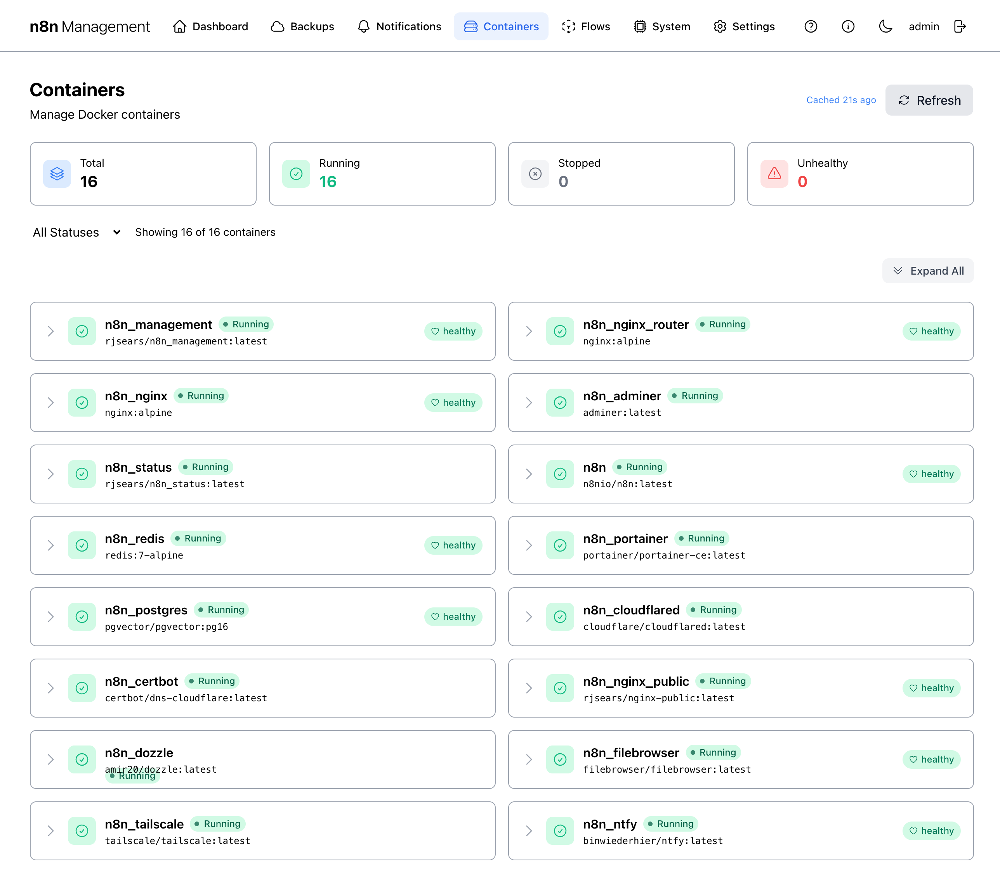
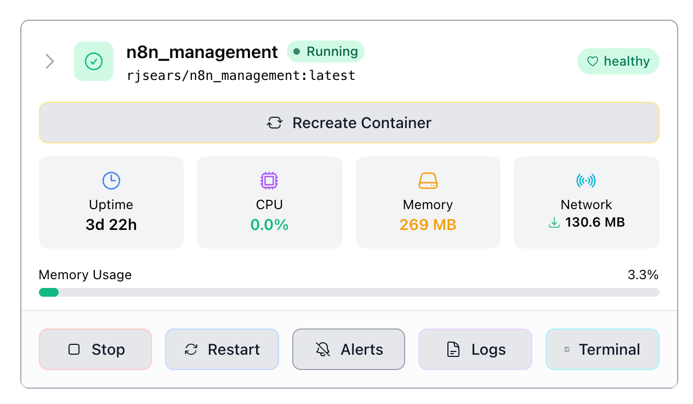

# Containers

The Containers page is your day-to-day control surface for the Docker stack that runs n8n: every container that the management console can see is listed, with one-click access to logs, restart, recreate, per-container alerts, and an in-browser terminal session.

## Overview

The page is laid out in four bands, top to bottom: a header with title and a manual **Refresh** button, a row of four summary cards, a filter dropdown plus an **Expand All** control, and the container list itself rendered as a two-column grid of collapsible cards.

*Figure 1: Containers page — full overview.*

## Summary cards & list {: #summary-and-list }

Four cards across the top mirror the Docker status numbers shown on the [Dashboard's Docker Containers panel](dashboard.md#docker-containers) but break them down into independent counts.

| Card | Counts |
|---|---|
| **Total** | Every container the management console can see, regardless of state. |
| **Running** | Containers in `running` state. |
| **Stopped** | Containers in `exited` or `stopped` state. |
| **Unhealthy** | Running containers reporting unhealthy from their Docker healthcheck. **Unlike the Dashboard, this card does *not* count "healthy" — only failures.** |

!!! danger

    An **Unhealthy** count above zero means at least one container's healthcheck is failing. Filter the list to **Stopped Only** first to see if anything has crashed; otherwise scan the list for the red unhealthy badge before restarting indiscriminately.

## Filtering and the list {: #filter }

The filter dropdown ("All Statuses") narrows the list by container state. The "Showing X of Y containers" label updates live to reflect the filter. The **Expand All** button on the right opens every container's action panel at once — useful when you need to scan several containers' resource usage in one glance.

### Filter options

- **All Statuses** — every container (default).
- **Running Only** — hides anything not currently running.
- **Stopped Only** — only exited or stopped containers. Useful right after a host reboot or when investigating a crash.

### List layout

Each container is a card with: a chevron (▶) to expand, a green-check status icon, the container name, a colored state pill (e.g., `Running`), the image name in monospace below the name, and (for containers with a Docker healthcheck) a health badge on the right.

!!! tip

    Click anywhere on a row to expand it — you don't need to hit the chevron precisely.

## Health badges

The right-side badge reflects the container's Docker healthcheck status:

| Badge | Meaning |
|---|---|
| `healthy` | Healthcheck passing. |
| `starting` | Container started; healthcheck still in its grace period. |
| `unhealthy` | Healthcheck failing repeatedly. **Investigate immediately.** |
| (no badge) | The container's image does not declare a healthcheck. Not a problem on its own, but you have less visibility — consider reviewing logs periodically. |

!!! note

    Healthcheck definitions live in each image's Dockerfile or in the project's `docker-compose.yaml`. If a container you care about has no badge and you want one, add a `HEALTHCHECK` directive at the image level.

## Expanding a container {: #expanded-row }

Clicking a row reveals the per-container action panel: a **Recreate Container** button at the top, four live resource readouts (Uptime, CPU, Memory, Network), a memory-usage percentage bar, and five action buttons across the bottom.

*Figure 2: A container's expanded action panel.*

### Live readouts

| Field | Source |
|---|---|
| **Uptime** | Time since this container instance started. |
| **CPU** | Current CPU percentage of one core. |
| **Memory** | Resident memory in human-readable units. |
| **Network** | Cumulative network throughput since container start. |
| **Memory Usage %** | Memory as a percentage of the container's hard limit (or host RAM if no limit set). |

## Per-container actions {: #actions }

Five action buttons sit below the live readouts: **Stop**, **Restart**, **Alerts**, **Logs**, **Terminal**. The full-width **Recreate Container** button at the top of the panel is the most aggressive option — used when configuration in `docker-compose.yaml` or in `.env` has changed and a simple restart is not enough.

### Stop & Restart

**Stop** sends Docker's stop signal to the container. The container's process gets a graceful shutdown window (default 10 seconds) before being killed. **Restart** stops then starts the container without recreating it — same image, same config.

!!! warning

    Stopping the `n8n_nginx` or `n8n_management` container ends your current session — you'll lose access to this UI until you restart it from the command line. There is no undo button on this page once nginx is stopped.

### Recreate Container

Recreate stops the container, removes it, and starts a fresh instance using the same compose configuration. The new container picks up the latest values from `.env` and any compose-file changes.

!!! danger

    Recreate *destroys the running container*. Anything written inside the container that isn't on a mounted volume is lost. Verify your data is on a volume (it should be — n8n's PostgreSQL, the management database, and the n8n config all live on volumes by default) before recreating.

!!! tip

    Restart is the right tool for "I changed an env var in the running container's mounted config file and need to pick it up." For changes to `.env` or `docker-compose.yaml`, use Recreate Container instead.

## Logs viewer {: #logs }

**Logs** opens an in-browser viewer for the container's stdout/stderr. The header lets you choose how many lines to fetch (50 / 100 / 200 / 500 / 1000 / All) and a "Since:" time filter. The **Follow** toggle keeps streaming new lines as they arrive; **Refresh** manually re-fetches the current window.

*Figure 3: Logs viewer for a single container.*

!!! tip

    For a unified view across all containers and persistent tailing, see the dedicated **Dozzle** service if you've enabled it (it ships with the stack). The in-app Logs view here is best for a quick targeted look.

## Alerts (per-container) {: #alerts }

**Alerts** opens the per-container Notification Settings modal. This is where you configure which container-level events should fire a notification, scoped *just to this container*. The global notification routing — channels, groups, rules — lives separately under [Notifications](notifications.md).

*Figure 4: Per-container alert configuration.*

### Configurable events

| Group | Event | Trigger |
|---|---|---|
| Status Events | Container Stopped | Container exits unexpectedly. |
| Status Events | Health Check Failed | Healthcheck transitions to unhealthy. Disabled (and noted) if the image has no healthcheck. |
| Status Events | Container Restarted | Docker auto-restarts the container. |
| Resource Thresholds | High CPU Usage | CPU exceeds a configurable threshold for a sustained period. |
| Resource Thresholds | High Memory Usage | Memory exceeds a configurable threshold. |

!!! warning

    If the modal shows "No notification targets configured," your alert toggles will save, but no actual notification will fire because there's nowhere to send it. Configure at least one channel under [Notifications](notifications.md) first, then return here.

## Terminal

**Terminal** opens an in-browser shell session inside the running container. Clicking the button navigates to the System page's Terminal tab with the container pre-selected and auto-connected — concretely, to `/management/system?tab=terminal&target=<container_id>&autoconnect=true`.

The Terminal feature is fully documented under [System → Terminal](system.md#terminal), since the management host's terminal lives in the same place. From here, just remember: clicking **Terminal** on a container is a deep-link shortcut.

!!! danger

    Anything you run in the Terminal executes *inside the container* as that container's user (often root). Destructive commands here can corrupt the container's state. Treat it like SSH-ing into a production box.

## Refresh & caching {: #refresh }

The page header shows a "*Cached Ns ago*" timestamp and a **Refresh** button. The container list is cached briefly to reduce load on the Docker daemon — by default the cache lives for ~30 seconds.

Click **Refresh** to bypass the cache and fetch fresh data immediately. The summary cards and per-row stats update at the same time.

!!! tip

    If a container action you took (Start/Stop/Restart/Recreate) doesn't appear to have taken effect, hit Refresh — the new state is always already true on the host; you just may be looking at a slightly stale cache.
