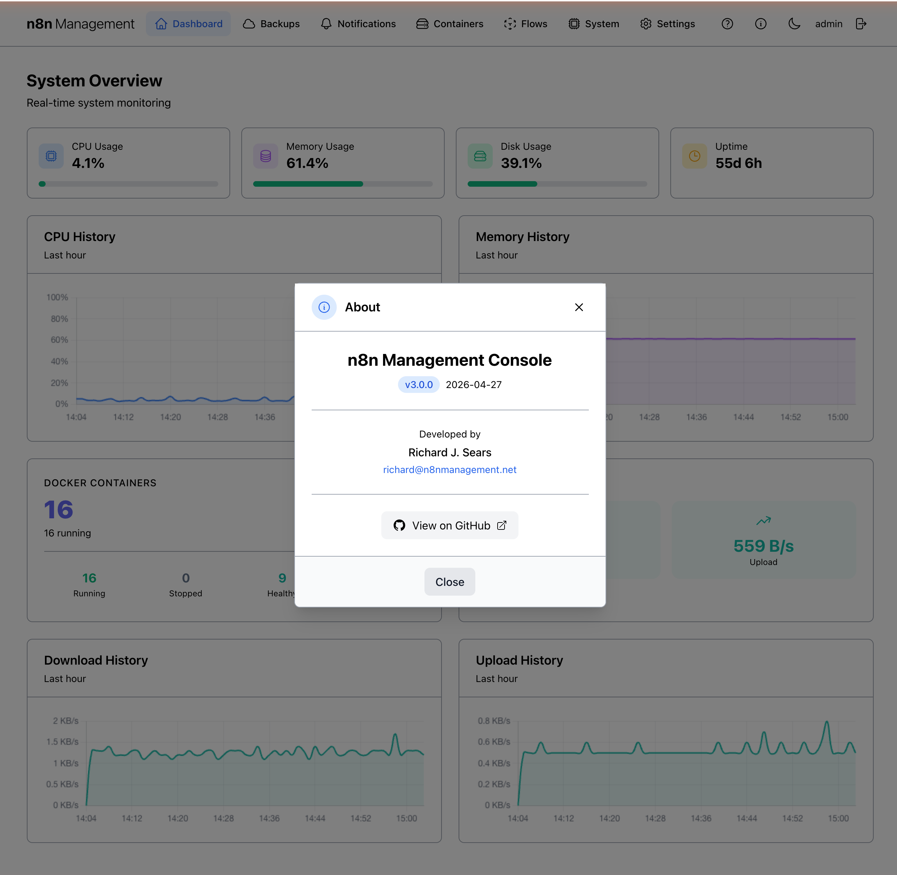

# Dashboard

The Dashboard is the home view after login. It surfaces the most-needed at-a-glance information about your n8n stack: real-time resource usage, history charts, container status, and network throughput. Use it as a starting point — drill into any section via the top navigation.

## Overview

The Dashboard renders a single-screen "System Overview" panel: a row of four stats cards along the top (CPU, Memory, Disk, Uptime), CPU and Memory history charts below them, then a Docker Containers panel and a Network I/O panel, and finally Download / Upload history charts at the bottom.

*Figure 1: The full Dashboard view.*

!!! note

    The Dashboard is read-only. To take action on a container, workflow, or backup, use the corresponding section from the top navigation.

## The header bar {: #header }

The header is consistent across every page in the management console. It provides primary navigation and four utility actions in the top-right. You can see it at the very top of [Figure 1](#overview) above.

### Sections (left to right)

| Item | Behavior |
|---|---|
| **n8n Management** logo | Click to return to the Dashboard from any page. |
| Dashboard / Backups / Notifications / Containers / Flows / System / Settings | Top-level section links. The active section is highlighted. |
| ❓ **Help & Documentation** | Opens the Help modal — see [below](#help). |
| ℹ️ **About** | Opens the About modal — see [below](#about). |
| 🌙 / ☀️ **Theme toggle** | Switches between light and dark themes — see [Light & dark themes](#theme-toggle). |
| Username | Displays the currently logged-in user. Not interactive. |
| ↪ **Logout** | Ends the current session and returns to the login screen. |

!!! danger

    Clicking **Logout** immediately ends your session. There is no confirmation dialog. If you have unsaved work in another tab (e.g., an n8n editor), save it before logging out.

## Stats cards

The top row shows four real-time metric cards: **CPU Usage**, **Memory Usage**, **Disk Usage**, and **Uptime**. The first three render a percentage value with a horizontal progress bar that fills proportionally to current load; the fourth shows total host uptime since last reboot, formatted as days and hours.

!!! warning

    **Disk Usage** tracks the filesystem the management container has access to — typically the host's root volume. If your backups land on a separate NFS mount, this gauge does **not** reflect NFS capacity. Check NFS status under [Settings → Environment → NFS Backup Storage](settings.md#environment).

## History charts {: #charts }

Two pairs of line charts (CPU/Memory above, Download/Upload below) plot the corresponding metric over the last hour. Each data point is a sampling captured by the n8n_status data collector. The X-axis is time (HH:MM), the Y-axis is the metric value with appropriate units.

On a healthy host, CPU stays under 20% with brief spikes during workflow execution. Memory plots a relatively flat line. Network throughput is bursty — quiet for long stretches with sudden spikes during backups or webhook traffic.

!!! tip

    Sustained high CPU often signals a workflow stuck in a tight loop. Cross-reference with the [Executions list](flows.md#executions) to find the offending workflow, or use the [Containers page](containers.md) to check per-container CPU.

!!! note

    The chart line represents *host* resources. Container-level metrics live on the [expanded container row](containers.md#expanded-row).

## Docker containers

The Docker Containers panel surfaces the count and health of every container the management console can see. The big number on the top-left is the total running count; below it, four sub-stats break the population down by state.

### Sub-stat behavior

| Sub-stat | Meaning | On click |
|---|---|---|
| **Running** | Containers in `running` state. | Jumps to [Containers](containers.md) filtered by running state. |
| **Stopped** | Containers in `exited` or `stopped` state. | Jumps to Containers filtered by stopped state. |
| **Healthy** | Containers reporting healthy from their Docker healthcheck. | Jumps to Containers filtered by healthy. |
| **Unhealthy** | Containers reporting unhealthy or with a failing healthcheck. | Jumps to Containers filtered by unhealthy. Investigate immediately. |

!!! danger

    An **Unhealthy** count above zero means at least one container's Docker healthcheck is failing. Click the sub-stat or visit [Containers](containers.md) to identify which, then check its logs before restarting.

## Network I/O

Real-time download and upload throughput for the host's primary interface, with current values shown alongside the live history charts at the bottom of the dashboard. Throughput is shown in human-readable units (B/s, KB/s, MB/s as appropriate). Values update every few seconds.

!!! tip

    A sudden upload spike often correlates with a backup uploading to off-site storage. Cross-reference with [Backups → History](backups.md#history) to confirm.

## Light & dark themes {: #theme-toggle }

The third icon button in the top-right corner of the header toggles between light and dark themes. The choice is persisted to your browser's local storage and survives navigation, refresh, and re-login.

*Figure 2: The Dashboard rendered in dark theme.*

!!! note

    The theme is per-browser, not per-user. Logging in from a different browser shows the default theme until toggled.

## Help & Documentation {: #help }

The Help button (❓ icon, fourth from left in the top-right group) opens a modal with curated links to API documentation, user guides, infrastructure docs, and project resources. Every link opens in a new browser tab.

*Figure 3: Help & Documentation modal.*

### What's linked

| Group | Link | Goes to |
|---|---|---|
| API Documentation | Swagger UI | Interactive API explorer with try-it-out |
| API Documentation | ReDoc | Clean, readable API reference |
| API Documentation | OpenAPI Schema | Raw OpenAPI JSON specification |
| User Guides | Backup Guide | Backup and restore documentation |
| User Guides | API Reference | API endpoints and usage examples |
| User Guides | Notifications Setup | Email and NTFY configuration |
| User Guides | Troubleshooting | Common issues and solutions |
| Infrastructure Docs | Cloudflare Setup | Cloudflare tunnel and DNS configuration |
| Infrastructure Docs | Tailscale Setup | Tailscale VPN integration |
| Infrastructure Docs | Certbot SSL | SSL certificate management |
| Infrastructure Docs | Migration Guide | Upgrading from previous versions |
| Project Resources | GitHub Repository | Source code and issue tracker |
| Project Resources | README | Project overview and quick start |

To close the modal, click **Close** at the bottom, click outside the modal area, or press ++esc++.

!!! note

    The User Guides and Infrastructure Docs linked above (Backup Guide, API Reference, Notifications Setup, Troubleshooting, Cloudflare Setup, Tailscale Setup, Certbot SSL, Migration Guide) are being rebuilt as fully-styled extensions of *this* manual — same look, same navigation, same theme. As each one is converted, the link will point to its new home under `docs/manual/`. The API Documentation links (Swagger UI, ReDoc, OpenAPI Schema) will continue to point to the live FastAPI-generated endpoints since those are dynamic.

## About

The About button (ℹ️ icon, fifth from left in the top-right group) opens a modal showing the management console version, build date, developer credit, and a link to the GitHub project.

*Figure 4: About modal — version 3.0.0.*

## Refresh behavior

Every card on the Dashboard auto-refreshes at a configurable interval (default: 30 seconds). There is no explicit "Refresh" button on the Dashboard — data is always live within the auto-refresh window.

!!! tip

    Need to force a snapshot right now? Reload the browser (++cmd+r++ / ++ctrl+r++) — every panel re-fetches on page load.

The auto-refresh interval is set globally and applies across all sections of the management console. To change it, see [Settings](settings.md).

!!! warning

    Lowering the refresh interval below 10 seconds increases load on both the host (resource sampling) and the management API. Only do so if you are actively investigating fast-moving behavior, then revert.
