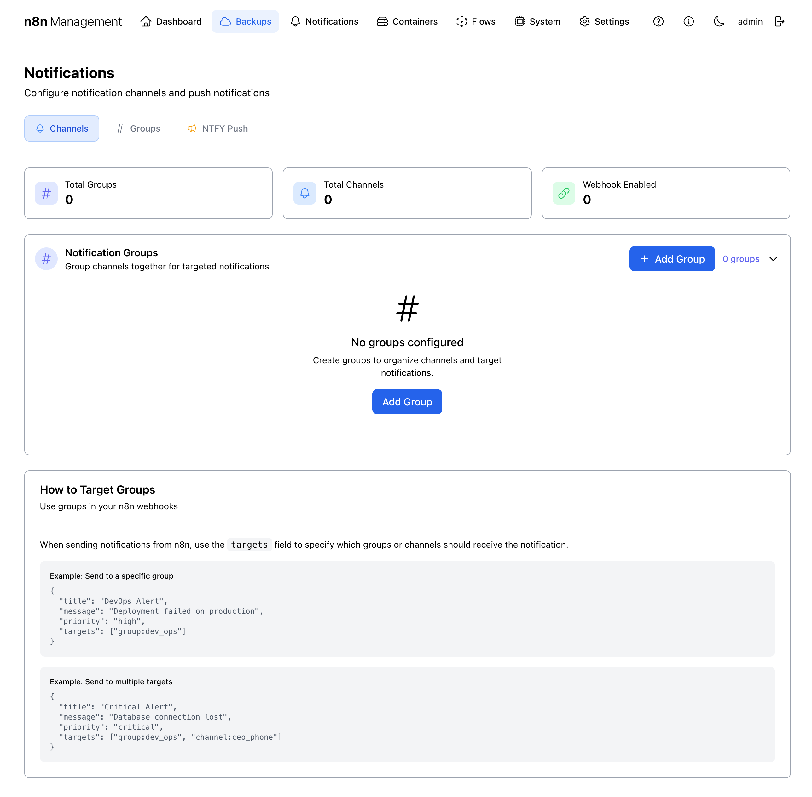

# Notifications

Notifications is the routing layer for everything that wants to alert a human: backup success/failure, container health changes, manual messages from your n8n workflows, and direct push messages via NTFY. The page has three top-level tabs — Channels (where alerts go), Groups (named bundles of channels), and NTFY Push (a self-hosted push service with its own message composer).

## Overview

The Notifications page header has a title, a description, and a single **Add Channel** button (always visible regardless of which tab is active, since adding a channel is the most common action). Below the header sit three tabs.


*Figure 1: Notifications page — Channels tab.*

## Channels tab {: #channels }

The Channels tab is the default view. A "channel" is a single delivery destination — a Slack webhook, a Discord webhook, an Apprise URL, an NTFY topic, an email address. Each channel is independent; channels can be combined into [Groups](#groups) for targeted delivery.

### Summary cards

| Card | Counts |
|---|---|
| **Total Channels** | Every channel that exists, regardless of state. |
| **Active** | Channels with the toggle ON. Inactive channels stay in the list but never receive notifications. |
| **Webhook Enabled** | Channels that accept routing from the global n8n Webhook Integration endpoint (see [below](#n8n-webhook)). |
| **Sent** | Cumulative count of notifications sent across all channels. |

### The channel list

The Notification Channels list shows each channel as a row with six columns: NAME, CHANNEL SLUG, STATUS, WEBHOOK, TYPE, ACTIONS. Each row's ACTIONS column has four icon buttons + a toggle:

| Action | Effect |
|---|---|
| ▶ **Test send** | Sends a synthetic notification to that channel's destination right now. |
| ✏ **Edit** | Opens an edit dialog for the channel's config. |
| 🗑 **Delete** | Removes the channel and any rules that target it. |
| Toggle | Flips Active / Inactive without deleting. |

!!! danger

    **Delete** removes the channel and any rules that target it. There is no soft-delete or restore. If you only want to stop receiving notifications temporarily, use the toggle instead.

!!! tip

    Always click **Test send** after creating or editing a channel. It sends a synthetic notification immediately so you can confirm the destination receives it before relying on it for production alerts.

## Groups tab {: #groups }

Groups bundle channels under a single name so notifications can target many destinations at once. A group has a name, a slug (`group:<name>`), and a list of member channels.


*Figure 2: Notifications page — Groups tab.*

### Targeting groups from n8n

The Groups tab includes an explainer block with example payloads showing how to address a group from an n8n workflow. The pattern is:

```json
{
  "title": "DevOps Alert",
  "message": "Deployment failed on prod",
  "targets": ["group:devops"]
}
```

You can mix groups, individual channels, and the special `"all"` target in the same array — see [n8n Webhook Integration](#n8n-webhook).

## NTFY Push tab {: #ntfy }

NTFY is a self-hosted push notification service (the `n8n_ntfy` container in the stack). The NTFY Push tab is a complete control surface for it — connection status at the top, then seven sub-tabs for every aspect of message lifecycle: Compose, Topics, Templates, Saved, History, Settings, Integrations.


*Figure 3: NTFY Push tab (Compose sub-tab is the default view).*

!!! security "Security flag"

    NTFY Push exposes the configured topic and (under Settings) the NTFY server URL plus any auth tokens. Blur both before publishing externally.

### The seven sub-tabs

| Sub-tab | Purpose |
|---|---|
| **Compose** | Full message composer for sending an ad-hoc NTFY message right now (default view). Fields: Topic, Title, Message (with Markdown toggle), Priority (Min/Low/Default/High/Urgent), Tags & Emojis, Click URL, Action Buttons, Advanced Options. |
| **Topics** | Lists your NTFY topics. Topics are namespaces — subscribers tune in to specific topics. |
| **Templates** | Reusable message templates with placeholders. Useful when you send the same shape of message repeatedly with different field values. |
| **Saved** | Messages you've saved from the Compose tab. Click any saved message to load it back into Compose for sending again. |
| **History** | Every NTFY message that has been sent — useful for audit and debugging. |
| **Settings** | NTFY server configuration: connection URL, base URL, authentication settings. |
| **Integrations** | Code-snippet examples for integrating NTFY with external systems — curl one-liners, Python, JavaScript, n8n HTTP Request node, etc. |

!!! note

    Topics created here can be referenced by Channel-type "Ntfy" channels — pick the topic during channel creation. They can also be sent to directly from Compose.

## Recent Notifications {: #recent }

Below the channels tab content sits a **Recent Notifications** card showing the most recent 20 messages sent across all channels. Collapsed by default; click to expand.

Each entry shows: title, channel that sent it, timestamp, delivery status. Common entries on a healthy stack include nightly *Backup Success* and *Backup Verification Passed* events.

## n8n Webhook Integration {: #n8n-webhook }

The bottom card on the Channels tab is the most powerful: a single webhook endpoint that lets your n8n workflows push notifications through this entire system without re-implementing each channel's API. Click to expand.


*Figure 4: n8n Webhook Integration — expanded. Contains the live webhook endpoint and API key.*

!!! security "Security flag"

    This panel exposes the webhook URL (containing your deployment hostname) and the API Key used to authenticate to it. The API Key is a credential — anyone with it can post notifications through your stack. Blur the API Key value and the hostname portion of the URL before publishing this manual outside your organization. Use the refresh icon next to the API Key to rotate it if you suspect it's been leaked.

### The webhook contract

Send a JSON POST to the displayed URL with these fields:

```json
{
  "title": "Alert Title",
  "message": "Your notification message",
  "priority": "normal",
  "targets": ["all"]
}
```

### Authenticating

The webhook requires the API Key shown in the panel as the `X-API-Key` header. The recommended n8n setup:

1. In n8n, create a **Header Auth** credential. Name it something like "n8n Mgmt Webhook." Header name: `X-API-Key`. Header value: paste from this panel.
2. In your workflow, add an **HTTP Request** node. Method: `POST`. URL: paste from this panel. Authentication: *Generic Credential Type → Header Auth → your saved credential*.
3. Body content type: JSON. Body: the shape shown above.

### Targets

| Target value | Effect |
|---|---|
| `"all"` | Sends to every channel that has Webhook routing enabled. |
| `"channel:<slug>"` | Sends only to the named channel. Slug is the value shown in the channel row's **CHANNEL SLUG** column. |
| `"group:<slug>"` | Sends to every channel in the named group. |
| Multiple values | Combine — e.g., `["channel:devops_slack", "group:oncall"]`. |

!!! tip

    Use the **refresh icon** next to the API Key field to rotate the key if it's ever exposed. Existing n8n credentials using the old key will need to be updated with the new value.

!!! danger

    The API Key is a long-lived credential with the power to send notifications through every channel in your stack. Don't paste it into shared chat, screenshots, or git commits. Rotate immediately if it leaks.
