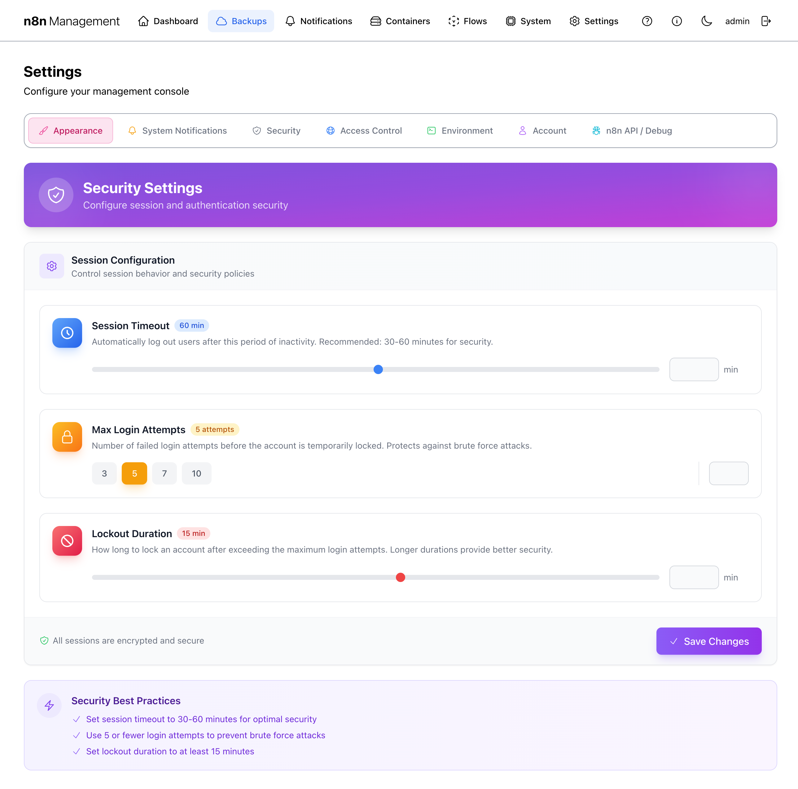
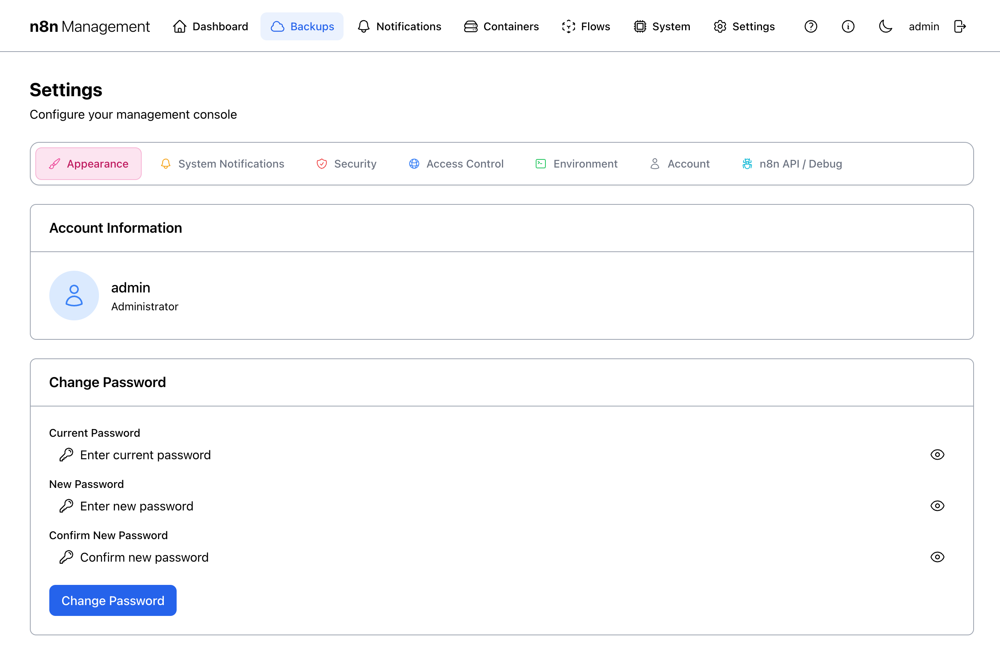

# Settings

Settings holds every configuration knob for the management console itself: appearance, notification routing, session security, network access policies, environment variables, your admin account, and the n8n API integration. Seven tabs across the top, each documented below.

## Overview

The page is a tabbed interface. The active tab's content fills the area below the tab strip. Most changes save automatically when you flip a toggle or pick an option; a few require an explicit Save button (called out where applicable).

*Figure 1: Settings page — Appearance tab, default view.*

### The seven tabs

| Tab | Scope |
|---|---|
| **Appearance** | Theme (Modern Light / Modern Dark) and navigation layout (Top / Side). |
| **System Notifications** | Which system events fire notifications and how aggressively. Routes through the global [Notifications](notifications.md) system. |
| **Security** | Session timeout, max login attempts, lockout duration. |
| **Access Control** | Nginx route inventory and IP-range allowlist for direct (non-Cloudflare) access. |
| **Environment** | Direct editor for every variable in your `.env` file. Behind a Danger Zone warning gate. |
| **Account** | Your own admin account info and password change. |
| **n8n API / Debug** | n8n API key configuration and Debug Mode toggle. |

## Appearance

The Appearance tab is the simplest. Two cards labeled **Modern Light** and **Modern Dark** show preview tiles of each theme. The currently-active theme has a check in its corner. Click a tile to switch.

Each tile also has a **Top** / **Side** toggle for navigation layout — top horizontal nav (default) or side vertical nav.

!!! note

    Theme choice is persisted server-side per user account, so it follows you across browsers and devices. The toggle in the page header (the moon/sun icon) reflects the same setting.

## System Notifications {: #sys-notifications }

The System Notifications tab is where you tell the management console *which events should fire alerts* and configure rate-limiting / quiet hours / digest behavior. Actual delivery channels (Slack, NTFY, email) live under [Notifications](notifications.md) — this tab is purely about *when* and *what*, not *where*.

*Figure 2: Settings → System Notifications tab.*

### Top strip controls

- **Maintenance** — pause all notifications during scheduled work. Click to enable; while on, no events fire regardless of category settings.
- **Quiet Hours** — define a daily window during which only critical events fire. Click to configure start/end times and severity threshold.
- **Events Enabled** counter — current total enabled events out of available.
- **This Hour** counter — events fired in the last 60 minutes.

### Event categories

| Category | Covers |
|---|---|
| **Backup Events** | Backup success / failure / verification / retention rotation. |
| **Container Events** | Health-check transitions, restarts, exit codes, resource thresholds. |
| **Security Events** | Failed logins, account lockouts, unauthorized API attempts. |
| **SSL Certificate Events** | Certificate expiration warnings, renewal success / failure. |
| **Docker Host System Events** | Host CPU / memory / disk threshold breaches. |

Click any category to expand it and toggle individual events on/off. The "X/Y enabled" badge updates live.

### Global Settings

- **Rate Limiting** — caps total notifications per hour to prevent storms (default 50/hour).
- **Daily Digest** — batches low-priority events into a single daily summary instead of per-event firing.

!!! tip

    Start by enabling only the Backup category and a couple of Container events. Add more after a week of operation, once you know what's signal vs. noise.

## Security

Session and login security policy. Every setting here applies to *every* management console user account.

*Figure 3: Settings → Security tab.*

### Settings {: #security-settings }

| Setting | Effect | Recommended |
|---|---|---|
| **Session Timeout** | Auto-logout after this period of inactivity. | 30–60 min for production; longer for trusted home networks. |
| **Max Login Attempts** | Failed logins before the account is temporarily locked. | 5 — protects against brute force without locking out fat-fingers. |
| **Lockout Duration** | How long the account stays locked after exceeding the max. | 15 min default; raise to hours for production. |

!!! warning

    Setting Session Timeout extremely high (e.g., 24 hours) defeats the purpose of session expiry. Setting it extremely low (e.g., 5 min) generates frustrated users who just stay logged in via "remember me" workarounds. Pick a value you'll actually live with.

!!! danger

    If you lock yourself out, the only recovery path is the CLI password reset documented in [Troubleshooting → Authentication](../TROUBLESHOOTING.md#authentication-issues) — which requires shell access to the management container. Don't lock the only admin out.

## Access Control

Access Control governs *direct* network access to the management host (the IP-range allowlist that nginx enforces). Traffic arriving via Cloudflare Tunnel *bypasses* these rules — that's a feature, not a bug, and the page banner explains why.

*Figure 4: Settings → Access Control tab.*

!!! security "Security flag"

    This panel exposes your full nginx route inventory (every URL the stack serves) and your direct-access CIDR allowlist (your internal subnets). Blur both before publishing.

### Two panels

- **Nginx Routes** — read-only inventory of every URL prefix the stack serves (e.g., `/management/`, `/files/`, `/portainer/`) and its access level (public / authenticated / admin). Useful for verifying your routing layout matches your intent.
- **IP Ranges (Direct Access)** — editable list of CIDR ranges allowed to reach the host directly. Add / edit / delete IP ranges with descriptions. Click **Reload Nginx** to apply changes.

### How it interacts with Cloudflare Tunnel

When traffic arrives via the Cloudflare Tunnel (`cloudflared`), it appears to nginx as coming from the internal Docker network — which is always allowed. The IP-range allowlist therefore only restricts *direct* connections (e.g., from your office network or a Tailscale peer). Public-internet users always come through Cloudflare, where access control is enforced by Cloudflare Access policies, not these rules.

!!! note

    The allowlist defaults are RFC-1918 private ranges plus Tailscale's CGNAT range. To restrict further, narrow these or remove them entirely — but only if you've confirmed that Cloudflare Tunnel covers all your real users, otherwise you'll lock everyone out of direct access.

!!! danger

    Removing all IP ranges and then restarting cloudflared (or losing tunnel connectivity) leaves you locked out of the management UI. Always keep at least one range covering your management network.

## Environment

The Environment tab is the direct editor for every variable in your deployment's `.env` file. It's behind a deliberate *Danger Zone* warning gate because changes here can break the stack catastrophically — wrong DB credentials, missing API keys, bad domain values all produce dead containers.

### Danger Zone gate {: #env-warning }

First click on the Environment tab shows a warning page, not the editor. You must explicitly acknowledge the risk to proceed.

*Figure 5: Environment tab — Danger Zone warning gate.*

#### Buttons on the warning

- **Download Full Backup** — strong recommendation: take a known-good backup before editing anything.
- **How to Recover** — opens the recovery procedure documentation.
- **Back to Safety** — abandons the edit attempt and returns you to a different tab.
- **I understand the risks, Continue** — bypasses the gate and reveals the editor below.

!!! danger

    The warning is not theatre. Setting `POSTGRES_PASSWORD` wrong locks every n8n workflow out of its DB. Setting `DOMAIN` wrong breaks SSL. Setting `N8N_MANAGEMENT_HOST_IP` wrong breaks Cloudflare Tunnel. Read the explanation, take a backup, then continue.

### Variable editor {: #env-editor }

Past the gate, the editor shows every `.env` variable grouped by purpose. Top action bar: **Validate Configuration**, **Reload Variables**, **Restore Previous .env**, **Add Custom Variable**, plus a "Last modified" timestamp.

*Figure 6: Environment variable editor — collapsed category view.*

!!! security "Security flag"

    This view shows category counts only. Once any category is expanded, the variable values become visible — see Figure 7 for the full warning.

#### The eleven categories

| Category | Contains |
|---|---|
| Required Settings | `DOMAIN`, `N8N_MANAGEMENT_HOST_IP` — must be set or system fails. |
| Database Configuration | PostgreSQL credentials and settings (`POSTGRES_USER`, `POSTGRES_PASSWORD`, ...). |
| Security & Authentication | Encryption keys, admin credentials, JWT secrets. |
| Management Console | Console-specific settings (port, root path, log level). |
| NFS Backup Storage | NFS server address, export path, mount options. |
| Cloudflare Tunnel | Cloudflare credentials and tunnel ID. |
| Tailscale VPN | Tailscale auth keys and node config. |
| Container Names | Custom names for each container — change with care, breaks references. |
| NTFY Notifications | NTFY server URL and topic config. |
| n8n API Integration | n8n API key for the management console's outbound calls. |
| Custom Variables | User-defined variables added via **Add Custom Variable**. |

#### Top action bar

| Button | Effect |
|---|---|
| **Validate Configuration** | Runs the same syntactic + semantic checks the system runs at boot. Catches missing required values, invalid IP formats, broken cron expressions, etc. |
| **Reload Variables** | Re-reads `.env` from disk. Useful if you edited the file outside the UI. |
| **Restore Previous .env** | Rolls back to the last-saved version (the system keeps a backup before each save). |
| **Add Custom Variable** | Adds a new variable in the Custom Variables category. |

#### Expanded category

Clicking a category expands it inline. Each variable shows: name, "Required" / "Optional" badge, plain-language description, and current value (or password-style mask for secrets).

*Figure 7: Required Settings category expanded.*

!!! security "Security flag"

    Variable values are visible in plain text in expanded category panels. This screenshot exposes the deployment `DOMAIN` and `N8N_MANAGEMENT_HOST_IP`. Other categories (Database Configuration, Security & Authentication, Cloudflare Tunnel, Tailscale VPN, n8n API Integration) expose secrets when expanded — never share screenshots of those tabs externally without redaction.

!!! warning

    After saving any change, run **Validate Configuration** before leaving the page. If validation fails, fix the issue immediately — the system will boot from your *saved* values, not your last-validated set.

!!! danger

    **Restore Previous .env** is your safety net but it only goes back one version. Always have a downloaded backup (Bare Metal archive — see [Backups → Bare Metal](backups.md#bare-metal)) before making non-trivial changes.

## Account

Read-only view of your own account plus a Change Password form. Doesn't manage other users (this stack is single-admin by design).

*Figure 8: Settings → Account tab.*

### Change Password

Enter your current password, then your new password twice, then click **Change Password**. The change is immediate.

!!! danger

    If you forget your password between this UI's reset and your next login, recovery requires CLI access to the management container. See [Troubleshooting → Authentication](../TROUBLESHOOTING.md#authentication-issues) for the SQL-based reset procedure.

## n8n API / Debug {: #api-debug }

Two unrelated controls bundled into one tab: the n8n API key (used by Flows + Notifications integrations) and a Debug Mode toggle.

*Figure 9: Settings → n8n API / Debug tab.*

!!! security "Security flag"

    The n8n API key is shown truncated (`eyJh...BdwM`) but the full value is one click away via **Update API Key**. Treat this tab as a credential surface.

### n8n API Key

The management console uses this key to call n8n's REST API for two purposes:

1. Toggling workflows active/inactive from the [Flows](flows.md) page.
2. Triggering on-demand executions from [Flows](flows.md#toggle).

Generate the key in n8n itself: **n8n Settings → API → New API Key**. Paste it via **Update API Key** here.

!!! tip

    If **Status** is `Not Configured`, the Flows page will still work in read-only mode (list, search, filter) but Toggle and Execute will be disabled. Adding the key unlocks them.

### Debug Mode

When enabled, the management console prints detailed error messages and verbose logs to the browser console (DevTools) and to `uvicorn.log`. Useful when something's broken and you need diagnostic detail.

!!! warning

    Debug logs may include sensitive data (request headers, query params, partial DB rows). Disable Debug Mode after troubleshooting — never leave it on in production for routine operation.
