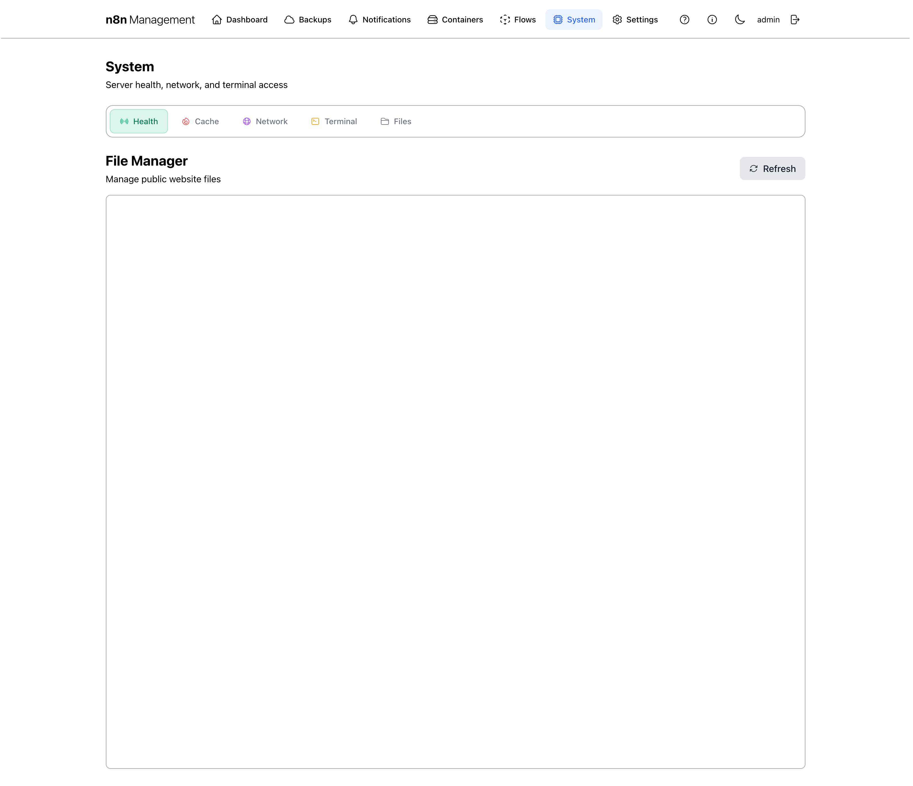

# System

The System page is your operations dashboard for the host: health snapshot, Redis cache state, network and tunnel integrations, in-browser terminal access, and a quick file manager. Most of this is read-only — to *change* a setting use the [Settings](settings.md) page; to *act on* a container use [Containers](containers.md).

## Overview

The header is a short title strip ("System / Server health, network, and terminal access"). Below it sit five top-level tabs:

| Tab | Purpose |
|---|---|
| **Health** | Top-level health summary plus a 3×3 grid of system status cards. Default view. |
| **Cache** | Redis cache status and the n8n_status data-collector service. |
| **Network** | External services list, host network configuration, Cloudflare Tunnel, Tailscale. |
| **Terminal** | In-browser shell access to the host or any container. |
| **Files** | Embedded File Browser for the public website volume. |

## Health tab {: #health }

The default view. The whole tab is a snapshot — a top banner with overall status counts (HEALTHY / DEGRADED / ERROR with Passed / Warnings / Errors counters and a Refresh button), then 9 cards covering different subsystems.

*Figure 1: System page — Health tab.*

### The nine status cards

| Card | Shows |
|---|---|
| **Docker Containers** | Running / Stopped / Unhealthy counts. Mirrors [Containers → Summary cards](containers.md#summary-and-list). |
| **Core Services** | Confirms each front-line service responds: N8n Api, Nginx, Nginx Public, Management. |
| **n8n Database** | PostgreSQL connection status, version, user, database name for the n8n workflow DB. |
| **Host System Resources** | Disk / Memory / CPU usage with progress bars. Same data as the [Dashboard stats cards](dashboard.md#stats-cards). |
| **SSL Certificates** | Domain, days valid, expiry date, plus a **Force Renew** button. See below. |
| **Management DB** | Same fields as the n8n Database card but for the management console's own PostgreSQL database. |
| **Backups** | Recent (24h / 30d) success counts plus the last backup timestamp and total size. |
| **Recent Logs** | Error and warning counts in the last hour, broken down by container — useful for spotting a noisy service. |
| **Docker Storage** | Total disk consumed by Docker — images, volumes, build cache. |

!!! note

    The rollup banner (HEALTHY / DEGRADED / ERROR) is computed from every card. A single card showing WARNING bumps the banner to DEGRADED; a single ERROR bumps it to ERROR. Drill into the cards above to find which subsystem flipped.

### SSL Certificates & Force Renew {: #health-ssl }

The SSL Certificates card is the most-touched card on this page. It shows the certificate's domain, days remaining until expiration, exact expiry timestamp, and a green **Force Renew** button.

#### Force Renew behavior

Clicking **Force Renew** triggers an immediate Let's Encrypt renewal via the certbot container, bypassing certbot's normal "expires in less than 30 days" gate. The browser request waits up to 5 minutes for the operation to complete because DNS-01 challenges have propagation delays. The button uses `--no-random-sleep-on-renew` to skip certbot's default random delay.

!!! danger

    Force Renew consumes one of your **Let's Encrypt rate-limit allowances** (50 per registered domain per week, with stricter sub-limits). Don't click it as a "test" — only when you actually need a fresh certificate. See the canonical [Certbot guide](../CERTBOT.md) for the full rate-limit table.

!!! warning

    If renewal fails repeatedly, check that your DNS provider credentials in `.env` are still valid, and that your certbot container image matches your DNS provider (e.g., `certbot/dns-cloudflare`). Also check `docker logs n8n_certbot` for `Unable to find deploy-hook command docker in the PATH` — that error means the scheduled renewal has been silently aborting entirely; see [Appendix → SSL renewals silently failing](appendix.md#tb-ssl-silent). Common error symptoms are documented in [Troubleshooting → SSL Certificate Issues](../TROUBLESHOOTING.md#ssl-certificate-issues).

!!! tip

    The Certbot container also runs an automatic background renewal every 12 hours that catches anything within 30 days of expiry. You shouldn't need Force Renew unless something specific has gone wrong.

## Cache tab {: #cache }

The Cache tab surfaces Redis health and the data-collector pipeline that keeps the management console fast. It's a status view — to flush keys or reconfigure Redis, edit the relevant variables under [Settings → Environment](settings.md#environment).

*Figure 2: System Cache tab.*

### What's on this tab

- **Cache Status banner** — overall health (HEALTHY / DEGRADED), Redis version, total cached keys, top-line hit rate.
- **Counters strip** — Hit Rate (%) / KEYS / COLLECTORS, with **Refresh** and **Flush** buttons.
- **Redis Server card** — server URL, connection status, version, uptime, memory used, client count, total commands processed.
- **Cache Hit Rate card** — running tally of hits vs. misses.
- **Status Collector card** — health of the n8n_status sidecar service that populates the cache.
- **Data Collectors list** — one row per individual collector (Host Metrics, Network, Containers, Cloudflare, Tailscale, Ntfy) with a per-collector status pill.
- **Cached Keys** — list of currently-cached entries.

!!! danger

    **Flush** empties the entire Redis cache. The management console will rebuild the cache as collectors run, but for ~30 seconds afterwards everything is "cold" — pages that depend on cached data will be slower or show stale loading states.

!!! tip

    If a particular tab shows stale data (e.g., a container you just stopped still appears running), find the corresponding collector and click its row to inspect — the issue is usually a stuck collector job rather than a broken cache.

## Network tab {: #network }

The Network tab is the densest page in the entire console. Four sub-sections cover external services, host network configuration, the Cloudflare tunnel, and Tailscale.

*Figure 3: System Network tab — full view.*

!!! security "Security flag"

    This tab exposes internal IPs, MAC addresses, the Cloudflare tunnel ID, Tailscale node info, and edge-location identifiers. Blur all of it before publishing.

### External Services

A list of optional companion services that ship with the stack:

| Service | Use it for |
|---|---|
| **Portainer** | Visual Docker management — image pulls, manual container ops, stack inspection. Lives at `/portainer/`. |
| **Adminer** | Direct PostgreSQL access for ad-hoc queries on either the n8n DB or the management DB. Lives at `/adminer/`. |
| **Dozzle** | Real-time log streaming across all containers — better for tailing many services at once than the per-container Logs viewer in [Containers](containers.md#logs). |
| **File Browser** | Web-based file manager scoped to the `public_web_root` volume. Same UI as the [Files tab](#files) but standalone. |

### Network Configuration

Read-only view of the host's network state: hostname, default gateway, DNS servers, and per-interface details (name, IPv4, IPv6, MAC).

!!! danger

    The IPv4 / IPv6 / MAC fields are *real network identifiers*. Don't share screenshots of this panel publicly.

### Cloudflare Tunnel

If you've configured a Cloudflare Tunnel, this card shows tunnel state (Running / Stopped), the cloudflared version, current connectivity (Connected / Disconnected), tunnel ID, and the Cloudflare edge locations the tunnel is currently connected to. An **API Key** button reveals or copies the cloudflared API token. A **Restart** button restarts the cloudflared container without leaving the page.

!!! danger

    The **API Key** button exposes a long-lived Cloudflare token with the tunnel's permissions. Do not click on a shared screen / over remote-control software unless you're certain no one's watching, and never paste the value into a chat.

!!! tip

    The full Cloudflare Tunnel architecture and DNS setup is documented in [Cloudflare guide](../CLOUDFLARE.md). This card is operations only.

### Tailscale

If Tailscale is enabled, the Tailscale card shows status (Connected / Disconnected), the assigned Tailscale IPv4 in your tailnet, hostname, OS, peer count, account/email of the logged-in tailnet user, and a **Reset Auth Key** button.

!!! note

    Tailscale full setup, MagicDNS, and re-authentication flows are documented in [Tailscale guide](../TAILSCALE.md).

## Terminal tab {: #terminal }

The Terminal tab gives you an in-browser shell — same engine as Containers' per-row Terminal button, but accessible directly here with a target picker. Targets include the **Host System** (a shell on the management host itself) and per-container shells.

*Figure 4: System Terminal tab — pick a target and connect.*

### How it works

Selecting a target sets the URL to `/management/system?tab=terminal&target=<id>&autoconnect=true` and the management API spawns a temporary shell-attachment via Docker exec, served over a websocket back to your browser.

!!! danger

    The **Host System** target gives you direct shell access to the underlying server with whatever permissions the management container's bind-mounted `/host` filesystem allows (typically root). Treat each session as if you were SSH-ing in. Don't paste arbitrary commands; close the tab when you're done.

!!! note

    Shell sessions inherit the AppArmor unconfined profile via `security_opt=["apparmor=unconfined"]` so they work inside LXC. If a session fails to start, the symptom and the canonical fix are documented in [Troubleshooting](../TROUBLESHOOTING.md).

## Files tab {: #files }

The Files tab embeds the File Browser service inside the management console. It's scoped to the `public_web_root` Docker volume — the directory served by the public website nginx.

*Figure 5: System Files tab — embedded File Browser.*

Use this for quick edits to public website assets without leaving the management console — uploads, renames, downloads, and inline text editing for HTML/CSS/JS files.

!!! note

    Authentication is "proxy auth" — the embedded File Browser trusts the management console's session, so you don't see a separate login. If File Browser ever shows its own login prompt, check the `.filebrowser.json` config (covered in [Troubleshooting → File Browser](../TROUBLESHOOTING.md#file-browser-issues)).
